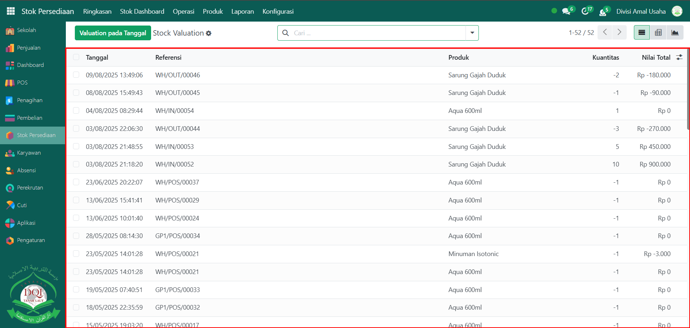

# Penilaian Stok



## Penilaian Stok

Laporan pada **Penilaian Stok** pada Odoo Pesantren digunakan untuk mengetahui nilai finansial persediaan barang pada periode tertentu. Laporan ini menampilkan informasi detail mengenai kuantitas, nilai per unit, serta nilai total produk yang ada di gudang, sehingga memudahkan dalam pelaporan keuangan dan audit persediaan.

### Melihat Penilaian Stok

Berikut adalah langkah-langkah untuk melihat penilaian stok pada Odoo Pesantren.

1. Login menggunakan akun administrator. Jika Anda belum memahami cara login sebagai admin, silakan lihat panduan [**Login Admin** di sini](../../panduan-login/login-admin.md).
2.  Buka modul **Stok Persediaan**, lalu klik menu **Laporan** kemudian pilih submenu **Penilaian**.

    <figure><figcaption></figcaption></figure>

3.  Halaman awal akan menampilkan daftar penilaian stok yang mencakup informasi seperti **Tanggal Valuation**, **Nomor Referensi**, **Nama Produk**, **Kuantitas**, dan **Nilai Total**.

    <figure><figcaption></figcaption></figure>

4.  Untuk melihat nilai stok pada tanggal tertentu, klik tombol **Valuation pada Tanggal**.

    <figure><figcaption></figcaption></figure>

5.  Akan muncul **form pop-up** yang meminta Anda mengisi tanggal penilaian. Masukkan tanggal yang diinginkan, lalu klik tombol **"Konfirmasi"** untuk menampilkan data penilaian stok sesuai periode tersebut.

    <figure><figcaption></figcaption></figure>

6.  Sistem akan memperbarui tampilan dan menampilkan nilai persediaan berdasarkan tanggal yang dipilih, termasuk detail perubahan nilai jika ada pergerakan stok sebelum tanggal tersebut.

    <figure><figcaption></figcaption></figure>

7.  Gunakan **toggle pencarian** untuk memfilter data, misalnya berdasarkan jenis pergerakan stok (**Barang Masuk**, **Barang Keluar**, atau **Memiliki Kuantitas Tersisa**). Anda juga dapat memanfaatkan filter **Kelompok** berdasarkan **Produk**, **Nomor Seri/Lot**, **Kategori Produk**, dan lainnya.

    <figure><figcaption></figcaption></figure>

8.  Setelah filter diaktifkan, maka data yang muncul pada daftar akan tersaring sesuai filter yang dipilih.

    <figure><figcaption></figcaption></figure>
