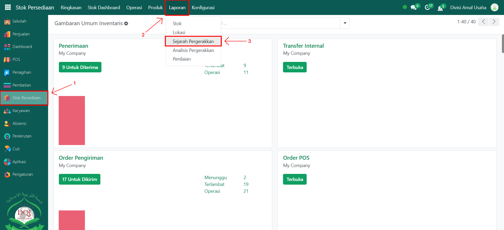
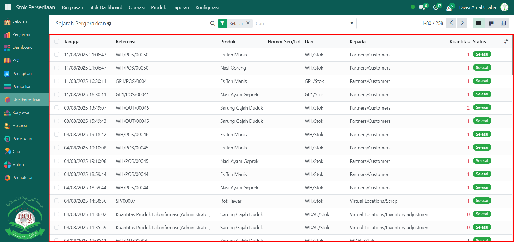
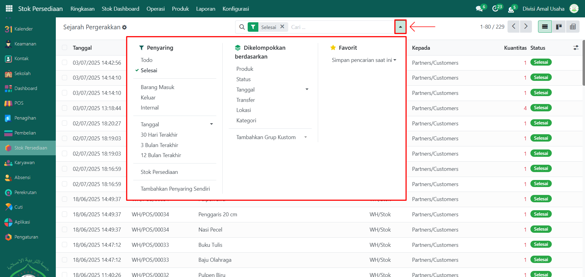
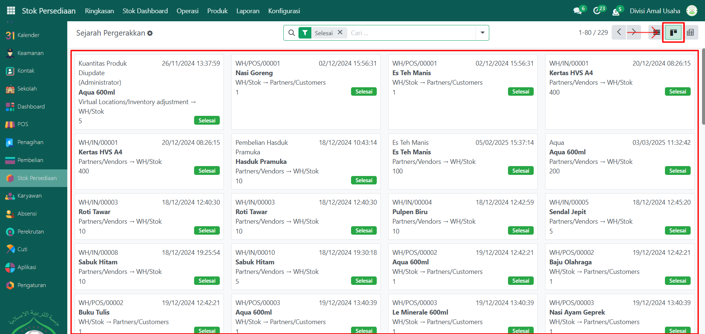
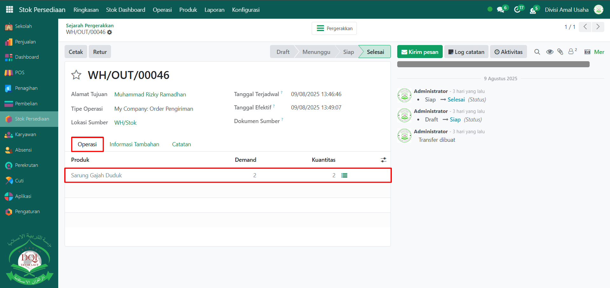
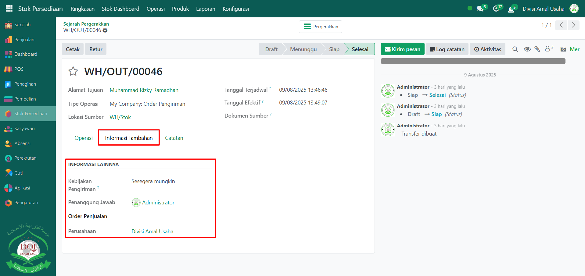
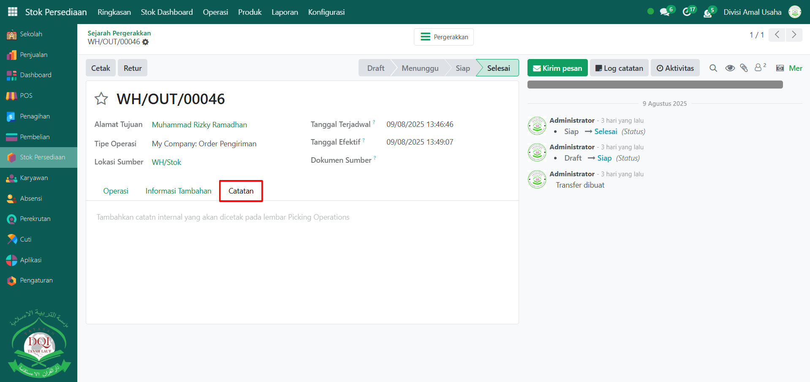

# Sejarah Pergerakan

Video \[]

## Sejarah Pergerakan

Laporan pada **Sejarah Pergerakan** pada Odoo Pesantren digunakan untuk memantau seluruh riwayat pergerakan stok barang, mulai dari penerimaan dari pemasok, pengiriman ke pelanggan, hingga perpindahan antar lokasi internal. Laporan ini membantu pengguna memahami arus keluar-masuk barang secara detail dan akurat.

### Melihat Sejarah Pergerakan

Berikut adalah langkah-langkah untuk melihat sejarah pergerakan stok barang pada Odoo Pesantren.

1. Login menggunakan akun administrator. Jika Anda belum memahami cara login sebagai admin, silakan lihat panduan [**Login Admin** di sini](../../panduan-login/login-admin.md).
2.  Buka **modul Stok Persediaan**, lalu klik menu **Laporan** kemudian pilih submenu **Sejarah Pergerakan**.

    <figure><figcaption></figcaption></figure>

3.  Halaman utama akan menampilkan daftar riwayat pergerakan stok, mencakup transaksi penerimaan, pengiriman, dan operasi internal dari berbagai produk yang tercatat di sistem.

    <figure><figcaption></figcaption></figure>

4.  Gunakan **toggle pencarian** untuk memfilter data berdasarkan kategori seperti **Barang Masuk**, **Barang Keluar**, atau **Operasi Internal**, dan lainnya serta filter **Kelompok** seperti **Produk**, **Status Pergerakan**, **Tanggal Transaksi**, dan lainnya.

    <figure><figcaption></figcaption></figure>

5.  Untuk mengubah tampilan, klik icon **Kanban** di sebelah icon daftar agar data pergerakan stok ditampilkan dalam bentuk kartu visual.

    <figure><figcaption></figcaption></figure>

6. Pilih salah satu entri pada daftar untuk membuka rincian pergerakan stok tersebut.
7.  Halaman detail akan menampilkan informasi lengkap mengenai transaksi, termasuk tanggal penerimaan dari pemasok atau tanggal pengiriman ke pelanggan. Pada **Tab Operasi** Anda dapat melihat daftar produk yang terlibat beserta kuantitas yang diterima, dikirim, atau dipindahkan.

    <figure><figcaption></figcaption></figure>

8.  Beralih ke **Tab Informasi Tambahan** untuk mengetahui data pendukung, seperti nama penanggung jawab operasi atau referensi dokumen terkait.

    <figure><figcaption></figcaption></figure>

9.  Buka **Tab Catatan** untuk membaca catatan atau komentar tambahan yang mungkin dicantumkan pada transaksi tersebut.

    <figure><figcaption></figcaption></figure>
