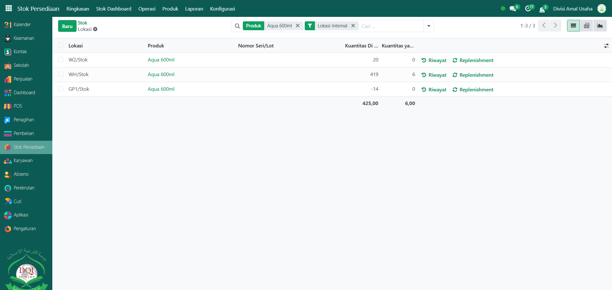

# Stok Persediaan

Video \[]

## Stok Persediaan

Laporan pada **Stok Persediaan** pada Odoo Pesantren berguna untuk menampilkan ringkasan jumlah stok produk yang tersedia di semua gudang dan lokasi penyimpanan. Informasi ini mencakup stok yang ada (_On Hand_), stok yang akan masuk (_Incoming_), stok yang keluar (_Outgoing_), serta jumlah stok prakiraan (_Forecasted_) yang dihitung berdasarkan transaksi yang direncanakan. Dari halaman ini, pengguna dapat memantau ketersediaan barang, memeriksa lokasi simpan, meninjau riwayat pergerakan, melihat aturan pengisian ulang, dan menganalisis proyeksi stok di masa mendatang.

### Melihat Stok Persediaan

Berikut adalah langkah-langkah untuk melihat Stok Persediaan pada Odoo Pesantren.

1. Login menggunakan akun administrator. Jika Anda belum memahami cara login sebagai admin, silakan lihat panduan [**Login Admin** di sini](../../panduan-login/login-admin.md).
2.  Buka modul **Stok Persediaan**, lalu klik menu **Laporan** kemudian pilih submenu **Stok**.

    <figure><figcaption></figcaption></figure>

3.  Halaman **Stok Persediaan** akan terbuka, menampilkan daftar seluruh produk beserta jumlah stoknya dalam bentuk tabel. Informasi yang disajikan meliputi jumlah stok tersedia, stok masuk, stok keluar, serta jumlah prakiraan stok.

    <figure><figcaption></figcaption></figure>

4.  Untuk melihat stok pada tanggal tertentu, klik tombol **"Stok Persediaan pada Tanggal"**,&#x20;

    <figure><figcaption></figcaption></figure>

5.  Masukkan tanggal yang diinginkan pada jendela pop-up, lalu klik **"Konfirmasi"**.

    <figure><figcaption></figcaption></figure>

6.  Sistem akan menampilkan data Stok Persediaan pada tanggal yang telah dikonfirmasi sebelumnya.

    <figure><figcaption></figcaption></figure>

7.  Gunakan filter yang tersedia untuk menampilkan data berdasarkan gudang atau kategori produk sesuai kebutuhan.

    <figure><figcaption></figcaption></figure>

8.  Klik tautan **"Riwayat"** (icon jam) pada salah satu produk untuk melihat catatan pergerakan stok masuk dan keluar secara detail.

    <figure><figcaption></figcaption></figure>

9.  Sistem akan menampilkan data riwayat pergerakan stok masuk dan keluar pada produk yang dipilih.

    <figure><figcaption></figcaption></figure>

10. Klik tautan **"Replenishment"** (icon panah melingkar) untuk melihat atau mengelola data pengisian ulang serta aturan restock pada produk tertentu.

    <figure><figcaption></figcaption></figure>

11. Sistem akan menampilkan aturan pengisian ulang pada produk yang dipilih, Anda juga dapat membuat peraturan pengisian ulang dengan klik tombol **"Baru"**.

    <figure><figcaption></figcaption></figure>

12. Klik tautan **"Lokasi"** (icon kotak) untuk mengetahui lokasi penyimpanan barang, termasuk informasi gudang dan rak.

    <figure><figcaption></figcaption></figure>

13. Klik tautan **"Prakiraan"** (icon grafik) untuk menampilkan proyeksi stok di masa mendatang.&#x20;

    <figure><figcaption></figcaption></figure>

14. Data ini menghitung stok tersedia ditambah stok masuk, dikurangi stok keluar, berdasarkan transaksi pembelian, penjualan, atau pengiriman yang sudah dijadwalkan. Dengan laporan ini, Anda dapat mengantisipasi potensi kekurangan stok dan merencanakan pembelian dengan tepat waktu.

