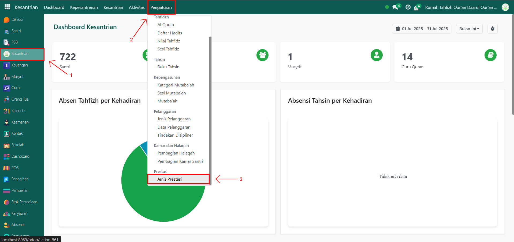
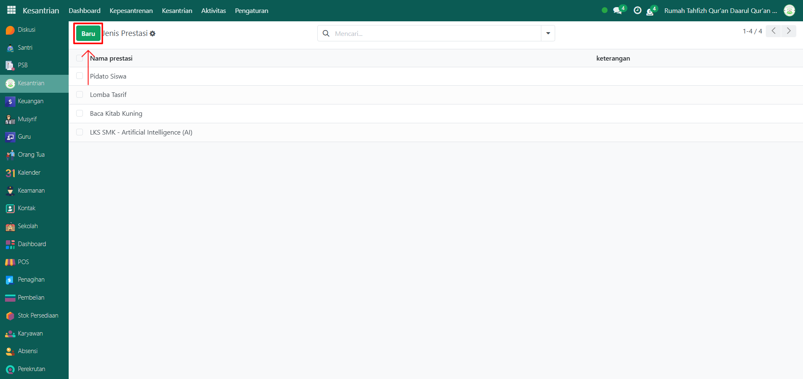
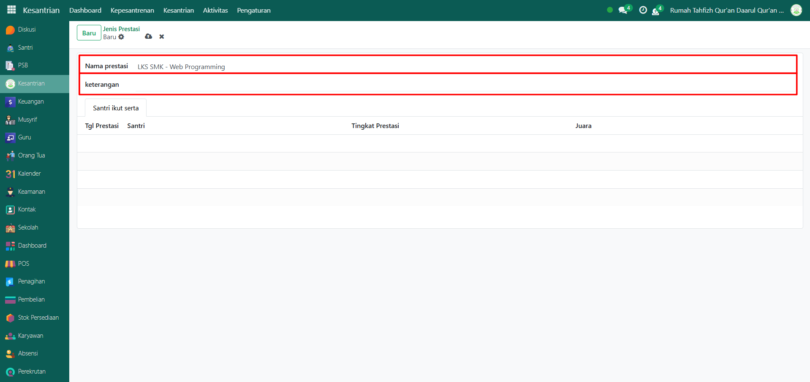
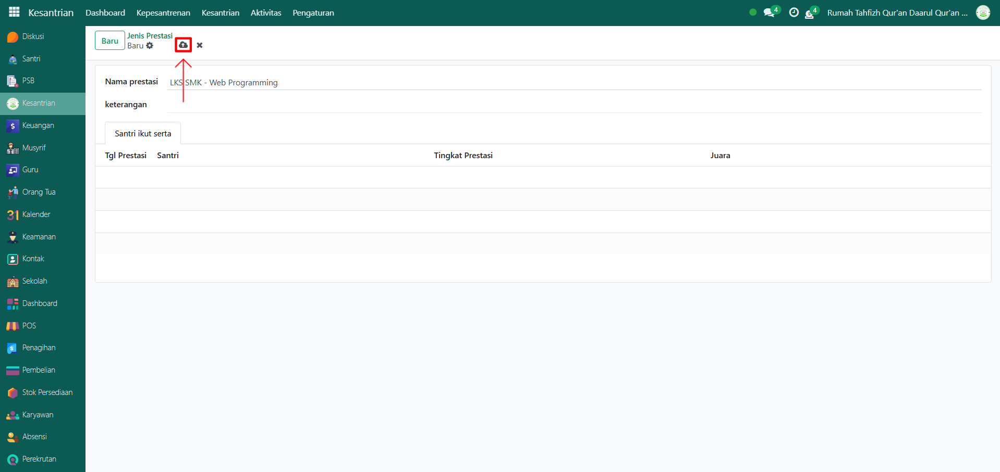

# Jenis Prestasi

Video \[]

## Master Data - Jenis Prestasi

Jenis Prestasi adalah data master yang digunakan untuk mendefinisikan kategori prestasi yang dapat diraih oleh santri, baik dalam bidang akademik, non-akademik, maupun lomba tertentu. Data ini akan digunakan sebagai acuan saat mencatat prestasi santri di sistem.

### Menambahkan Jenis Prestasi

Berikut adalah langkah-langkah untuk menambahkan jenis prestasi pada Odoo Pesantren.

1.  Buka modul **Kesantrian**, lalu klik menu **Pengaturan** dan pilih submenu Jenis Prestasi.

    <figure><figcaption></figcaption></figure>

2.  Klik tombol **“Baru”** untuk membuat data jenis prestasi baru.

    <figure><figcaption></figcaption></figure>

3.  Akan tampil halaman form, isi inputan yang tersedia seperti:

    * **Nama Prestasi** (misalnya: _LKS SMK – Web Programming_).
    * **Keterangan** _(opsional)_.
    * **Tab Santri Ikut Serta** di bagian bawah tidak perlu diisi, karena sistem akan mengisinya otomatis jika ada transaksi penambahan prestasi pada santri tertentu.

    <figure><figcaption></figcaption></figure>

4.  Setelah semua inputan diisi dengan benar, klik ikon **Simpan** di sebelah kanan ikon **Gear** agar data Jenis Prestasi tersimpan di sistem.

    <figure><figcaption></figcaption></figure>

5. Data Jenis Prestasi berhasil disimpan dan dapat digunakan saat mencatat prestasi santri.

### Edit dan Hapus Data Jenis Prestasi

Untuk mengedit suatu data jenis prestasi, silahkan pilih terlebih dahulu data mana yang akan diedit. Editlah data jenis prestasi dan klik icon **Simpan** untuk menyimpan data perubahan tersebut.

Untuk menghapus suatu data jenis prestasi adalah dengan pilih data mana yang akan dihapus, kemudian klik icon **Gear** atau **Action** lalu pilih opsi **Hapus**, maka akan tampil dialog konfirmasi apakah anda ingin menghapus data tersebut. Jika ya, klik **Hapus** jika tidak maka klik **Tidak, tetap simpan**.

***


Data **Jenis Prestasi** tidak dapat dihapus apabila sudah terdapat transaksi yang berhubungan dengan data tersebut. Jika belum ada transaksi yang tercatat, maka data masih dapat dihapus dari sistem.

