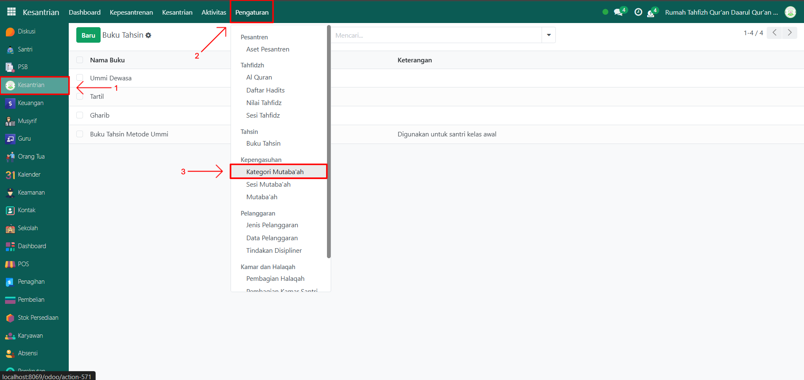
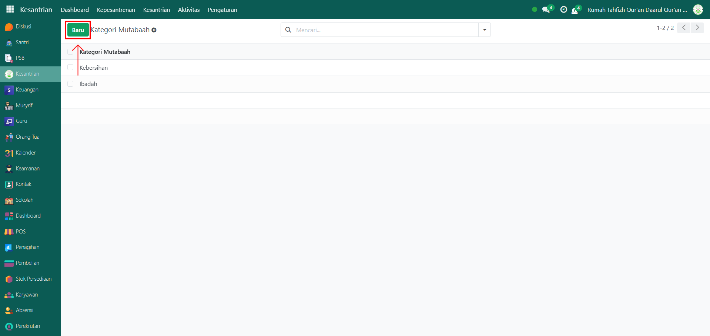
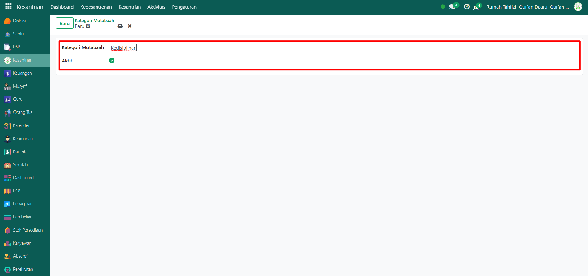
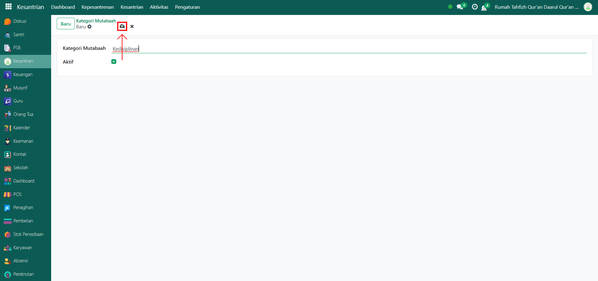

# Kategori Mutaba'ah

VIdeo \[]

## Master Data - Kategori Mutaba'ah

Kategori Mutaba’ah pada Odoo Pesantren digunakan untuk mendata jenis-jenis mutaba’ah santri, misalnya ibadah, kedisiplinan, atau kebersihan. Data ini menjadi acuan saat mencatat aktivitas mutaba’ah harian santri.

### Langkah-Langkah Menambahkan Data Kategori Mutaba'ah

Berikut adalah langkah-langkah menambahkan data kategori mutaba'ah di Odoo Pesantren.

1.  Buka modul **Kesantrian,** lalu klik menu **Pengaturan** dan pilih submenu **Kategori Mutaba'ah**.

    <figure><figcaption></figcaption></figure>

2.  Klik tombol **“Baru”** untuk membuat data kategori mutaba’ah baru.

    <figure><figcaption></figcaption></figure>

3.  Akan tampil halaman form, isi inputan yang tersedia seperti:

    * **Kategori Mutaba’ah** (misalnya: Ibadah)
    * **Aktif** (centang checkbox ini agar kategori mutaba’ah dapat digunakan pada pencatatan aktivitas santri).

    <figure><figcaption></figcaption></figure>

4.  Setelah semua inputan diisi dengan benar, klik icon **Simpan** di sebelah kanan icon **Gear** agar data kategori mutaba’ah tersimpan di sistem.

    <figure><figcaption></figcaption></figure>

5. Data Kategori Mutaba’ah berhasil disimpan dan dapat digunakan untuk mencatat aktivitas mutaba’ah harian santri.
