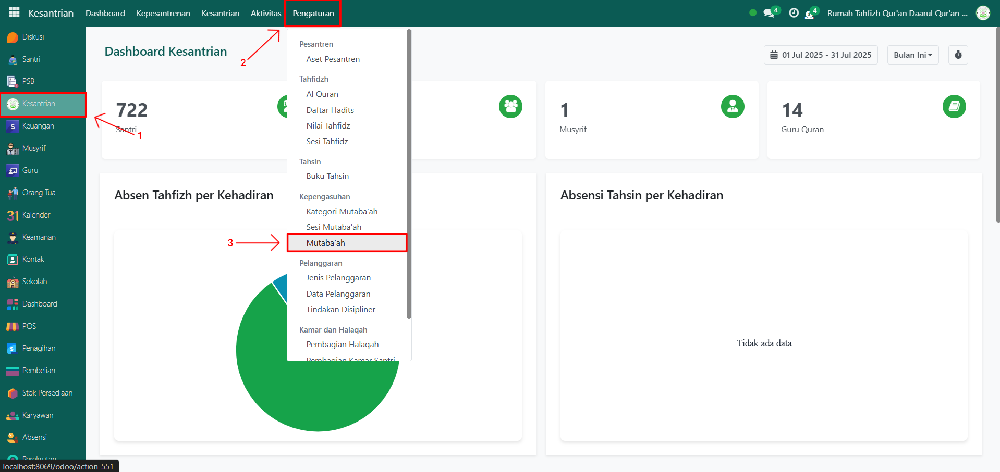
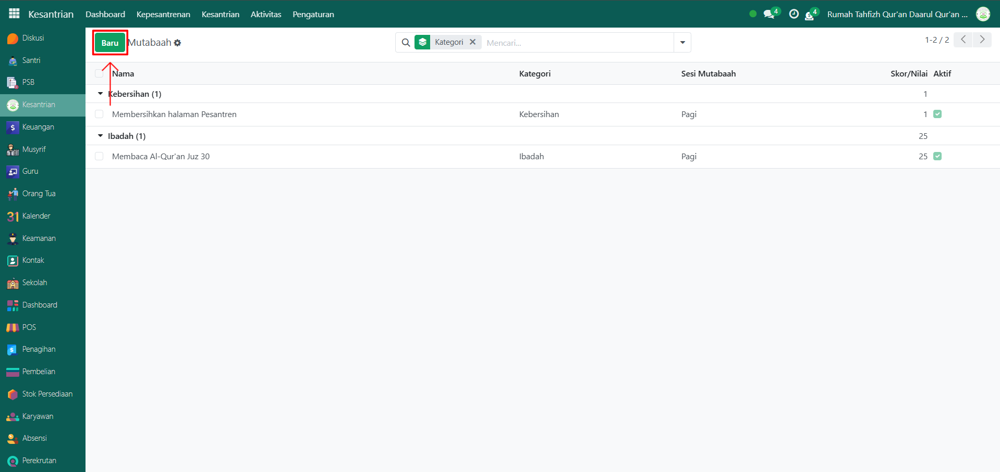
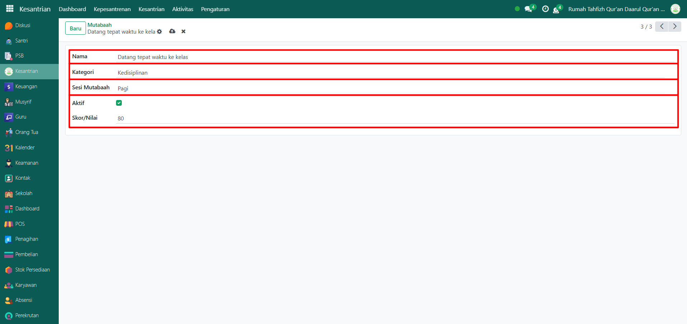
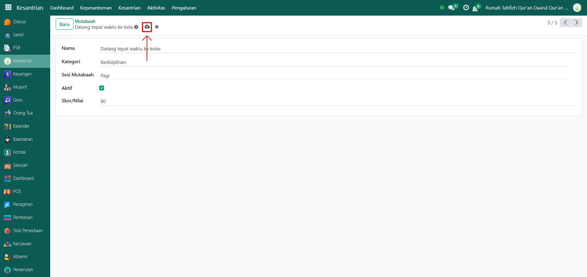

# Mutaba'ah

Video \[]

## Master Data - Mutaba'ah

Mutaba’ah berfungsi untuk mendata jenis-jenis kegiatan yang harus dilakukan santri dalam keseharian mereka, seperti ibadah, kedisiplinan, kebersihan, dan kegiatan lain yang ditentukan oleh pesantren. Data ini menjadi acuan saat pencatatan mutaba’ah harian santri.

### Menambahkan Mutaba'ah

Berikut adalah langkah-langkah untuk menambahkan mutaba'ah pada Odoo Pesantren.

1.  Buka modul **Kesantrian**, lalu klik menu **Pengaturan** dan pilih submenu **Mutabaah**.&#x20;

    <figure><figcaption></figcaption></figure>

2.  Klik tombol “Baru” untuk membuat data mutabaah baru.&#x20;

    <figure><figcaption></figcaption></figure>

3.  Akan tampil halaman form, isi inputan yang tersedia seperti:

    * Nama (isi dengan nama aktivitas yang akan di tambahkan)
    * Kategori (isi dengan kategori aktivitas yang terreferensi dari master data "Kategori Mutabaah").
    * Sesi Mutabaah (isi dengan sesi yang terreferensi dari master data "Sesi Mutabaah")
    * Aktifkan checkbox "Aktif" jika aktivitas tersebut masih berjalan di pesantren.
    * Skor/nilai (isi dengan nilai yang diberikan apabila santri melakukan aktivitas tersebut)

    <figure><figcaption></figcaption></figure>

4.  Setelah semua inputan diisi dengan benar, klik icon **Simpan** di sebelah kanan icon **Gear** agar data mutabaah tersimpan di sistem.

    <figure><figcaption></figcaption></figure>

5. Data Mutaba’ah berhasil disimpan dan dapat digunakan saat pencatatan aktivitas mutaba’ah harian santri.
