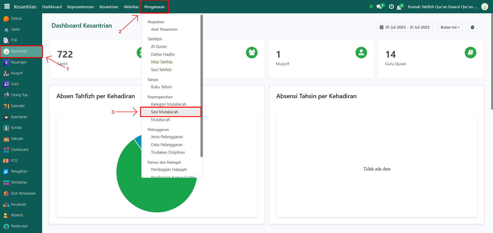
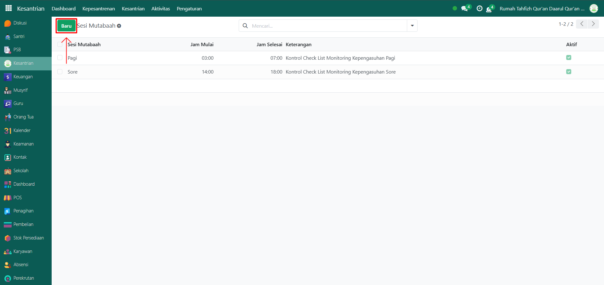
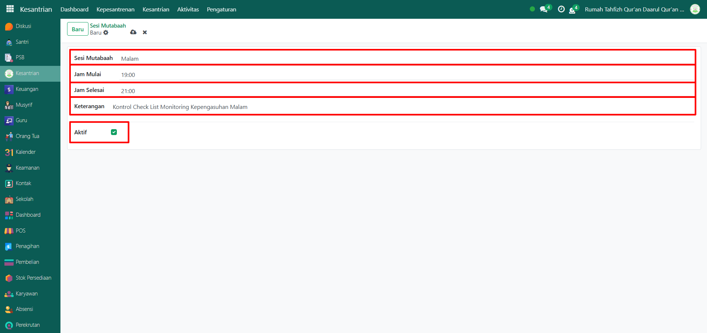
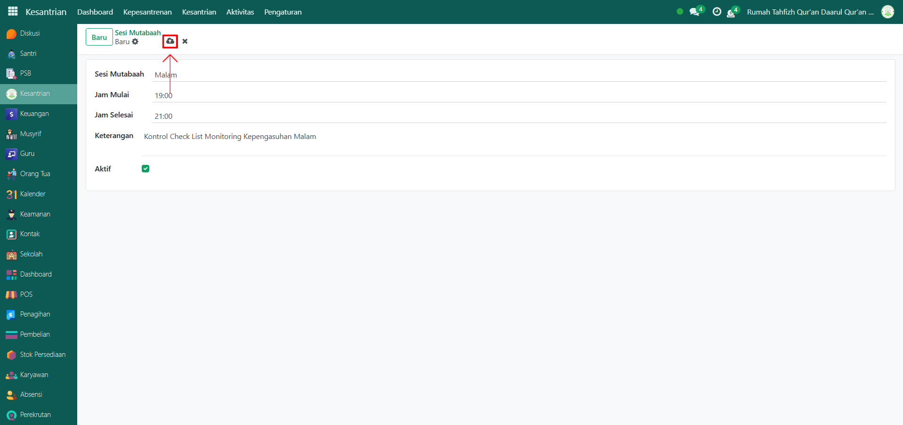

# Sesi Mutaba'ah

Video \[]

## Master Data - Sesi Mutaba'ah

Data Sesi Mutabaah pada Odoo Pesantren digunakan untuk mencatat aktivitas pemantauan harian (mutabaah yaumiyah) santri yang mencakup waktu dimulai hingga selesai dan keterangan sesinya.

### Langkah-Langkah Menambahkan Sesi Mutaba'ah

Berikut adalah langkah-langkah untuk menambahkan sesi mutaba'ah pada Odoo Pesantren.

1.  Buka modul Kesantrian, lalu klik menu Pengaturan dan pilih submenu Sesi Mutabaah.

    <figure><figcaption></figcaption></figure>

2.  Klik tombol “Baru” untuk membuat data sesi mutabaah baru.

    <figure><figcaption></figcaption></figure>

3.  Akan tampil halaman form, isi inputan yang tersedia seperti:

    * Sesi Mutabaah (isi dengan waktu dimana sesi mutabaah akan berlangsung)
    * Jam Mulai (isi dengan jam dimulai nya sesi)
    * Jam Selesai (isi dengan jam berakhirnya sesi)
    * Keterangan (isi dengan informasi detail dari sesi yang berlangsung)
    * Aktifkan checkbox "Aktif" jika sesi tersebut masih berjalan di pesantren.

    <figure><figcaption></figcaption></figure>

4.  Setelah semua inputan diisi dengan benar, klik icon Simpan di sebelah kanan icon Gear agar data sesi mutabaah tersimpan di sistem.

    <figure><figcaption></figcaption></figure>

5. Data Sesi Mutaba’ah berhasil disimpan dan dapat digunakan pada pencatatan aktivitas mutaba’ah harian santri.
