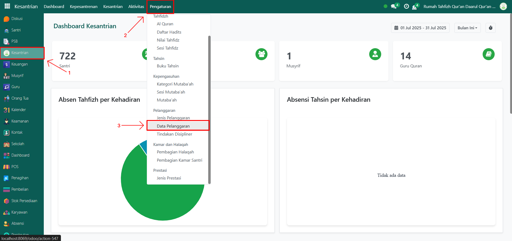
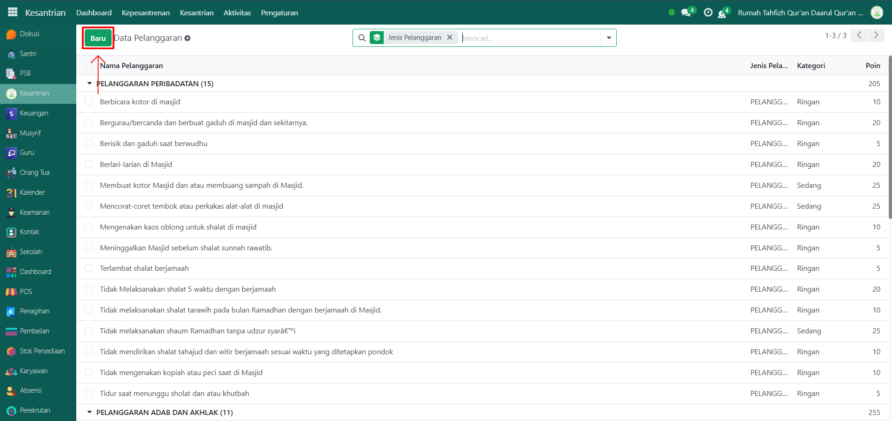
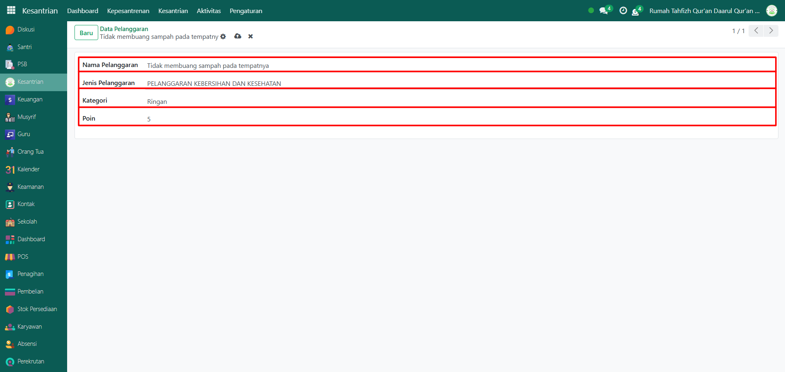
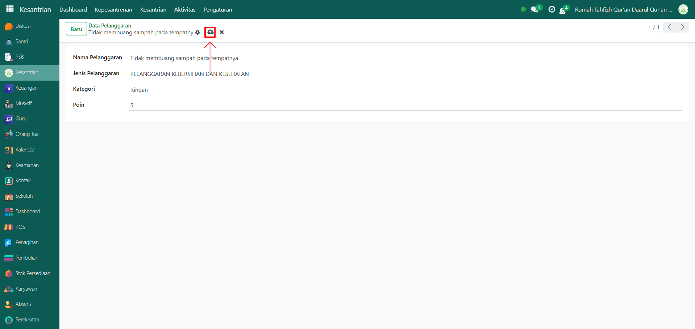
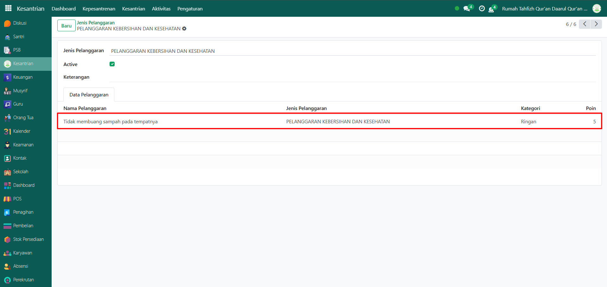

# Data Pelanggaran

Video \[]

## Master Data - Data Pelanggaran

Data Pelanggaran pada Odoo Pesantren digunakan untuk menyimpan daftar pelanggaran yang mungkin dilakukan oleh santri dalam kehidupan sehari-hari di lingkungan pesantren. Data ini berfungsi sebagai referensi tetap yang digunakan saat mengisi laporan pelanggaran santri oleh musyrif, guru, atau petugas disiplin. Pelanggaran yang dicatat dapat berupa pelanggaran ringan, sedang, maupun berat, sesuai dengan peraturan pesantren yang berlaku.

### Menambahkan Data Pelanggaran

Berikut adalah langkah-langkah untuk menambahkan data pelanggaran pada Odoo Pesantren.

1.  Buka modul **Kesantrian**, lalu klik menu **Pengaturan** dan pilih submenu **Data Pelanggaran**.

    <figure><figcaption></figcaption></figure>

2.  Klik tombol “Baru” untuk membuat data pelanggaran baru.

    <figure><figcaption></figcaption></figure>

3.  Akan tampil halaman form, isi inputan yang tersedia seperti:

    * Nama pelanggaran (isi dengan nama pelanggaran yang akan di tambahkan).
    * Jenis pelanggaran (isi dengan jenis pelanggaran yang terrefrensi dari data "Jenis pelanggaran")
    * Kategori pelanggaran (isi dengan kategori pelanggaran yang telah disediakan, yaitu Ringan, Sedang, Berat, dan Sangat Berat)
    * Poin (isi dengan jumlah poin yang didapat santri saat melakukan pelanggaran tersebut).

    <figure><figcaption></figcaption></figure>

4.  Setelah semua inputan diisi dengan benar, klik icon Simpan di sebelah kanan icon Gear agar data pelanggaran tersimpan di sistem.

    <figure><figcaption></figcaption></figure>

5.  Kembali ke submenu jenis pelanggaran untuk melihat data pelanggaran yang baru saja ditambahkan. Cari sesuai jenis pelanggaran yang dimasukkan saat mengisi data pelanggaran.

    <figure><figcaption></figcaption></figure>
