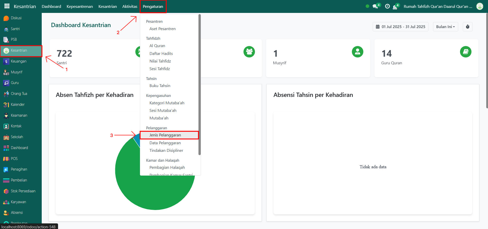
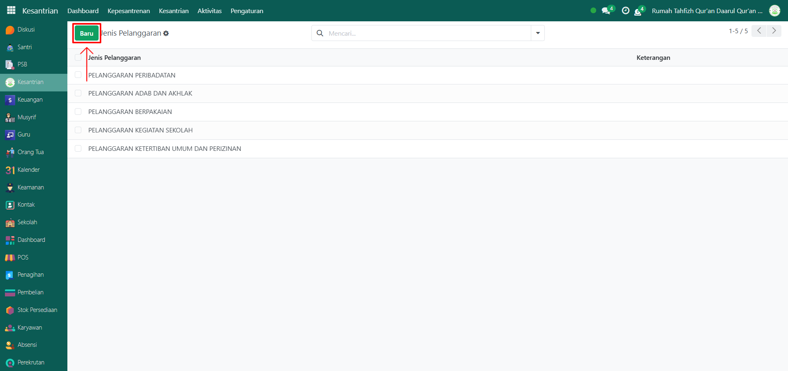
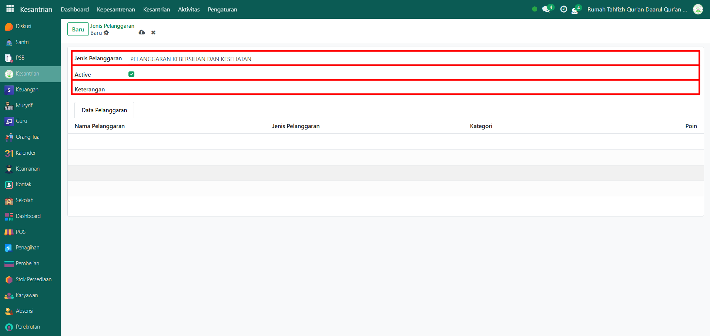
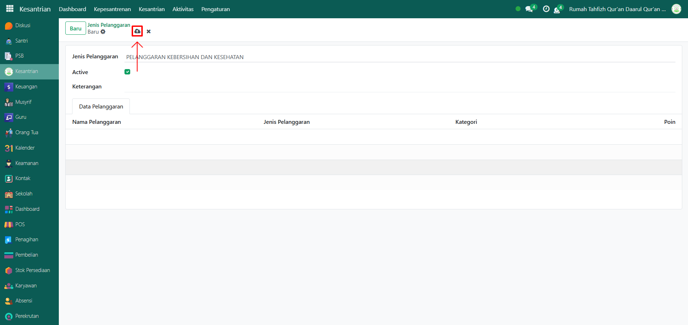

# Jenis Pelanggaran

Video \[]

## Master Data - Jenis Pelanggaran

Data Jenis Pelanggaran pada Odoo Pesantren digunakan untuk menyimpan daftar jenis pelanggaran yang dilakukan santri yang nantinya akan memuat informasi data pelanggaran yang masuk ke dalam jenis pelanggaran tersebut.

### Langkah-Langkah Menambahkan Jenis Pelanggaran

Berikut adalah langkah-langkah untuk menambahkan jenis pelanggaran.

1.  Buka modul **Kesantrian**, lalu klik menu **Pengaturan** dan pilih submenu **Jenis Pelanggaran**.&#x20;

    <figure><figcaption></figcaption></figure>

2.  Klik tombol “Baru” untuk membuat data jenis pelanggaran baru.&#x20;

    <figure><figcaption></figcaption></figure>

3.  Akan tampil halaman form, isi inputan yang tersedia seperti:

    * Jenis pelanggaran (isi dengan jenis pelanggaran yang akan di tambahkan)
    * Aktifkan checkbox "Aktif" jika jenis pelanggaran tersebut masih berlaku di pesantren.
    * Keterangan (opsional, bisa isi dengan informasi tambahan/detail dari jenis pelanggaran tersebut").
    * Tab data pelanggaran di bagian bawah tidak perlu diisi. Karena akan terisi otomatis apabila ada data pelanggaran yang termasuk kedalam jenis pelanggaran tersebut.

    <figure><figcaption></figcaption></figure>

4.  Setelah semua inputan diisi dengan benar, klik icon Simpan di sebelah kanan icon Gear agar data jenis pelanggaran tersimpan di sistem.

    <figure><figcaption></figcaption></figure>

5. Jenis Pelanggaran berhasil disimpan dan dapat digunakan saat mencatat data pelanggaran santri.
