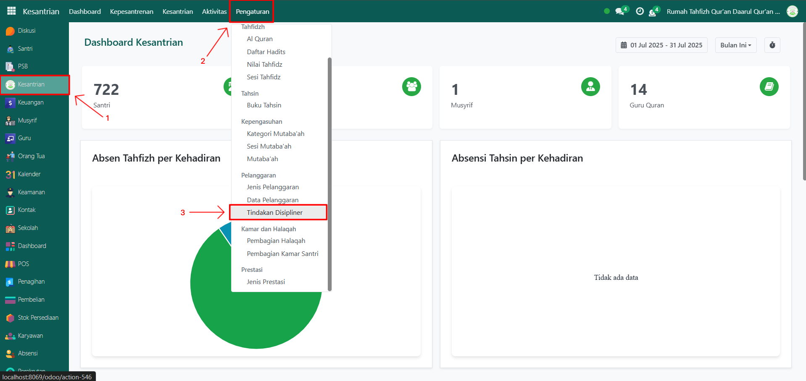
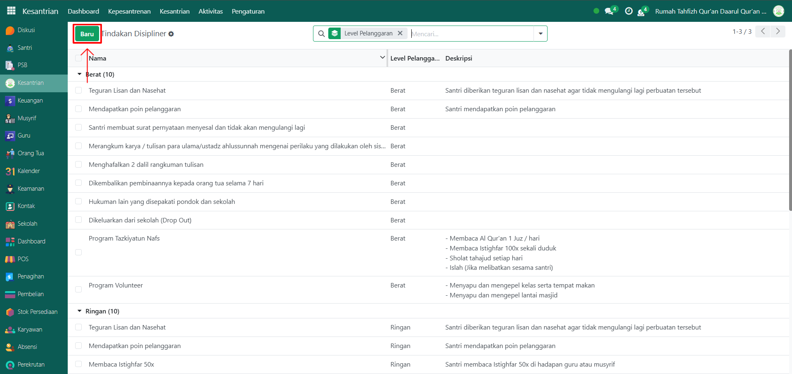
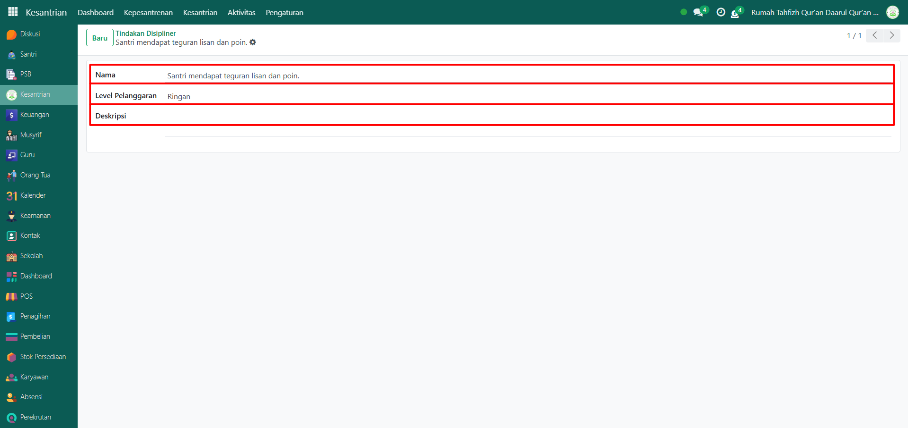
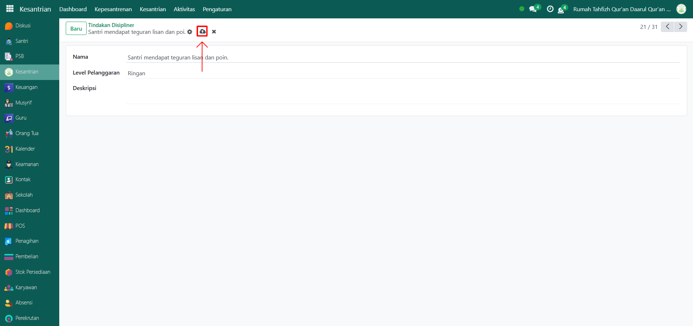

# Tindakan Disipliner

Video \[]

## Master Data - Tindakan Disipliner

Data Tindakan Disipliner pada Odoo Pesantren digunakan untuk mencatat jenis-jenis penanganan atau sanksi yang diberikan kepada santri setelah melakukan pelanggaran tertentu. Data ini bersifat referensial dan dipakai dalam proses pelaporan serta eksekusi sanksi. Dengan data ini, sistem dapat menyesuaikan jenis tindakan yang diberikan sesuai tingkat pelanggaran dan kebijakan pesantren.

### Langkah-Langkah Menambahkan Tindakan Disipliner

Berikut adalah langkah-langkah untuk menambahkan tindakan disipliner pada Odoo Pesantren.

1.  Buka modul **Kesantrian**, lalu klik menu **Pengaturan** dan pilih submenu **Tindakan Disipliner.**

    <figure><figcaption></figcaption></figure>

2.  Klik tombol **“Baru”** untuk membuat data tindakan disipliner baru.&#x20;

    <figure><figcaption></figcaption></figure>

3.  Akan tampil halaman form, isi inputan yang tersedia seperti:

    * Nama (isi dengan nama tindakan disipliner yang akan di tambahkan).
    * Level pelanggaran (isi dengan level pelanggaran yang telah disediakan, yaitu Ringan, Sedang, Berat, dan Sangat Berat)
    * Deskripsi (isi dengan informasi tambahan atau detail dari tindakan disipliner tersebut)

    <figure><figcaption></figcaption></figure>

4.  Setelah semua inputan diisi dengan benar, klik icon Simpan di sebelah kanan icon Gear agar data tindakan disipliner tersimpan di sistem.

    <figure><figcaption></figcaption></figure>

5. Data Tindakan Disipliner berhasil disimpan dan dapat digunakan untuk mengaitkan sanksi dengan setiap pelanggaran yang dilakukan santri.
