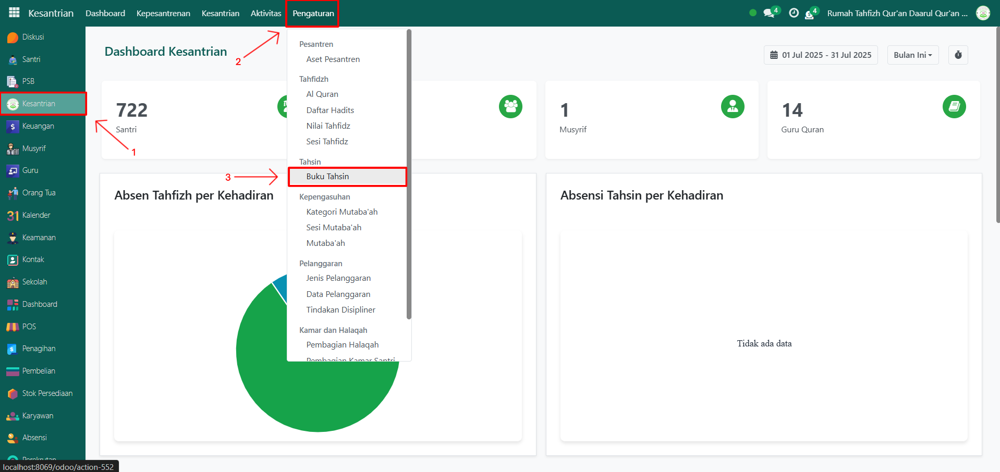
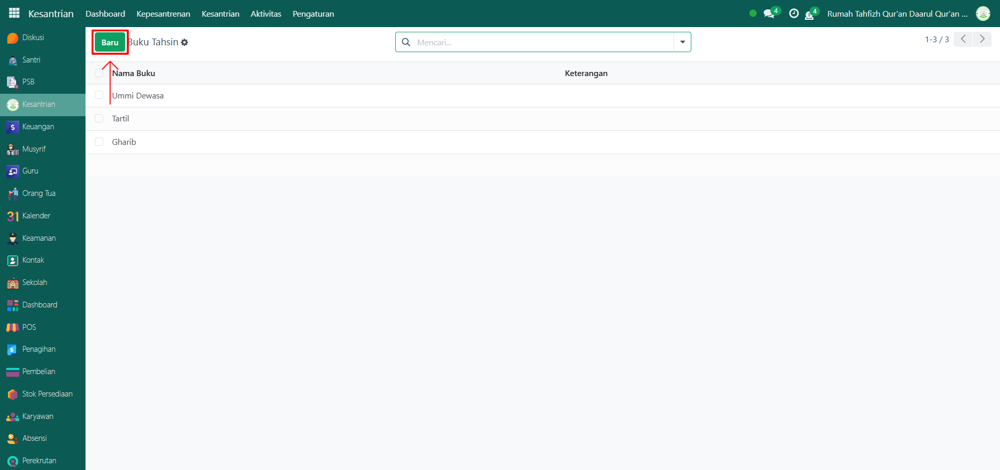
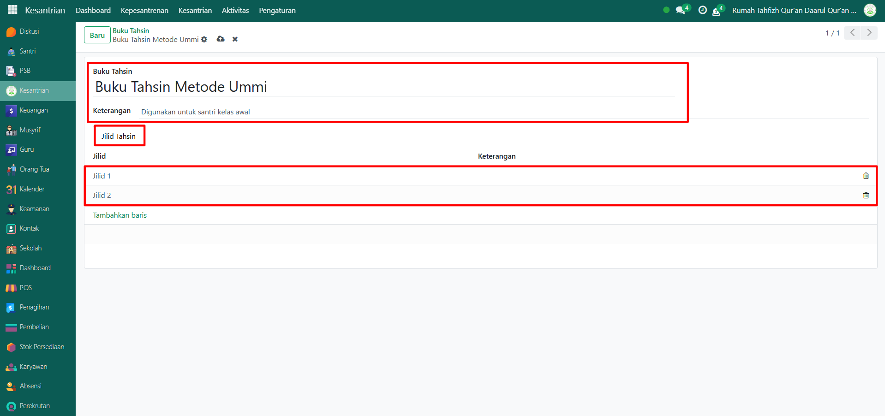

# Buku Tahsin

Video \[]

## Master Data - Buku Tahsin

Data Buku Tahsin pada Odoo Pesantren digunakan untuk menyimpan daftar referensi buku atau modul pembelajaran tahsin yang digunakan dalam proses pengajaran baca tulis Al-Qur’an. Data ini mendukung proses pembelajaran bagi para santri.

### Menambahkan Data Buku Tahsin

Berikut adalah langkah-langkah untuk menambahkan data buku tahsin pada Odoo Pesantren.

1.  Buka modul **Kesantrian**, lalu klik menu **Pengaturan** dan pilih submenu **Buku Tahsin**.

    <figure><figcaption></figcaption></figure>

2.  Klik tombol “Baru” untuk membuat data buku tahsin baru.

    <figure><figcaption></figcaption></figure>

3.  Akan tampil halaman form, isi inputan yang tersedia seperti:

    * Buku Tahsin (isi dengan nama Buku Tahsin yang ada di pesantren)
    * Keterangan (opsional, misalnya atau deskripsi buku catatan tambahan)
    * Jilid Tahsin (isi dengan menambahkan baris dengan data edisi jilid dan keterangan).

    <figure><figcaption></figcaption></figure>

4.  Setelah semua inputan selesai diisi, klik icon **Simpan** di sebelah kanan icon **Gear** agar data Buku Tahsin tersimpan di sistem.

    <figure><figcaption></figcaption></figure>

5. Data Buku Tahsin berhasil disimpan dan dapat digunakan dalam pencatatan tahsin santri.
