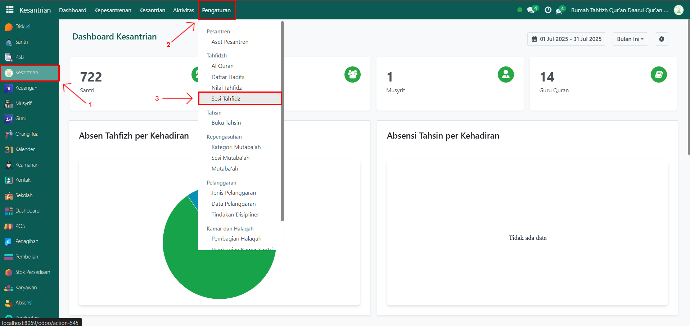
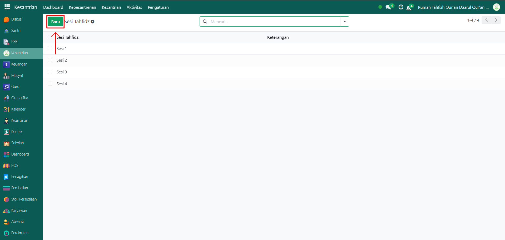
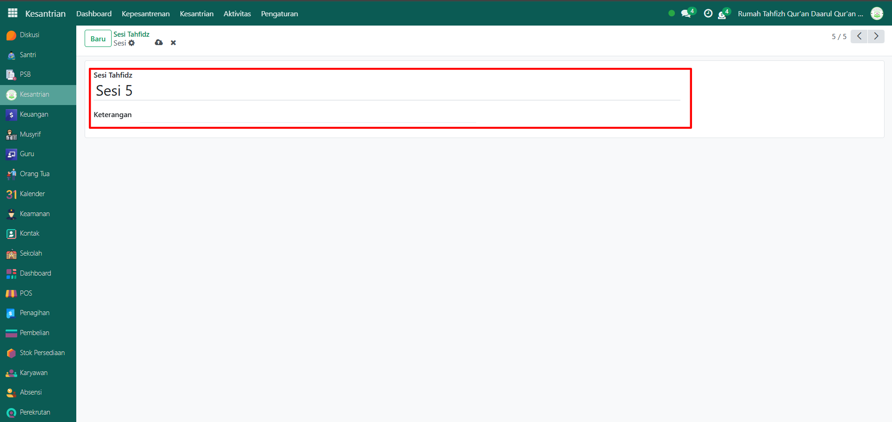
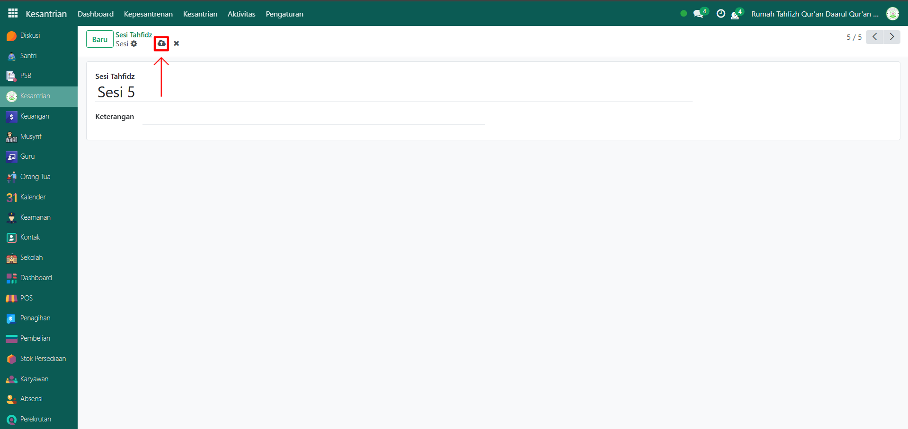

# Sesi Tahfidz

Video \[]

## Master Data - Sesi Tahfidz

Sesi Tahfidz pada Odoo Pesantren digunakan untuk mengatur pembagian waktu atau sesi kegiatan tahfidz Al-Qur’an bagi santri. Dengan adanya sesi, proses penjadwalan hafalan menjadi lebih terstruktur dan mudah dipantau.

### Langkah-Langkah Menambahkan Sesi Tahfidz

Berikut adalah langkah-langkah untuk menambahkan data Sesi Tahfidz pada Odoo Pesantren:

1.  Buka modul **Kesantrian**, lalu klik menu **Pengaturan** dan pilih submenu **Sesi Tahfidz**.

    <figure><figcaption></figcaption></figure>

2.  Klik tombol **“Baru”** untuk membuat data sesi tahfidz baru.

    <figure><figcaption></figcaption></figure>

3.  Akan tampil halaman form, isi inputan yang tersedia seperti:

    * **Nama Sesi Tahfidz** (misalnya: Sesi 5)
    * **Keterangan** (opsional, untuk memberikan catatan tambahan terkait sesi)

    <figure><figcaption></figcaption></figure>

4.  Setelah semua inputan diisi dengan benar, klik icon **Simpan** di sebelah kanan icon Gear agar data Sesi Tahfidz tersimpan di sistem.

    <figure><figcaption></figcaption></figure>

5. Data Sesi Tahfidz berhasil disimpan dan dapat digunakan dalam pencatatan kegiatan tahfidz santri.
