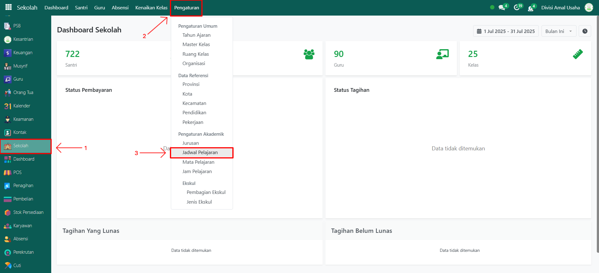
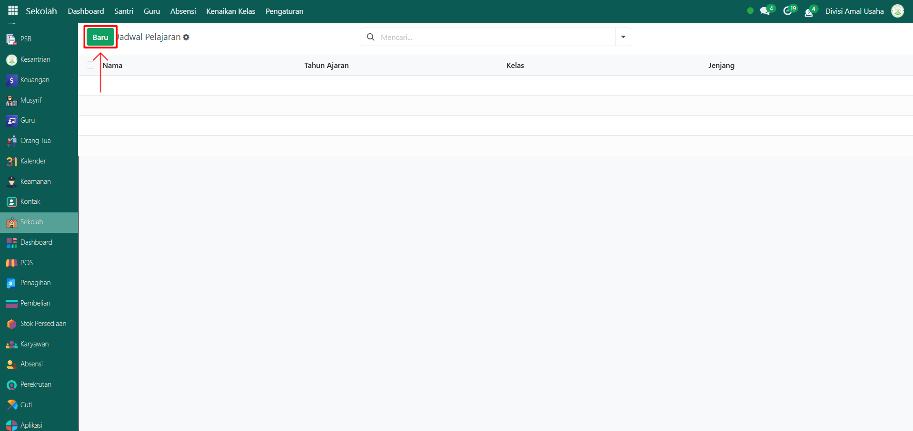
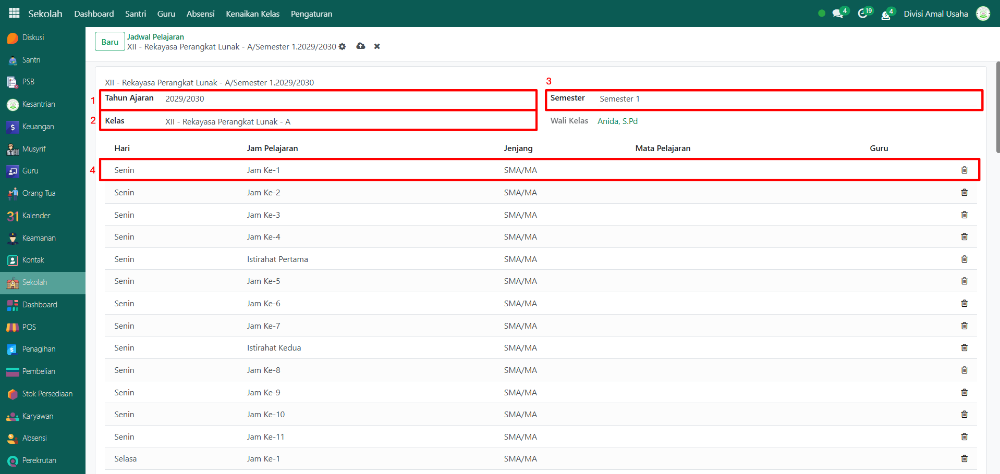
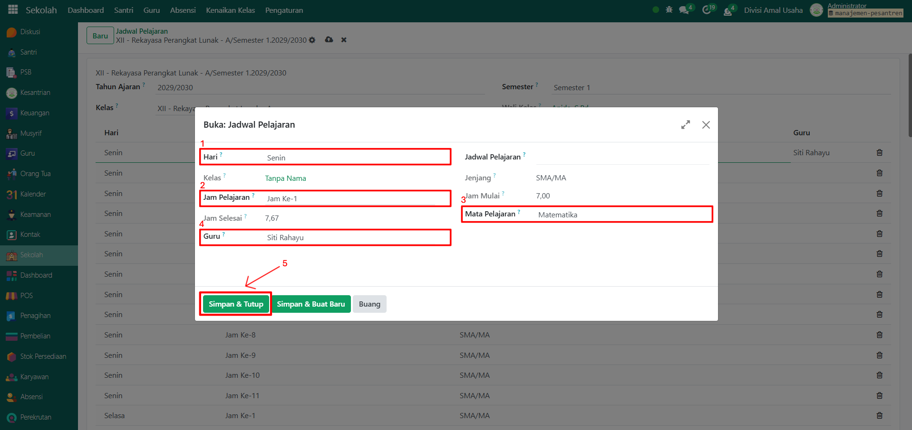
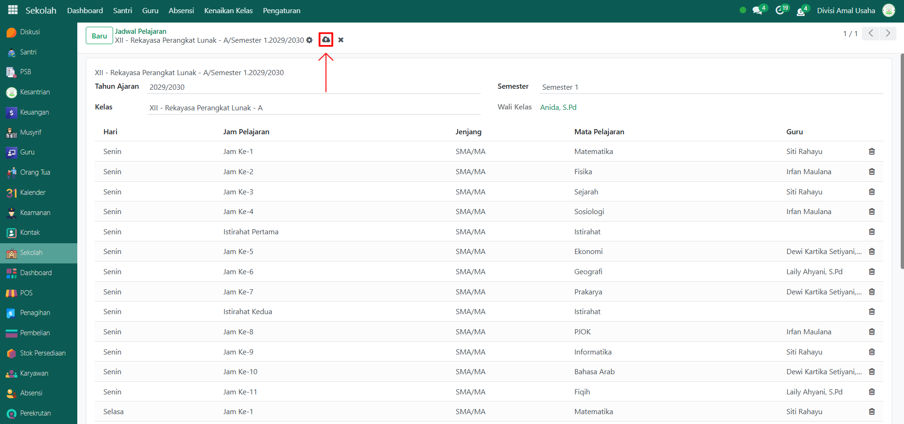

# Jadwal Pelajaran

Video \[]

## Master Data - Jadwal Pelajaran

Menu **Jadwal Pelajaran** digunakan untuk menyusun dan mengatur waktu belajar santri sesuai tahun ajaran, kelas, semester, mata pelajaran, dan guru yang mengajar. Data ini menjadi acuan utama dalam kegiatan belajar mengajar agar jadwal berjalan tertib dan terstruktur.

### Langkah-Langkah Mengatur Jadwal Pelajaran

Berikut adalah langkah-langkah untuk mengatur jadwal pelajaran pada Odoo Pesantren.

1.  Buka modul **Sekolah**, lalu klik menu **Pengaturan** dan pilih submenu **Jadwal Pelajaran**.

    <figure><figcaption></figcaption></figure>

2.  Klik tombol **"Baru"** untuk membuat data jadwal pelajaran baru.

    <figure><figcaption></figcaption></figure>

3.  Akan tampil halaman form, isi inputan yang tersedia seperti:

    * **Tahun Ajaran** (misalnya: _2029/2030_)
    * **Kelas** (misalnya: _XII - Rekayasa Perangkat Lunak - A_)
    * **Semester** (misalnya: _Semester 1_)
    * **List Tabel Jadwal Pelajaran** untuk mengatur detail jadwal harian.

    <figure><figcaption></figcaption></figure>

4.  Untuk mengisi detail jadwal, klik salah satu baris pada tabel (misalnya: _Hari Senin, Jam Ke-1_) hingga muncul pop-up form, lalu isi inputannya:

    * **Hari** (misalnya: _Senin_)
    * **Kelas** (otomatis terisi sesuai jadwal)
    * **Jam Pelajaran** (misalnya: _Jam Ke-1_)
    * **Mata Pelajaran** (pilih mata pelajaran)
    * **Guru** (pilih guru yang mengajar sesuai mata pelajaran).

    Jika sudah klik tombol **Simpan & Tutup** untuk menyimpan detail jadwal harian.

    <figure><figcaption></figcaption></figure>

5. Ulangi langkah tersebut untuk melengkapi jadwal pada hari-hari lain (misalnya: Selasa–Sabtu).
6.  Setelah seluruh jadwal terisi, lalu klik ikon **Simpan** di sebelah kanan ikon **Gear** agar jadwal pelajaran tersimpan di sistem.

    <figure><figcaption></figcaption></figure>
