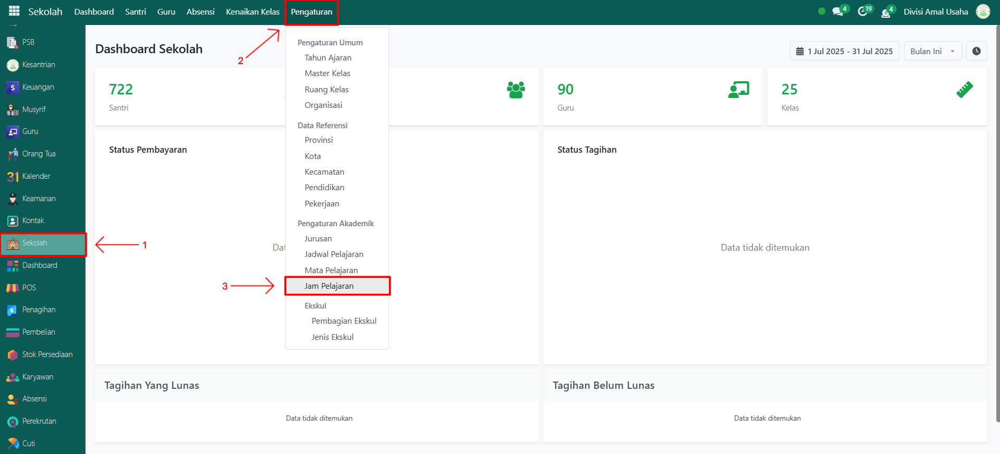

# Jam Pelajaran

Video \[]

## Master Data - Jam Pelajaran

Data **Jam Pelajaran** digunakan untuk mengatur waktu pelajaran dalam satu hari, termasuk jam ke berapa, waktu mulai, dan waktu selesai. Data ini menjadi acuan dalam penyusunan jadwal pelajaran agar kegiatan belajar mengajar berjalan teratur.

### Menambahkan Data Jam Pelajaran

Berikut adalah langkah-langkah untuk menambahkan data jam pelajara pada Odoo Pesantren.

1. Login menggunakan akun administrator. Jika Anda belum memahami cara login sebagai admin, silakan lihat panduan [**Login Admin** di sini](../../panduan-login/login-admin.md).
2.  Buka modul **Sekolah**, lalu klik menu **Pengaturan** kemudian pilih submenu **Jam Pelajaran**.

    <figure><figcaption></figcaption></figure>

3.  Klik tombol **"Baru"** untuk membuat data jam pelajaran baru

    <figure><figcaption></figcaption></figure>

4.  Akan tampil halaman form, isi inputan yang tersedia seperti:

    * **Nama** (misalnya: _Jam Ke-11_).
    * **Jam Mulai** (jam mulai pelajaran).
    * **Jam Selesai** (jam berakhirnya pelajaran).

    <figure><figcaption></figcaption></figure>

5.  Setelah semua inputan diisi dengan benar, klik ikon **Simpan** di sebelah kanan ikon **Gear** agar data jam pelajaran tersimpan di sistem.

    <figure><figcaption></figcaption></figure>

6. Data jam pelajaran berhasil disimpan dan dapat digunakan dalam penyusunan jadwal pelajaran secara otomatis.

### Edit dan Hapus Data Jam Pelajaran

Untuk mengedit suatu data jam pelajaran, silahkan pilih terlebih dahulu data mana yang akan diedit. Editlah data jam pelajaran dan klik icon **Simpan** untuk menyimpan data perubahan tersebut.

Untuk menghapus suatu data jam pelajaran adalah dengan pilih data mana yang akan dihapus, kemudian klik icon **Gear** atau **Action** lalu pilih opsi **Hapus**, maka akan tampil dialog konfirmasi apakah anda ingin menghapus data tersebut. Jika ya, klik **Hapus** jika tidak maka klik **Tidak, tetap simpan**.

***


Data **Jam Pelajaran** tidak dapat dihapus apabila sudah terdapat transaksi yang berhubungan dengan data tersebut. Jika belum ada transaksi yang tercatat, maka data masih dapat dihapus dari sistem.

