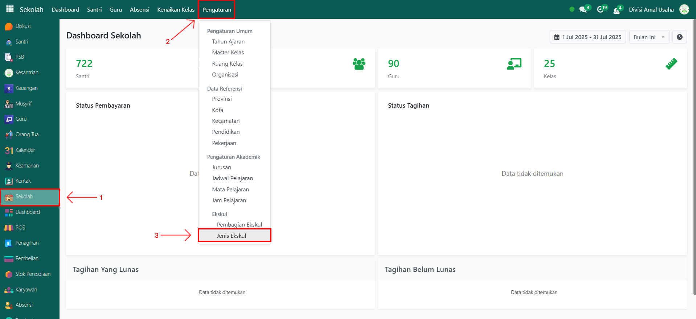
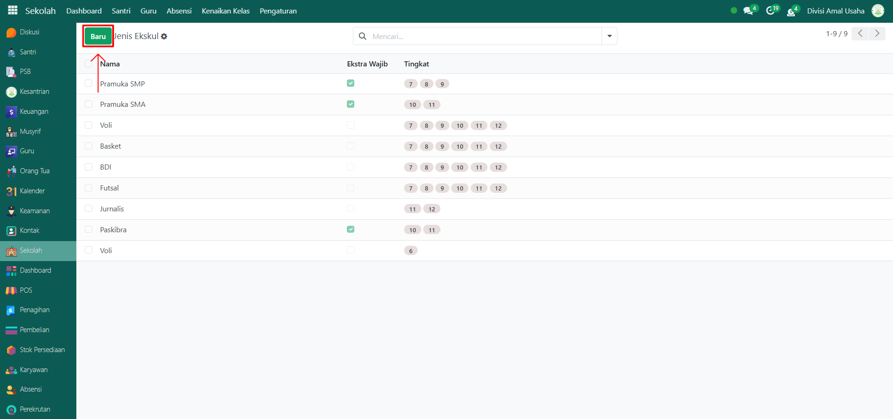
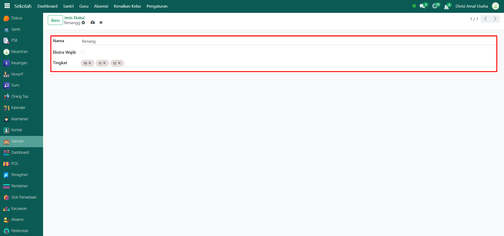
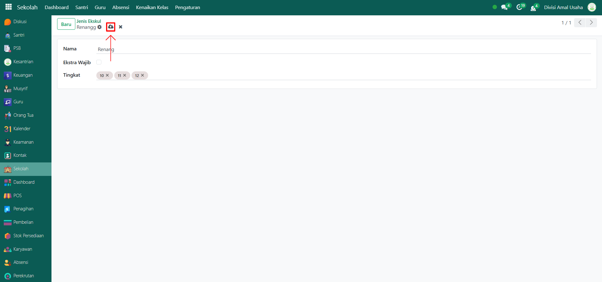

# Jenis Ekskul

Video \[]

## Master Data - Jenis Ekskul

Menu **Jenis Ekskul** digunakan untuk mendefinisikan jenis-jenis kegiatan ekstrakurikuler yang tersedia di pesantren, baik yang bersifat wajib maupun pilihan. Data ini akan menjadi acuan utama dalam pengelolaan aktivitas ekstrakurikuler santri sesuai tingkat kelas masing-masing.

### Menambahkan Data Jenis Ekskul

Berikut adalah langkah-langkah untuk menambahkan data jenis ekskul pada Odoo Pesantren.

1.  Buka modul **Sekolah**, lalu klik menu **Pengaturan** dan pilih submenu **Jenis Ekskul**.

    <figure><figcaption></figcaption></figure>

2.  Klik tombol **"Baru"** untuk membuat data Jenis Ekskul baru.

    <figure><figcaption></figcaption></figure>

3.  Akan tampil halaman form, isi inputan yang tersedia seperti:

    * **Nama Jenis Ekskul** (misalnya: Pramuka, Pencak Silat, Hadroh)
    * **Ekstra Wajib** (aktifkan jika ekskul ini wajib diikuti oleh santri)
    * **Tingkat** (misalnya: 10, 11, 12) untuk menentukan kelas yang bisa mengikuti ekskul tersebut.

    <figure><figcaption></figcaption></figure>

4.  Setelah semua inputan diisi dengan benar, klik ikon **Simpan** di sebelah kanan ikon **Gear** agar data Jenis Ekskul tersimpan di sistem.

    <figure><figcaption></figcaption></figure>

5. Data Jenis Ekskul berhasil disimpan dan dapat digunakan saat mengatur kegiatan ekstrakurikuler santri.

### Edit dan Hapus Data Jenis Ekskul

Untuk mengedit suatu data jenis ekskul, silahkan pilih terlebih dahulu data mana yang akan diedit. Editlah datajenis ekskul dan klik icon **Simpan** untuk menyimpan data perubahan tersebut.

Untuk menghapus suatu data jenis ekskul adalah dengan pilih data mana yang akan dihapus, kemudian klik icon **Gear** atau **Action** lalu pilih opsi **Hapus**, maka akan tampil dialog konfirmasi apakah anda ingin menghapus data tersebut. Jika ya, klik **Hapus** jika tidak maka klik **Tidak, tetap simpan**.

***


Data ini **dapat dihapus**, namun apabila sudah terdapat transaksi yang terkait dengan data tersebut, **disarankan untuk tidak menghapusnya** demi menjaga konsistensi dan keakuratan data transaksi di sistem.

