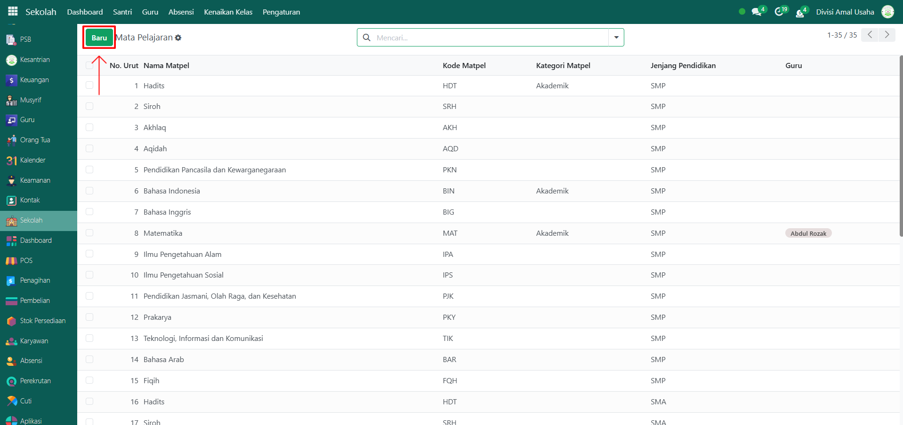
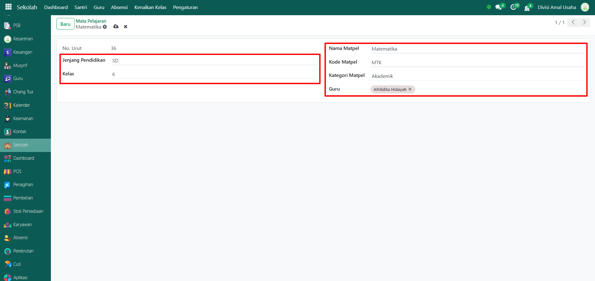
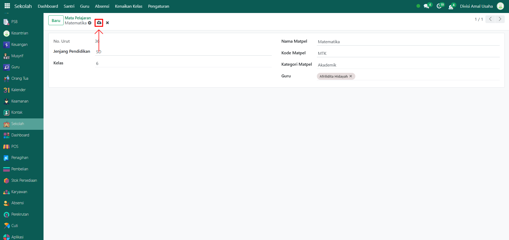

# Mata Pelajaran



## Master Data - Mata Pelajaran

Data **Mata Pelajaran** digunakan untuk mencatat daftar pelajaran yang diajarkan di pesantren sesuai jenjang pendidikan dan kelas, baik pelajaran umum, diniyyah, tahfidz, maupun ekstrakurikuler. Data ini menjadi dasar dalam penyusunan jadwal pelajaran, penilaian, serta administrasi akademik.

### Menambahkan Data Mata Pelajaran

Berikut adalah langkah-langkah untuk menambahknan data mata pelajaran pada Odoo Pesantren.

1. Login menggunakan akun administrator. Jika Anda belum memahami cara login sebagai admin, silakan lihat panduan [**Login Admin** di sini](../../panduan-login/login-admin.md).
2.  Buka modul **Sekolah**, lalu klik menu **Pengaturan** kemudian pilih submenu **Mata Pelajaran.**

    <figure><figcaption></figcaption></figure>

3.  Klik tombol **"Baru"** untuk membuat data mata pelajaran baru.

    <figure><figcaption></figcaption></figure>

4.  Akan tampil halaman form, isi inputan yang tersedia seperti:

    * **Jenjang Pendidikan** (pilih jenjang pendidikan yang ada).
    * **Kelas** (pilih kelas sesuai jenjang pendidikan yang dipilih).
    * **Nama Mata Pelajaran** (masukkan nama mata pelajaran yang akan dibuat).
    * **Kode Mata Pelajaran** (masukkan kode mata pelajaran untuk memberi identitas mata pelajaran).
    * **Kategori Mata Pelajaran** (Akademik, Diniyyah, Tahfidz, Ekstrakurikuler, atau Lainnya).
    * **Guru** (pilih guru yang sudah tersimpan pada sistem).

    <figure><figcaption></figcaption></figure>

5.  Setelah semua inputan diisi dengan benar, klik ikon **Simpan** di sebelah kanan ikon **Gear** agar data mata pelajaran tersimpan di sistem.

    <figure><figcaption></figcaption></figure>

6. Data mata pelajaran berhasil disimpan dan dapat digunakan untuk penyusunan jadwal pelajaran maupun kegiatan akademik lainnya.

### Edit dan Hapus Data Mata Pelajaran

Untuk mengedit suatu data mata pelajaran, silahkan pilih terlebih dahulu data mana yang akan diedit. Editlah data produk dan klik icon **Simpan** untuk menyimpan data perubahan tersebut.

Untuk menghapus suatu data mata pelajaran adalah dengan pilih data mana yang akan dihapus, kemudian klik icon **Gear** atau **Action** lalu pilih opsi **Hapus**, maka akan tampil dialog konfirmasi apakah anda ingin menghapus data tersebut. Jika ya, klik **Hapus** jika tidak maka klik **Tidak, tetap simpan**.

***


Data **Mata Pelajaran** tidak dapat dihapus apabila sudah terdapat transaksi yang berhubungan dengan data tersebut. Jika belum ada transaksi yang tercatat, maka data masih dapat dihapus dari sistem.

