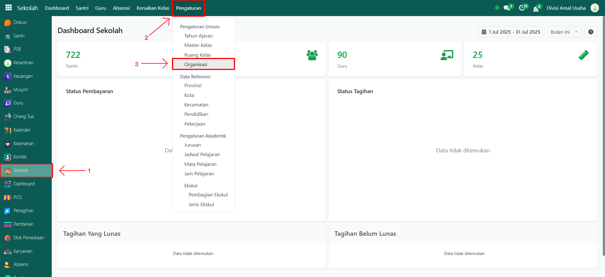
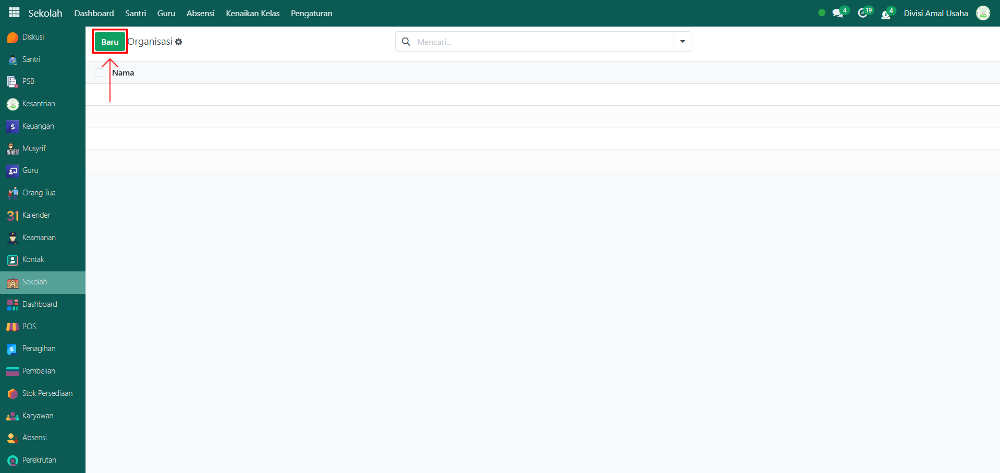
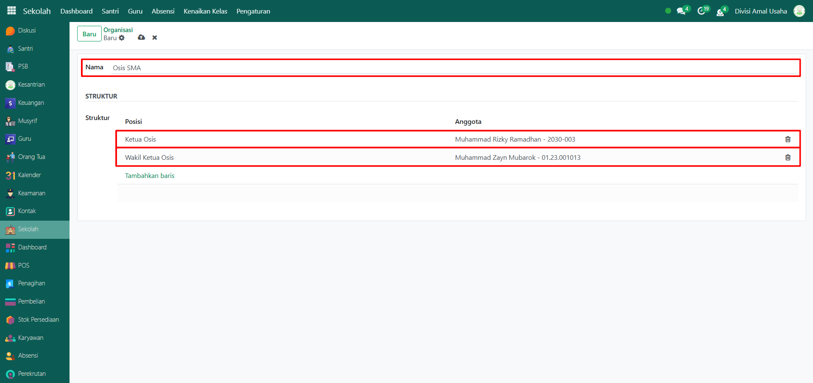
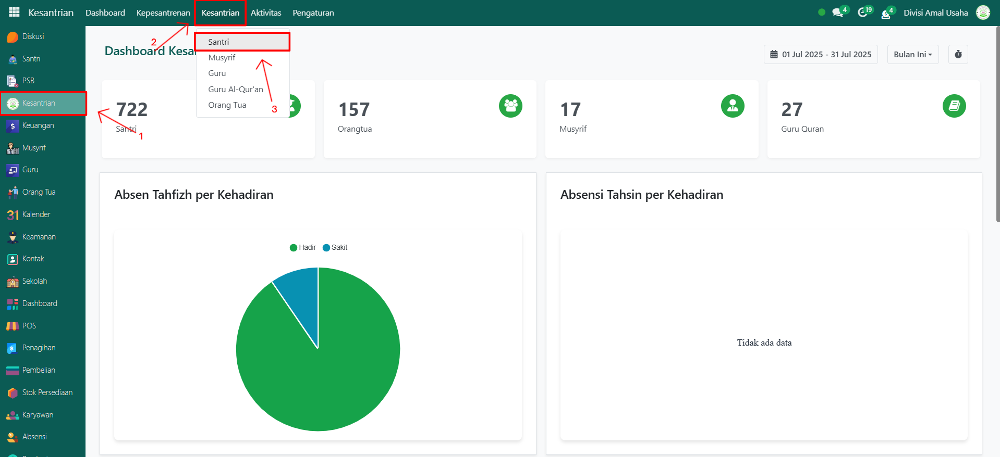
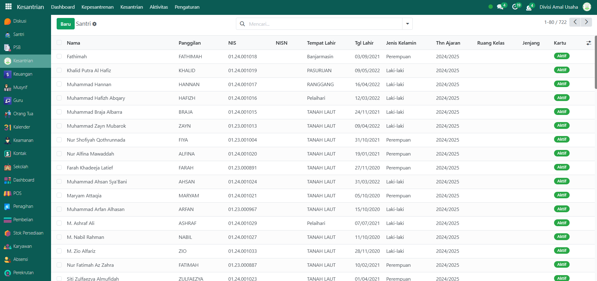
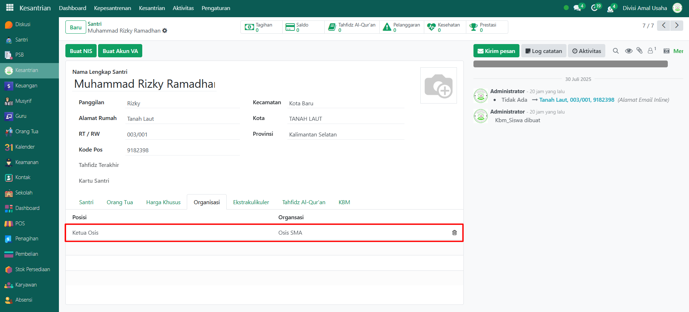

# Organisasi Siswa

Video \[]

## Master Data - Organisasi Siswa

Menu **Organisasi Siswa** digunakan untuk mencatat data organisasi yang ada di pesantren, seperti OSIS, Rohis, Pramuka, atau organisasi lain. Fitur ini juga memungkinkan menambahkan struktur organisasi dengan menentukan santri yang menjadi anggota beserta jabatannya.

### Menambahkan Data Organisasi Siswa

Berikut adalah langkah-langkah untuk menambahkan data organisasi siswa pada Odoo Pesantren.

1.  Buka modul **Sekolah**, lalu klik menu **Pengaturan** dan pilih submenu **Organisasi**.

    <figure><figcaption></figcaption></figure>

2.  Klik tombol **"Baru"** untuk membuat data organisasi siswa baru.

    <figure><figcaption></figcaption></figure>

3.  Akan tampil halaman form, isi inputan yang tersedia seperti:

    * **Nama Organisasi** (misalnya: OSIS SMA).
    * **Struktur**, tambahkan santri yang sudah tersimpan pada data santri beserta posisinya di dalam organisasi.

    <figure><figcaption></figcaption></figure>

4.  Setelah semua inputan diisi dengan benar, klik ikon **Simpan** di sebelah kanan ikon **Gear** agar data organisasi tersimpan di sistem.

    <figure><figcaption></figcaption></figure>

5.  Untuk melihat keterkaitan santri dengan organisasi, buka **modul Kesantrian**, lalu klik submenu **Santri**.&#x20;

    <figure><figcaption></figcaption></figure>

6.  Pilih santri yang menjadi anggota organisasi, maka organisasi yang telah dibuat akan muncul secara otomatis pada profil santri tersebut.

    <figure><figcaption></figcaption></figure>

7.  Data organisasi siswa berhasil disimpan dan dapat digunakan untuk keperluan administrasi maupun pelacakan keanggotaan santri.

    <figure><figcaption></figcaption></figure>
