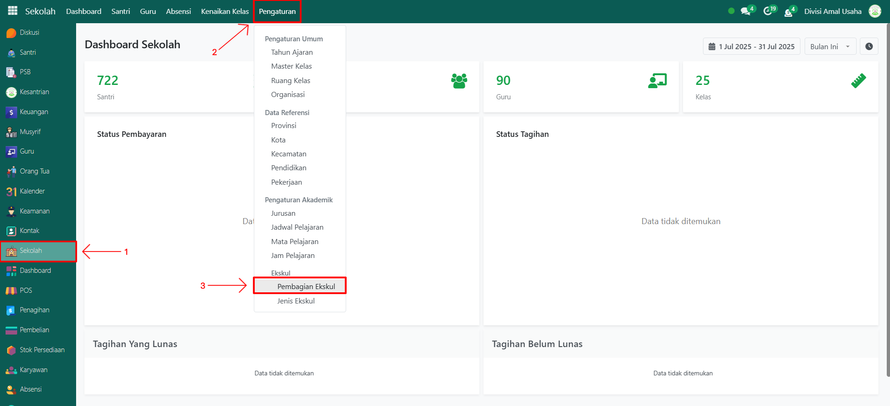
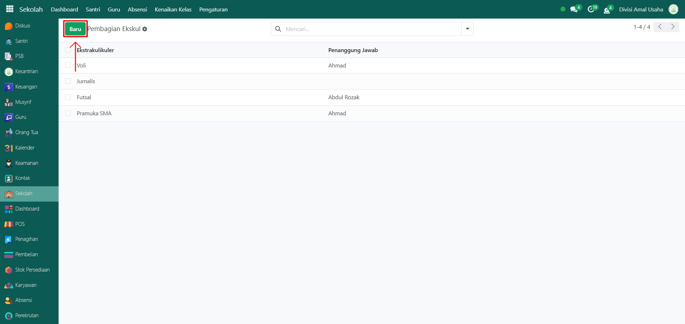
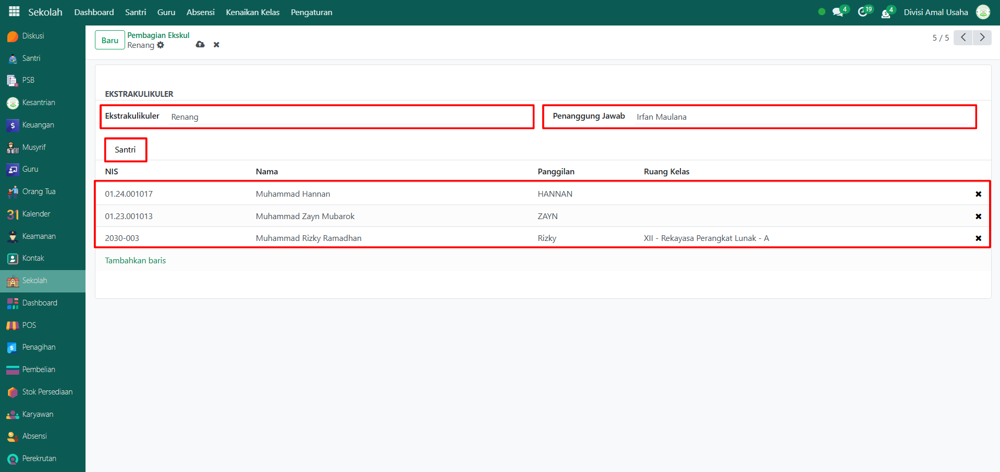

# Pembagian Ekskul

Video \[]

## Master Data - Pembagian Ekskul

Menu **Pembagian Ekskul** digunakan untuk mengatur distribusi santri ke dalam kegiatan ekstrakurikuler yang sudah didefinisikan. Melalui menu ini, admin atau pengelola dapat menentukan santri mana saja yang mengikuti jenis ekskul tertentu beserta penanggung jawabnya.

### Melakukan Pembagian Ekskul

Berikut adalah langkah-langkah untuk melakukan pembagian ekskul pada Odoo Pesantren.

1.  Buka modul **Sekolah**, lalu klik menu **Pengaturan** dan pilih submenu **Pembagian Ekskul**.

    <figure><figcaption></figcaption></figure>

2.  Klik tombol **"Baru"** untuk membuat data Pembagian Ekskul baru.

    <figure><figcaption></figcaption></figure>

3.  Akan tampil halaman form, isi inputan yang tersedia seperti:

    * **Jenis Ekstrakurikuler** (misalnya: Pramuka, Hadroh, Pencak Silat)
    * **Penanggung Jawab** (isi dengan guru atau pembina ekskul yang bertanggung jawab)
    * **Tab Santri** → isi dengan data santri yang sudah tersimpan di sistem dan ditugaskan mengikuti ekskul tersebut.

    <figure><figcaption></figcaption></figure>

4.  Setelah semua inputan diisi dengan benar, klik ikon **Simpan** di sebelah kanan ikon **Gear** agar data Pembagian Ekskul tersimpan di sistem.

    <figure><figcaption></figcaption></figure>

5. Data Pembagian Ekskul berhasil disimpan dan dapat digunakan untuk mengelola kegiatan ekstrakurikuler santri sesuai jenis ekskul yang diikuti.
