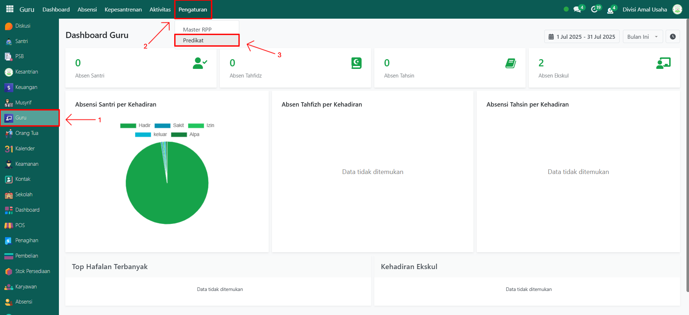
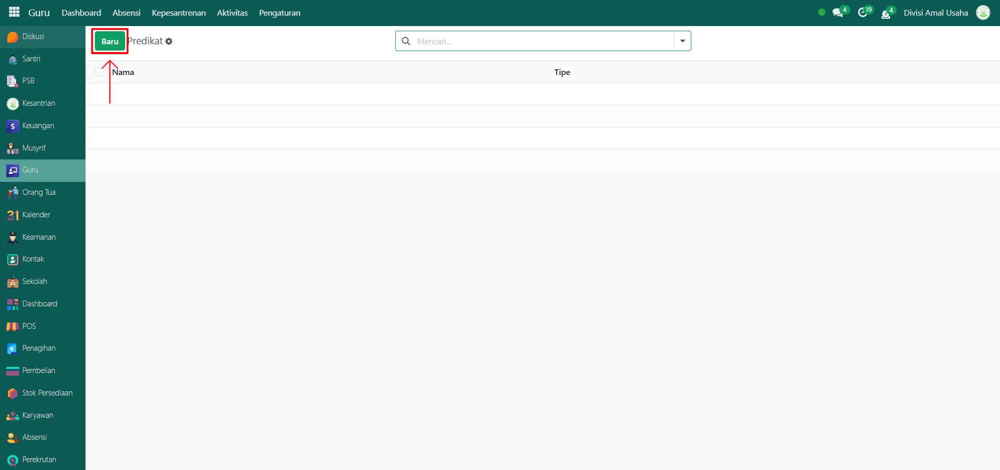
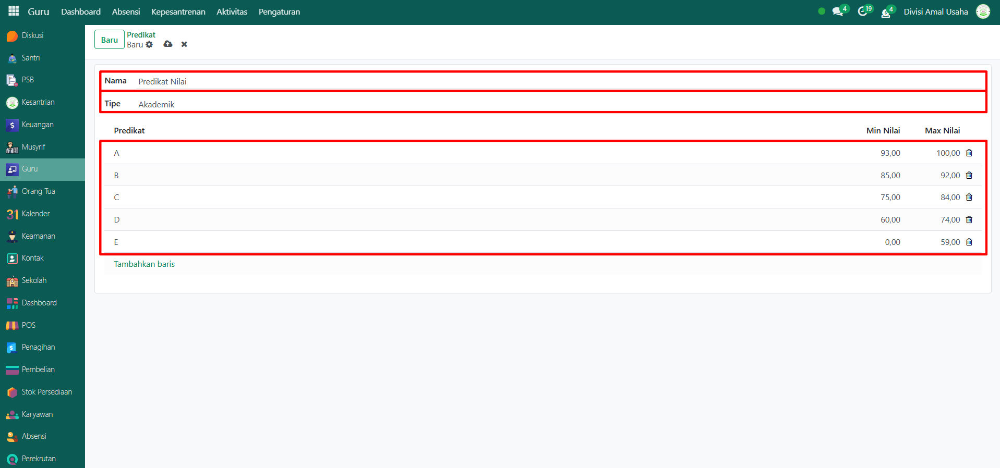
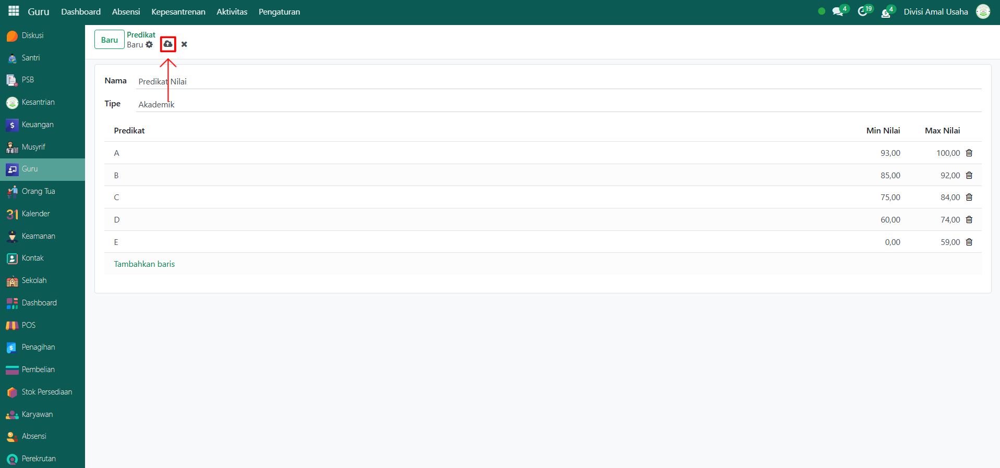

# Predikat Nilai

Video \[]

## Master Data - Predikat Nilai

Menu **Predikat Nilai** digunakan untuk menentukan standar penilaian santri baik pada aspek akademik maupun ekstrakurikuler. Melalui menu ini, sistem dapat mengkategorikan nilai ke dalam predikat tertentu (A, B, C, D, E) sesuai dengan rentang nilai minimum dan maksimum yang sudah ditentukan.

### Langkah-Langkah Menambahkan Predikat Nilai

Berikut adalah langkah-langkah untuk menambahkan predikat nilai pada Odoo Pesantren.

1.  Buka **modul Guru**, lalu klik menu **Pengaturan** dan pilih submenu **Predikat Nilai**.

    <figure><figcaption></figcaption></figure>

2.  Klik tombol **"Baru"** untuk membuat data Predikat Nilai baru.

    <figure><figcaption></figcaption></figure>

3.  Akan tampil halaman form, isi inputan yang tersedia seperti:

    * **Nama Predikat Nilai** (misalnya: Predikat Akademik)
    * **Tipe** (pilih: Akademik atau Ekstrakurikuler)
    * **List Tabel Daftar Predikat Nilai**, isi dengan:
      * **Predikat** (misalnya: A, B, C, D, E)
      * **Nilai Minimum** (contoh: 85)
      * **Nilai Maksimum** (contoh: 100)

    <figure><figcaption></figcaption></figure>

4.  Setelah semua inputan diisi dengan benar, klik ikon **Simpan** di sebelah kanan ikon **Gear** agar data Predikat Nilai tersimpan di sistem.

    <figure><figcaption></figcaption></figure>

5. Data Predikat Nilai berhasil disimpan dan dapat digunakan secara otomatis dalam proses penilaian santri.
