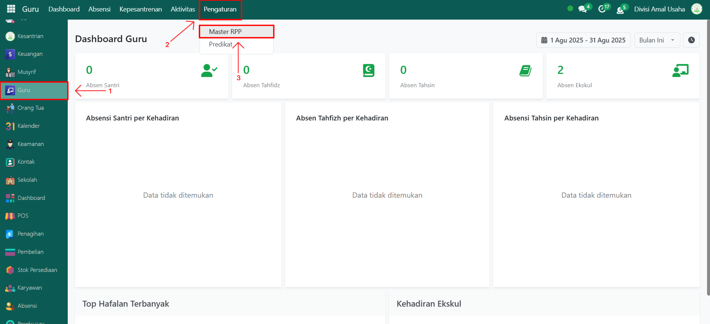
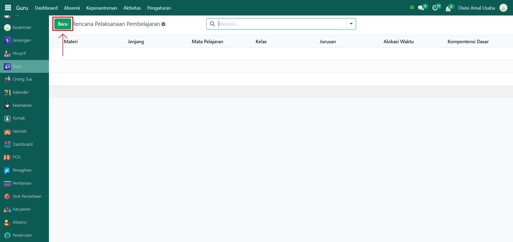
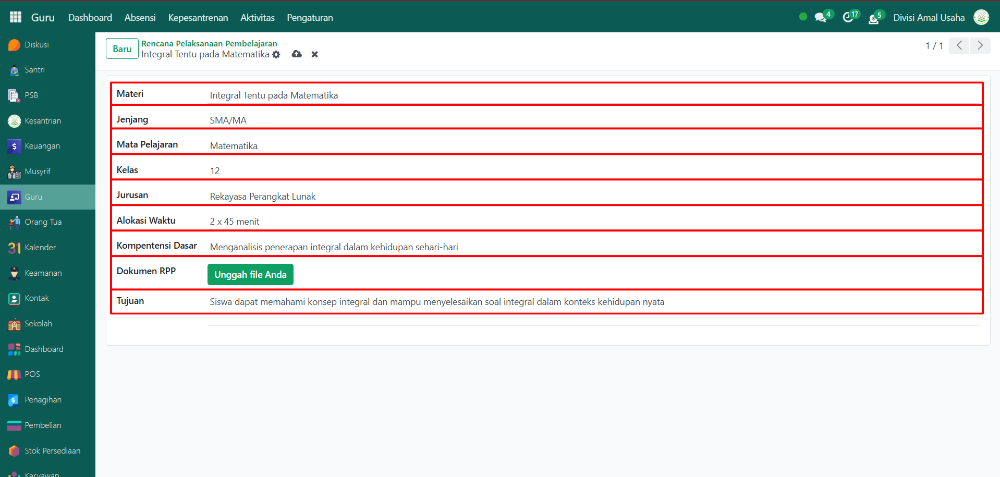
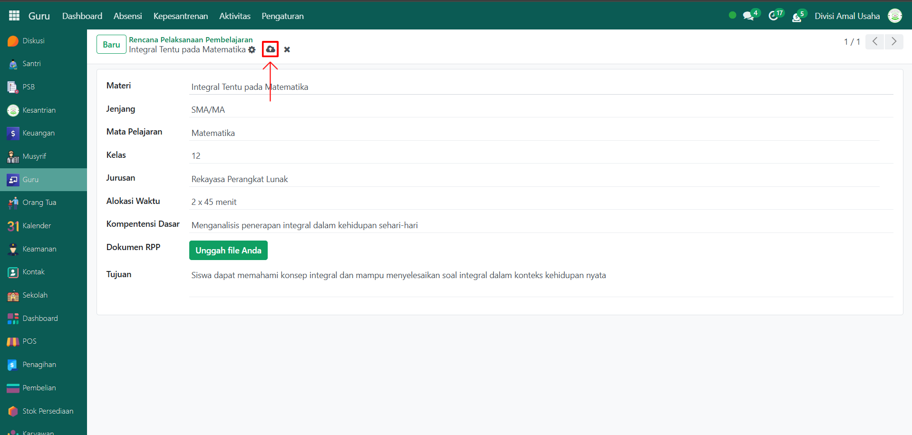

# Rencana Pelaksanaan Pembelajaran

Video \[]

## Master Data - Rencana Pelaksanaan Pembelajaran

Data **Rencana Pelaksanaan Pembelajaran (RPP)** adalah dokumen perencanaan yang berisi tujuan, materi, metode, dan langkah-langkah pembelajaran yang digunakan guru dalam proses belajar mengajar. Pada Odoo Pesantren, data RPP dapat ditambahkan dan dikelola agar sesuai dengan kurikulum yang berlaku.

### Menambahkan Rencana Pelaksanaan Pembelajaran (RPP)

Berikut adalah langkah-langkah untuk menambahkan rencana pelaksanaan pembelajaran pada Odoo Pesantren.

1. Login menggunakan akun administrator atau guru. Jika Anda belum memahami cara login sebagai admin atau guru, silakan lihat panduan [**Login Admin** di sini](../../panduan-login/login-admin.md) dan [**Login Guru** di sini](../../setup-and-konfigurasi/role-and-hak-akses-pengguna/panduan-login/login-guru.md).
2.  Buka modul **Guru**, lalu klik menu **Pengaturan** kemudian pilih submenu **Master RPP**.

    <figure><figcaption></figcaption></figure>

3.  Klik tombol **"Baru"** untuk membuat data Rencana Pelaksanaan Pembelajaran.

    <figure><figcaption></figcaption></figure>

4.  Akan tampil halaman form, kemudian isi inputan yang tersedia seperti:

    * **Materi** (misalnya: Integral Tentu pada Matematika).
    * **Jenjang** (misalnya: SMA/MA).
    * **Mata Pelajaran** (misalnya: Matematika, sesuaikan dengan mata pelajaran yang telah dibuat/konfigurasi).
    * **Kelas** (misalnya: 12).
    * **Jurusan** (misalnya: Rekayasa Perangkat Lunak).
    * **Alokasi Waktu** (misalnya: 2 x 45 menit).
    * **Kompetensi Dasar** (misalnya: Menganalisis penerapan integral dalam kehidupan sehari-hari)
    * **Dokumen RPP** (unggah file dokumen RPP dalam format PDF atau DOC)
    * **Tujuan Pembelajaran** (misalnya: Siswa dapat memahami konsep integral dan mampu menyelesaikan soal integral dalam konteks kehidupan nyata).

    <figure><figcaption></figcaption></figure>

5.  Setelah semua inputan diisi dengan benar, klik ikon **Simpan** di sebelah kanan ikon **Gear** agar data RPP tersimpan di sistem.

    <figure><figcaption></figcaption></figure>

6. Data RPP yang berhasil disimpan dapat digunakan oleh guru sebagai acuan pembelajaran pada absensi santri.

### Edit dan Hapus Data Rencana Pelaksanaan Pembelajaran

Untuk mengedit suatu data rencana pelaksanaan pembelajaran, silahkan pilih terlebih dahulu data mana yang akan diedit. Editlah data rencana pelaksanaan pembelajaran dan klik icon **Simpan** untuk menyimpan data perubahan tersebut.

Untuk menghapus suatu data rencana pelaksanaan pembelajaran adalah dengan pilih data mana yang akan dihapus, kemudian klik icon **Gear** atau **Action** lalu pilih opsi **Hapus**, maka akan tampil dialog konfirmasi apakah anda ingin menghapus data tersebut. Jika ya, klik **Hapus** jika tidak maka klik **Tidak, tetap simpan**.

***


Data ini **dapat dihapus**, namun apabila sudah terdapat transaksi yang terkait dengan data tersebut, **disarankan untuk tidak menghapusnya** demi menjaga konsistensi dan keakuratan data transaksi di sistem.

