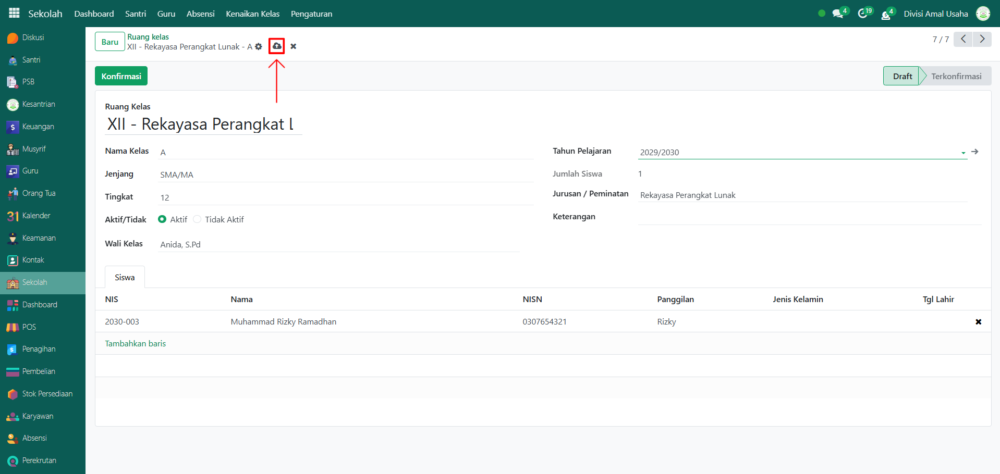

# Ruang Kelas



## Master Data - Ruang Kelas

Data **Ruang Kelas** digunakan untuk mencatat dan mengelola data kelas yang ada di pesantren. Dengan adanya data ruang kelas, admin atau pengelola sekolah dapat menetapkan wali kelas, jurusan, jumlah santri dalam kelas tersebut, serta mengaitkannya langsung dengan data santri yang sudah terdaftar.

### Menambahkan Data Ruang Kelas

Berikut adalah langkah-langkah untuk menambahkan data ruang kelas pada Odoo Pesantren.

1. Login menggunakan akun administrator. Jika Anda belum memahami cara login sebagai admin, silakan lihat panduan [**Login Admin** di sini](../../panduan-login/login-admin.md).
2.  Buka modul **Sekolah**, lalu klik menu **Pengaturan** kemudian pilih submenu **Ruang Kelas**.

    <figure><figcaption></figcaption></figure>

3.  Klik tombol **“Baru”** untuk membuat data Ruang Kelas baru.

    <figure><figcaption></figcaption></figure>

4.  Akan tampil halaman form, isi inputan yang tersedia seperti:

    * **Nama Ruang Kelas** (pilih nama ruang kelas dengan master kelas yang ada).
    * **Aktif/Tidak** (pilih tombol radio "Aktif" jika ingin mengaktifkan, sebaliknya pilih "Tidak Aktif" jika ruang kelas tidak dipakai).
    * **Wali Kelas** (pilih wali kelas yang akan mengampu kelas tersebut).
    * **Tahun Pelajaran** (pilih tahun ajaran yang saat ini aktif).
    * **Jumlah Siswa** (akan terisi otomatis berdasarkan santri yang ditambahkan ke kelas ini).
    * **Jurusan / Peminatan** (pilih jurusan yang ingin dimasukkan sebagai peminatan pada kelas tersebut).
    * **Keterangan** (opsional, untuk informasi tambahan seperti lokasi ruang kelas).
    * **Tab Santri** (tambahkan santri yang sudah ada dalam sistem untuk dimasukkan ke ruang kelas tersebut).

    <figure><figcaption></figcaption></figure>

5.  Setelah semua inputan diisi dengan benar, klik icon **Simpan** di sebelah kanan icon **Gear** agar data ruang kelas tersimpan dan statusnya menjadi **Draft**.

    <figure><figcaption></figcaption></figure>

6.  Jika ruang kelas sudah final dan terverifikasi oleh pihak pesantren, klik tombol **"Konfirmasi"** untuk mengaktifkan ruang kelas tersebut.

    <figure><figcaption></figcaption></figure>

7.  Data ruang kelas yang berhasil disimpan dan dikonfirmasi dapat digunakan dalam proses akademik seperti absensi, jadwal pelajaran, dan penilaian.

    <figure><figcaption></figcaption></figure>

### Edit dan Hapus Data Ruang Kelas

Untuk mengedit suatu data ruang kelas, silahkan pilih terlebih dahulu data mana yang akan diedit. Setelah masuk pada halaman form ruang kelas, klik tombol **"Draft"** untu mulai mengedit data. Editlah data ruang kelas dan klik icon **Simpan** untuk menyimpan data perubahan tersebut dan klik tombol **"Konfirmasi"** untuk mengkonfirmasi data ruang kelas.

Untuk menghapus suatu data ruang kelas adalah dengan pilih data mana yang akan dihapus, kemudian klik icon **Gear** atau **Action** lalu pilih opsi **Hapus**, maka akan tampil dialog konfirmasi apakah anda ingin menghapus data tersebut. Jika ya, klik **Hapus** jika tidak maka klik **Tidak, tetap simpan**.

***


Data **Ruang Kelas** tidak dapat dihapus apabila sudah terdapat transaksi yang berhubungan dengan data tersebut. Jika belum ada transaksi yang tercatat, maka data masih dapat dihapus dari sistem.

