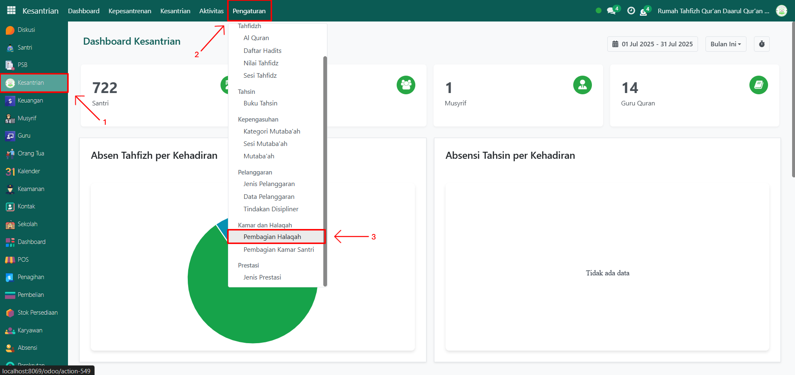
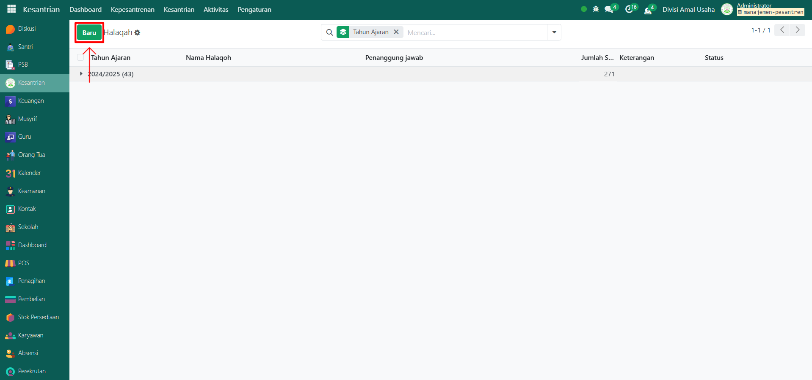
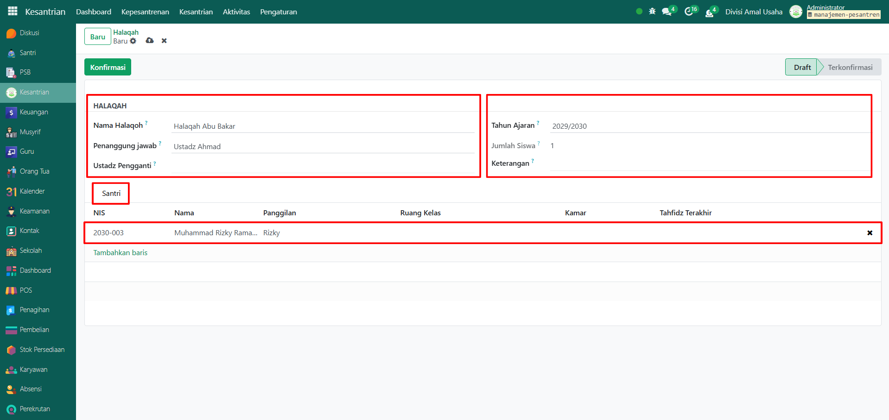
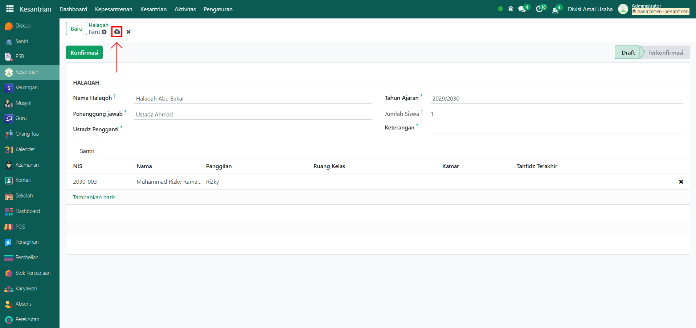
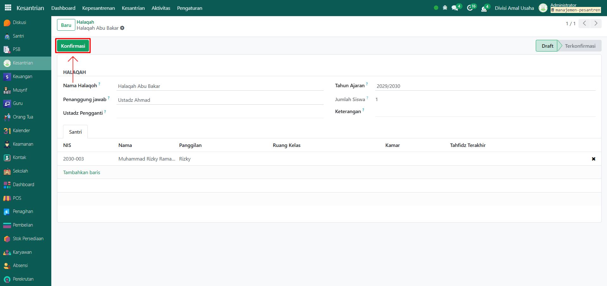
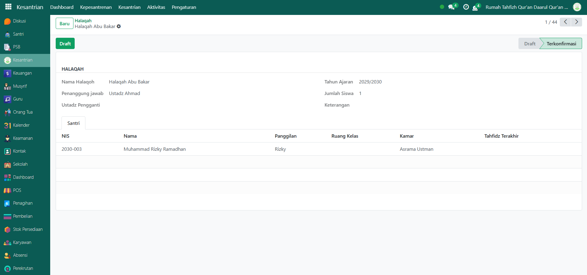

# Halaqah

Video \[]

## Master Data - Halaqah

Data **Halaqah** pada Odoo Pesantren digunakan untuk mendata kelompok-kelompok belajar Al-Qur’an yang terdiri dari beberapa santri di bawah bimbingan seorang ustadz atau musyrif.

### Menambahkan Pembagian Halaqah

Berikut adalah langkah-langkah untuk menambahkan halaqah pada Odoo Pesantren.

1. Login menggunakan akun administrator. Jika Anda belum memahami cara login sebagai admin, silakan lihat panduan [**Login Admin** di sini](../../panduan-login/login-admin.md).
2.  Buka modul **Kesantrian**, lalu klik menu **Pengaturan** kemudian pilih submenu **Pembagian Halaqah**.

    <figure><figcaption></figcaption></figure>

3.  Klik tombol “Baru” untuk membuat data halaqah baru.

    <figure><figcaption></figcaption></figure>

4.  Akan tampil halaman form, isi inputan yang tersedia seperti:

    * **Nama Halaqah** (isi dengan nama atau kode kelompok halaqah, seperti Halaqah A1).
    * **Penanggung Jawab** (isi dengan ustadz/musyrif yang menjadi penanggung jawab halaqah)
    * **Tahun Ajaran** (isi dengan tahun ajaran halaqah ini aktif)
    * **Jumlah Siswa** akan terisi otomatis berdasarkan santri yang masuk halaqah ini.
    * **Keterangan** (opsional, bisa diisi dengan informasi tambahan)
    * **Tab Santri** (isi dengan data santri yang sudah tersimpan).

    <figure><figcaption></figcaption></figure>

5.  Setelah semua inputan diisi dengan benar, klik icon **Simpan** di sebelah kanan icon Gear agar data halaqah tersimpan dan statusnya menjadi **Draft**.

    <figure><figcaption></figcaption></figure>

6.  Apabila halaqah sudah terkonformasi oleh pihak pesantren, maka klik tombol konfirmasi untuk mengkonfirmasi data yang disimpan.

    <figure><figcaption></figcaption></figure>

7.  Data Halaqah berhasil disimpan dan siap digunakan dalam kegiatan pembelajaran dan kesantrian.

    <figure><figcaption></figcaption></figure>

### Edit dan Hapus Data Halaqah

Untuk mengedit suatu data halaqah, silahkan pilih terlebih dahulu data mana yang akan diedit. Editlah data halaqah dan klik icon **Simpan** untuk menyimpan data perubahan tersebut.

Untuk menghapus suatu data halaqah adalah dengan pilih data mana yang akan dihapus, kemudian klik icon **Gear** atau **Action** lalu pilih opsi **Hapus**, maka akan tampil dialog konfirmasi apakah anda ingin menghapus data tersebut. Jika ya, klik **Hapus** jika tidak maka klik **Tidak, tetap simpan**.

***


Data **Halaqah** tidak dapat dihapus apabila sudah terdapat transaksi yang berhubungan dengan data tersebut. Jika belum ada transaksi yang tercatat, maka data masih dapat dihapus dari sistem.

