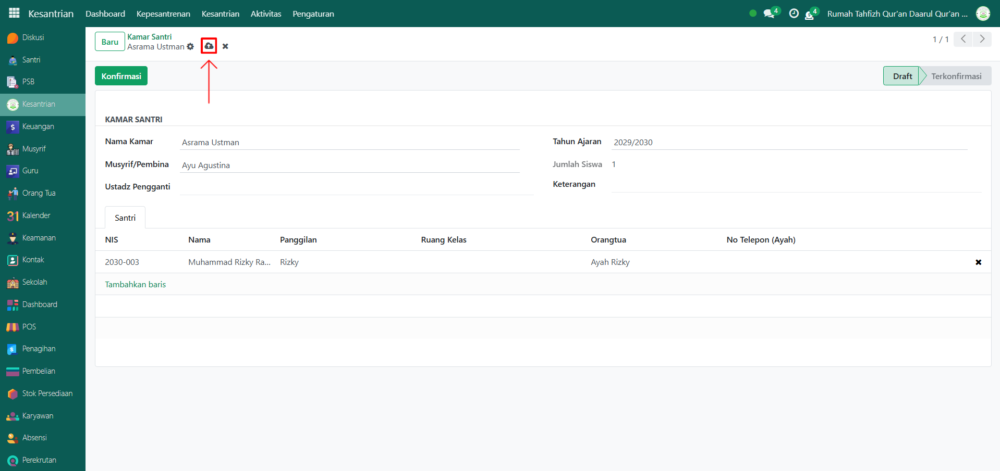
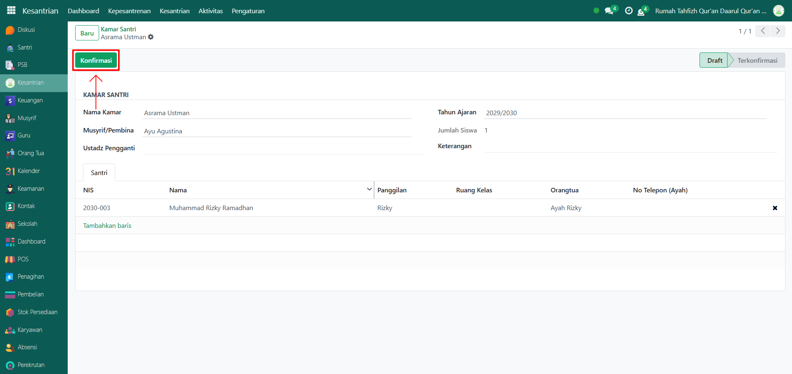
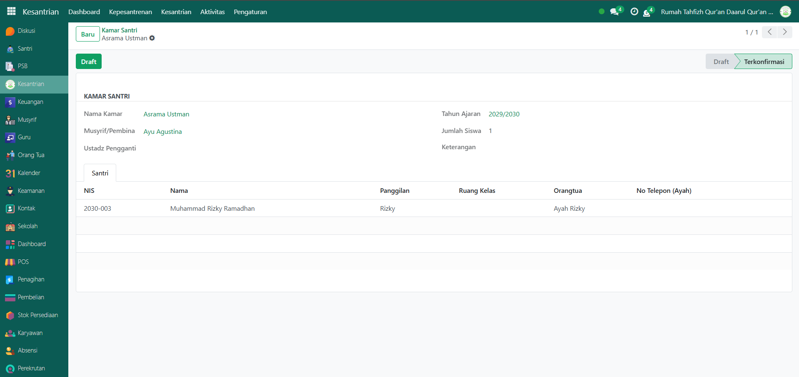

# Kamar Santri

Video \[]

## Master Data - Kamar Santri

Kamar Santri merupakan data master yang digunakan untuk mengatur dan mencatat pembagian santri ke dalam kamar atau asrama, lengkap dengan musyrif/pembina yang bertanggung jawab.

### Menambahkan Pembagian Kamar Santri

Berikut adalah langkah-langkah untuk menambah dan membagikan kamar santri pada Odoo Pesantren.

1.  Buka modul **Kesantrian**, lalu klik menu **Pengaturan** dan pilih submenu **Pembagian Kamar Santri**.

    <figure><figcaption></figcaption></figure>

2.  Klik tombol **"Baru"** untuk membuat data Kamar Santri baru.

    <figure><figcaption></figcaption></figure>

3.  Akan tampil halaman form, isi inputan yang tersedia seperti:

    * **Nama Kamar**
    * **Musyrif/Pembina**
    * **Ustadz Pengganti** (opsional)
    * **Tahun Ajaran**
    * **Jumlah Santri** (akan terisi otomatis berdasarkan santri yang ditempatkan pada kamar tersebut)
    * **Keterangan** (opsional)
    * **Tab Santri** → pilih santri yang sudah tersimpan untuk dimasukkan ke kamar ini.

    <figure><figcaption></figcaption></figure>

4.  Setelah semua inputan diisi dengan benar, klik icon **Simpan** di sebelah kanan icon Gear agar data Kamar Santri tersimpan dengan status **Draft**.

    <figure><figcaption></figcaption></figure>

5.  Apabila kamar santri sudah diverifikasi oleh pihak pesantren, klik tombol **Konfirmasi** untuk mengubah status dari **Draft** menjadi **Terkonfirmasi**.

    <figure><figcaption></figcaption></figure>

6.  Data Kamar Santri berhasil disimpan dan dapat digunakan untuk pengelolaan asrama santri di sistem.

    <figure><figcaption></figcaption></figure>
