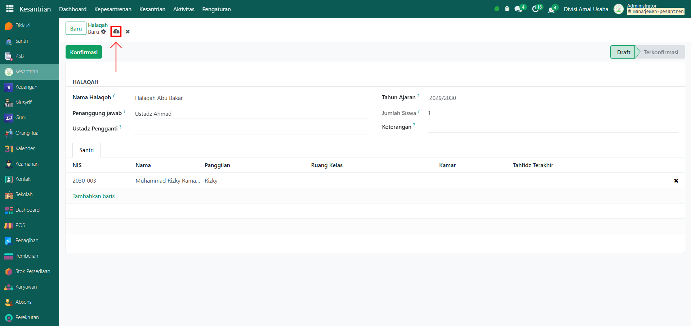

# Halaqah

Video \[]

## Master Data - Halaqah

Data Halaqah pada Odoo Pesantren digunakan untuk mendata kelompok-kelompok belajar Al-Qur’an yang terdiri dari beberapa santri di bawah bimbingan seorang ustadz atau musyrif.

### Langkah-Langkah Menambahkan Halaqah

Berikut adalah langkah-langkah untuk menambahkan halaqah pada Odoo Pesantren.

1.  Buka modul **Kesantrian**, lalu klik menu **Pengaturan** dan pilih submenu **Pembagian Halaqah**.

    <figure><figcaption></figcaption></figure>

2.  Klik tombol “Baru” untuk membuat data halaqah baru.

    <figure><figcaption></figcaption></figure>

3.  Akan tampil halaman form, isi inputan yang tersedia seperti:

    * **Nama Halaqah** (isi dengan nama atau kode kelompok halaqah, seperti Halaqah A1).
    * **Penanggung Jawab** (isi dengan ustadz/musyrif yang menjadi penanggung jawab halaqah)
    * **Tahun Ajaran** (isi dengan tahun ajaran halaqah ini aktif)
    * **Jumlah Siswa** akan terisi otomatis berdasarkan santri yang masuk halaqah ini.
    * **Keterangan** (opsional, bisa diisi dengan informasi tambahan)
    * **Tab Santri** (isi dengan data santri yang sudah tersimpan).

    <figure><figcaption></figcaption></figure>

4.  Setelah semua inputan diisi dengan benar, klik icon **Simpan** di sebelah kanan icon Gear agar data halaqah tersimpan dan statusnya menjadi **Draft**.

    <figure><figcaption></figcaption></figure>

5.  Apabila halaqah sudah terkonformasi oleh pihak pesantren, maka klik tombol konfirmasi untuk mengkonfirmasi data yang disimpan.

    <figure><figcaption></figcaption></figure>

6.  Data Halaqah berhasil disimpan dan siap digunakan dalam kegiatan pembelajaran dan kesantrian.

    <figure><figcaption></figcaption></figure>
