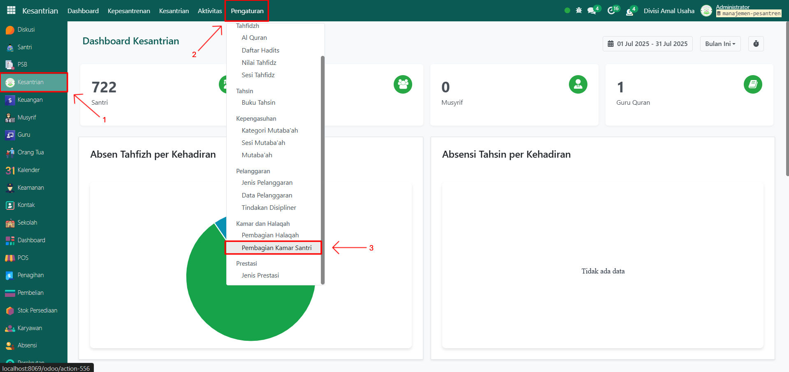
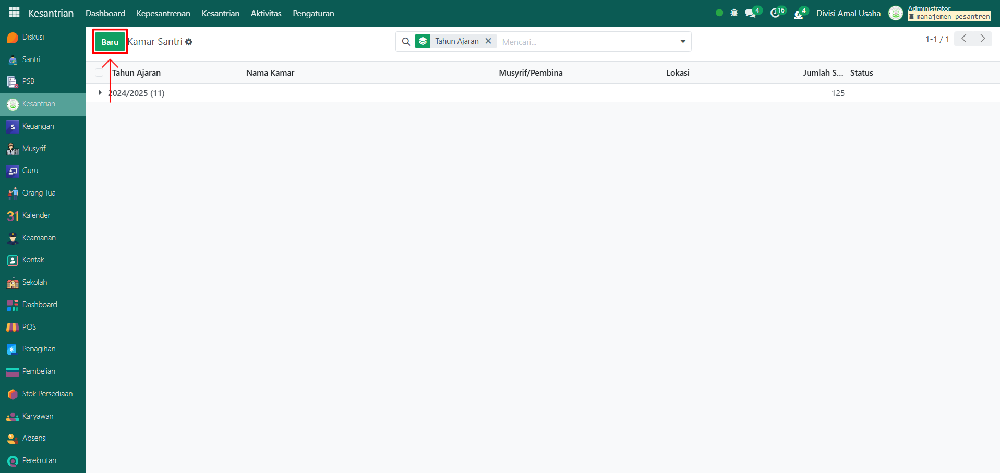
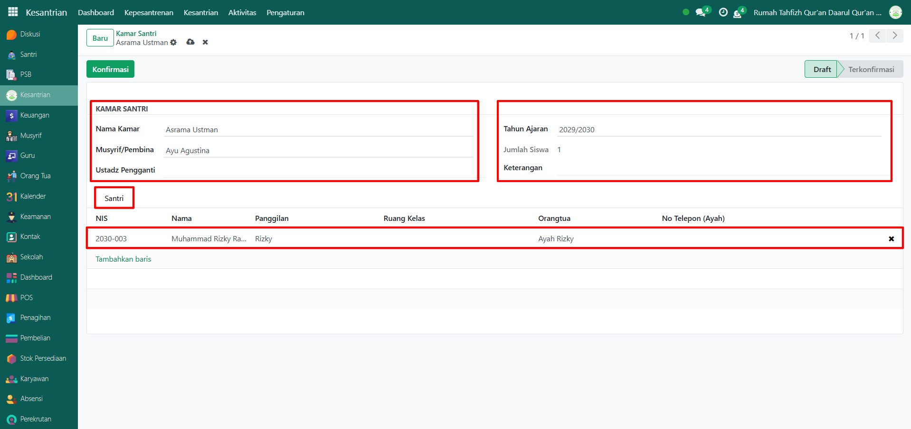
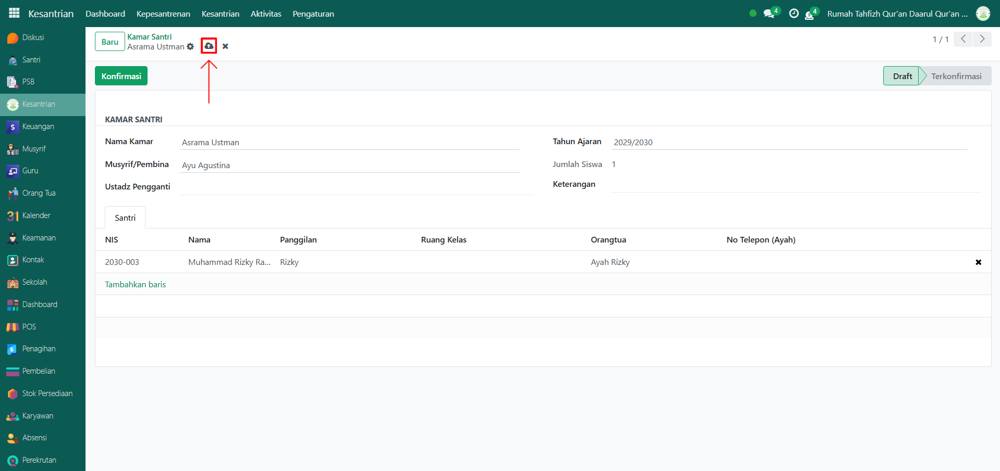
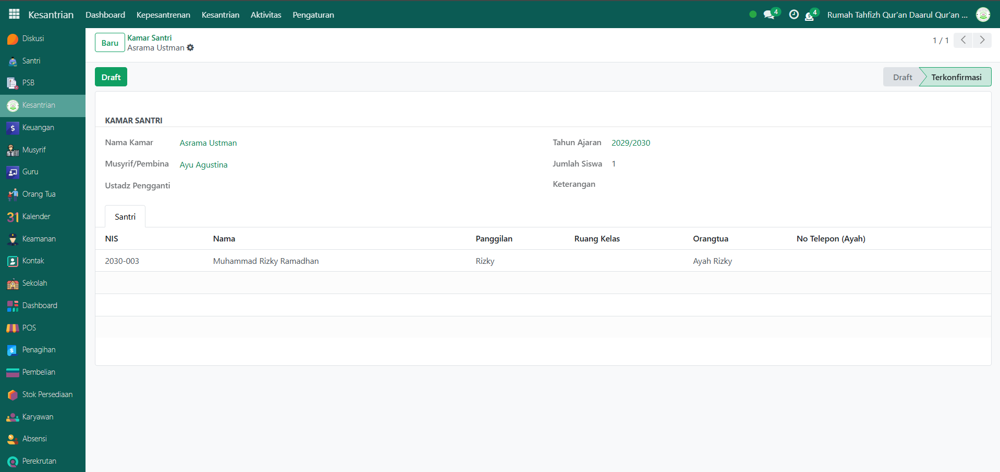

# Kamar Santri



## Master Data - Kamar Santri

Data **Kamar Santri** merupakan data master yang digunakan untuk mengatur dan mencatat pembagian santri ke dalam kamar atau asrama, lengkap dengan musyrif/pembina yang bertanggung jawab.

### Menambahkan Pembagian Kamar Santri

Berikut adalah langkah-langkah untuk menambah dan membagikan kamar santri pada Odoo Pesantren.

1. Login menggunakan akun administrator. Jika Anda belum memahami cara login sebagai admin, silakan lihat panduan [**Login Admin** di sini](../../panduan-login/login-admin.md).
2.  Buka modul **Kesantrian**, lalu klik menu **Pengaturan** kemudian pilih submenu **Pembagian Kamar Santri**.

    <figure><figcaption></figcaption></figure>

3.  Klik tombol **"Baru"** untuk membuat data Kamar Santri baru.

    <figure><figcaption></figcaption></figure>

4.  Akan tampil halaman form, isi inputan yang tersedia seperti:

    * **Nama Kamar** (isi dengan nama kamar santri).
    * **Musyrif/Pembina** (pilih musyrif yang bertanggung jawab atas kamar yang dibuat).
    * **Tahun Ajaran** (isi dengan tahun ajaran yang aktif saat ini).
    * **Jumlah Santri** (akan terisi otomatis berdasarkan santri yang ditempatkan pada kamar tersebut).
    * **Keterangan** (opsional, bisa diisi dengan informasi tambahan).
    * **Tab Santri** (isi dengan data santri yang sudah tersimpan).

    <figure><figcaption></figcaption></figure>

5.  Setelah semua inputan diisi dengan benar, klik icon **Simpan** di sebelah kanan icon Gear agar data Kamar Santri tersimpan dengan status **Draft**.

    <figure><figcaption></figcaption></figure>

6.  Apabila kamar santri sudah diverifikasi oleh pihak pesantren, klik tombol **Konfirmasi** untuk mengubah status dari **Draft** menjadi **Terkonfirmasi**.

    <figure><figcaption></figcaption></figure>

7.  Data Kamar Santri berhasil disimpan dan dapat digunakan untuk pengelolaan asrama santri di sistem.

    <figure><figcaption></figcaption></figure>

### Edit dan Hapus Data Kamar Santri

Untuk mengedit suatu data kamar santri, silahkan pilih terlebih dahulu data mana yang akan diedit. Setelah masuk pada halaman form kamar santri, klik tombol **"Draft"** untu mulai mengedit data. Editlah data kamar santri dan klik icon **Simpan** untuk menyimpan data perubahan tersebut dan klik tombol **"Konfirmasi"** untuk mengkonfirmasi data kamar santri.

Untuk menghapus suatu data kamar santri adalah dengan pilih data mana yang akan dihapus, kemudian klik icon **Gear** atau **Action** lalu pilih opsi **Hapus**, maka akan tampil dialog konfirmasi apakah anda ingin menghapus data tersebut. Jika ya, klik **Hapus** jika tidak maka klik **Tidak, tetap simpan**.

***


Data ini **dapat dihapus**, namun apabila sudah terdapat transaksi yang terkait dengan data tersebut, **disarankan untuk tidak menghapusnya** demi menjaga konsistensi dan keakuratan data transaksi di sistem.

