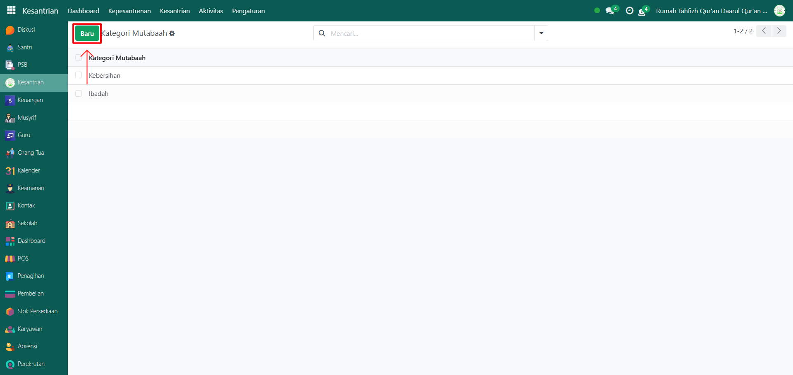
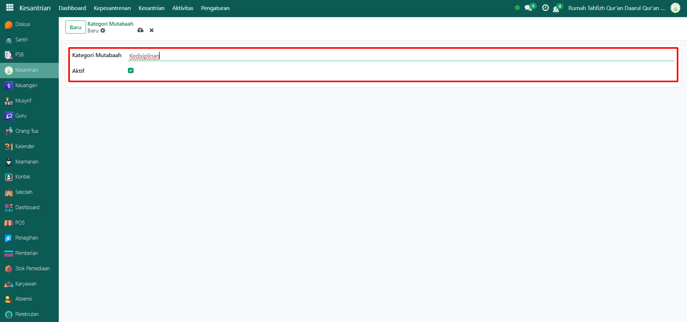
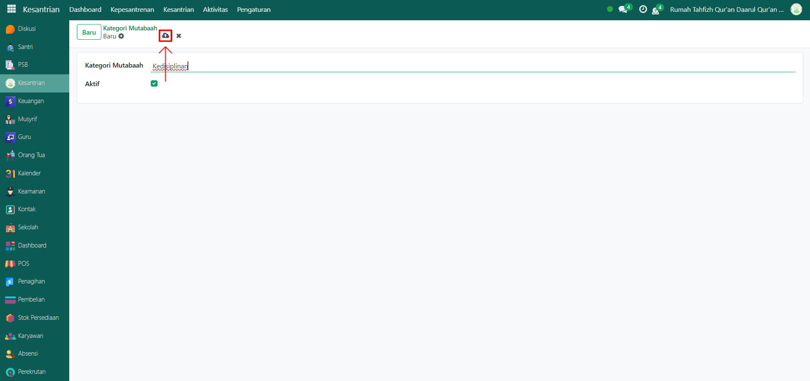

# Kategori Mutaba'ah

VIdeo \[]

## Master Data - Kategori Mutaba'ah

Data **Kategori Mutaba’ah** pada Odoo Pesantren digunakan untuk mendata jenis-jenis mutaba’ah santri, misalnya ibadah, kedisiplinan, atau kebersihan. Data ini menjadi acuan saat mencatat aktivitas mutaba’ah harian santri.

### Menambahkan Data Kategori Mutaba'ah

Berikut adalah langkah-langkah menambahkan data kategori mutaba'ah di Odoo Pesantren.

1. Login menggunakan akun administrator. Jika Anda belum memahami cara login sebagai admin, silakan lihat panduan [**Login Admin** di sini](../../../panduan-login/login-admin.md).
2.  Buka modul **Kesantrian,** lalu klik menu **Pengaturan** kemudian pilih submenu **Kategori Mutaba'ah**.

    <figure><figcaption></figcaption></figure>

3.  Klik tombol **“Baru”** untuk membuat data kategori mutaba’ah baru.

    <figure><figcaption></figcaption></figure>

4.  Akan tampil halaman form, isi inputan yang tersedia seperti:

    * **Kategori Mutaba’ah** (misalnya: Ibadah)
    * **Aktif** (centang checkbox ini agar kategori mutaba’ah dapat digunakan pada pencatatan aktivitas santri).

    <figure><figcaption></figcaption></figure>

5.  Setelah semua inputan diisi dengan benar, klik icon **Simpan** di sebelah kanan icon **Gear** agar data kategori mutaba’ah tersimpan di sistem.

    <figure><figcaption></figcaption></figure>

6. Data Kategori Mutaba’ah berhasil disimpan dan dapat digunakan untuk mencatat aktivitas mutaba’ah harian santri.

### Edit dan Hapus Data Kategori Mutaba'ah

Untuk mengedit suatu data kategori mutaba'ah, silahkan pilih terlebih dahulu data mana yang akan diedit. Editlah data kategori mutaba'ah dan klik icon **Simpan** untuk menyimpan data perubahan tersebut.

Untuk menghapus suatu data kategori mutaba'ah adalah dengan pilih data mana yang akan dihapus, kemudian klik icon **Gear** atau **Action** lalu pilih opsi **Hapus**, maka akan tampil dialog konfirmasi apakah anda ingin menghapus data tersebut. Jika ya, klik **Hapus** jika tidak maka klik **Tidak, tetap simpan**.

***


Data **Kategori Mutaba'ah** tidak dapat dihapus apabila sudah terdapat transaksi yang berhubungan dengan data tersebut. Jika belum ada transaksi yang tercatat, maka data masih dapat dihapus dari sistem.

