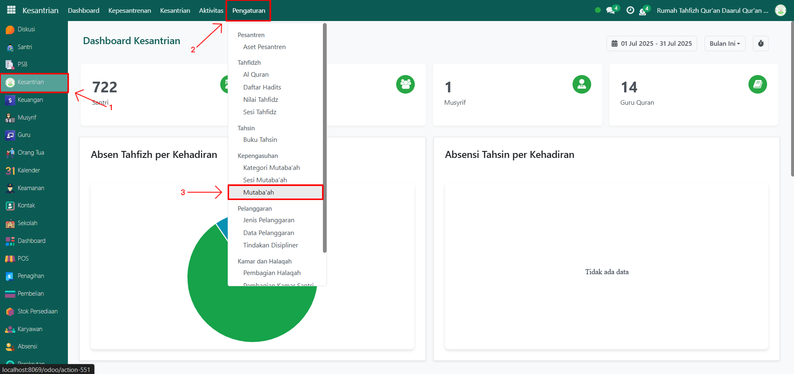
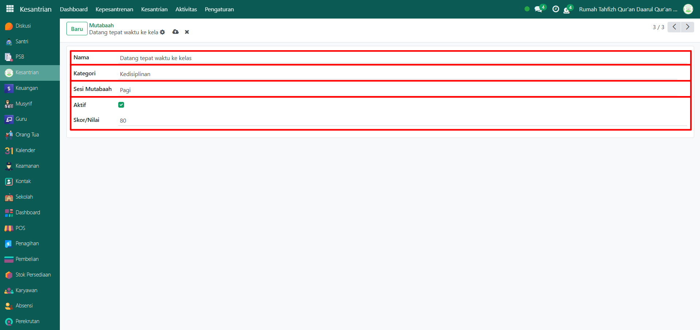
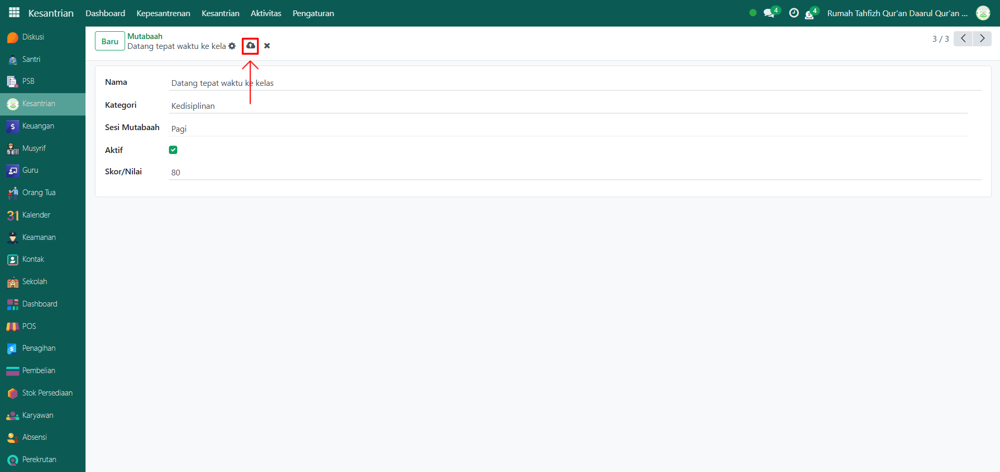

# Mutaba'ah



## Master Data - Mutaba'ah

Data **Mutaba’ah** berfungsi untuk mendata jenis-jenis kegiatan yang harus dilakukan santri dalam keseharian mereka, seperti ibadah, kedisiplinan, kebersihan, dan kegiatan lain yang ditentukan oleh pesantren. Data ini menjadi acuan saat pencatatan mutaba’ah harian santri.

### Menambahkan Mutaba'ah

Berikut adalah langkah-langkah untuk menambahkan mutaba'ah pada Odoo Pesantren.

1. Login menggunakan akun administrator. Jika Anda belum memahami cara login sebagai admin, silakan lihat panduan [**Login Admin** di sini](../../../panduan-login/login-admin.md).
2.  Buka modul **Kesantrian**, lalu klik menu **Pengaturan** kemudian pilih submenu **Mutabaah**.&#x20;

    <figure><figcaption></figcaption></figure>

3.  Klik tombol “Baru” untuk membuat data mutabaah baru.&#x20;

    <figure><figcaption></figcaption></figure>

4.  Akan tampil halaman form, isi inputan yang tersedia seperti:

    * Nama (isi dengan nama aktivitas yang akan di tambahkan)
    * Kategori (isi dengan kategori aktivitas yang terreferensi dari master data "Kategori Mutabaah").
    * Sesi Mutabaah (isi dengan sesi yang terreferensi dari master data "Sesi Mutabaah")
    * Aktifkan checkbox "Aktif" jika aktivitas tersebut masih berjalan di pesantren.
    * Skor/nilai (isi dengan nilai yang diberikan apabila santri melakukan aktivitas tersebut)

    <figure><figcaption></figcaption></figure>

5.  Setelah semua inputan diisi dengan benar, klik icon **Simpan** di sebelah kanan icon **Gear** agar data mutabaah tersimpan di sistem.

    <figure><figcaption></figcaption></figure>

6. Data Mutaba’ah berhasil disimpan dan dapat digunakan saat pencatatan aktivitas mutaba’ah harian santri.

### Edit dan Hapus Data Mutaba'ah

Untuk mengedit suatu data mutaba'ah, silahkan pilih terlebih dahulu data mana yang akan diedit. Editlah data mutaba'ah dan klik icon **Simpan** untuk menyimpan data perubahan tersebut.

Untuk menghapus suatu data mutaba'ah adalah dengan pilih data mana yang akan dihapus, kemudian klik icon **Gear** atau **Action** lalu pilih opsi **Hapus**, maka akan tampil dialog konfirmasi apakah anda ingin menghapus data tersebut. Jika ya, klik **Hapus** jika tidak maka klik **Tidak, tetap simpan**.

***


Data ini **dapat dihapus**, namun apabila sudah terdapat transaksi yang terkait dengan data tersebut, **disarankan untuk tidak menghapusnya** demi menjaga konsistensi dan keakuratan data transaksi di sistem.

