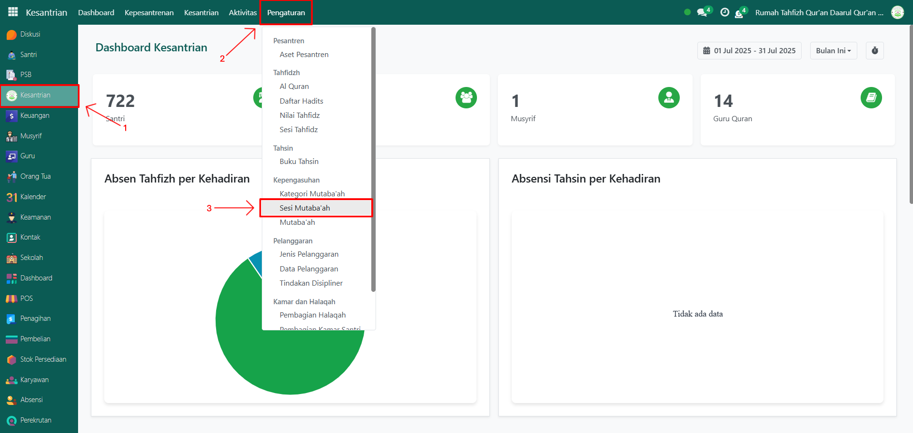
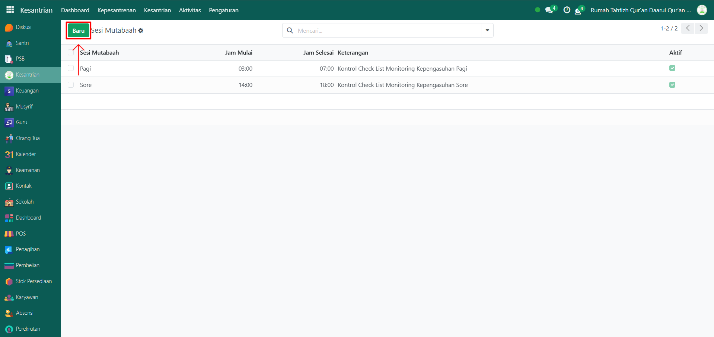
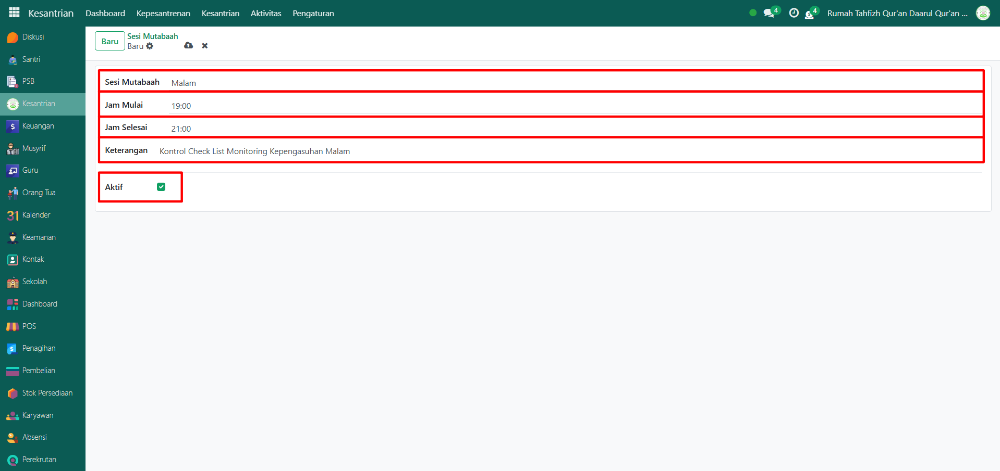
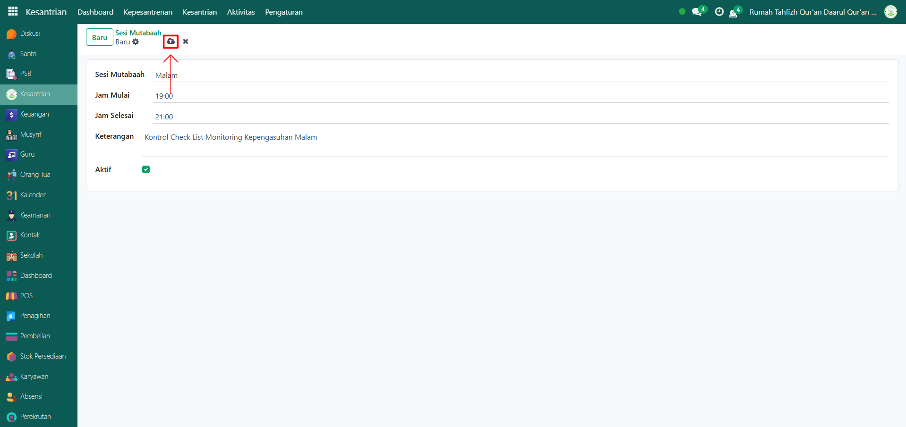

# Sesi Mutaba'ah

Video \[]

## Master Data - Sesi Mutaba'ah

Data **Sesi Mutabaah** pada Odoo Pesantren digunakan untuk mencatat aktivitas pemantauan harian (mutabaah yaumiyah) santri yang mencakup waktu dimulai hingga selesai dan keterangan sesinya.

### Menambahkan Sesi Mutaba'ah

Berikut adalah langkah-langkah untuk menambahkan sesi mutaba'ah pada Odoo Pesantren.

1. Login menggunakan akun administrator. Jika Anda belum memahami cara login sebagai admin, silakan lihat panduan [**Login Admin** di sini](../../../panduan-login/login-admin.md).
2.  Buka modul Kesantrian, lalu klik menu Pengaturan kemudian pilih submenu Sesi Mutabaah.

    <figure><figcaption></figcaption></figure>

3.  Klik tombol “Baru” untuk membuat data sesi mutabaah baru.

    <figure><figcaption></figcaption></figure>

4.  Akan tampil halaman form, isi inputan yang tersedia seperti:

    * Sesi Mutabaah (isi dengan waktu dimana sesi mutabaah akan berlangsung)
    * Jam Mulai (isi dengan jam dimulai nya sesi)
    * Jam Selesai (isi dengan jam berakhirnya sesi)
    * Keterangan (isi dengan informasi detail dari sesi yang berlangsung)
    * Aktifkan checkbox "Aktif" jika sesi tersebut masih berjalan di pesantren.

    <figure><figcaption></figcaption></figure>

5.  Setelah semua inputan diisi dengan benar, klik icon Simpan di sebelah kanan icon Gear agar data sesi mutabaah tersimpan di sistem.

    <figure><figcaption></figcaption></figure>

6. Data Sesi Mutaba’ah berhasil disimpan dan dapat digunakan pada pencatatan aktivitas mutaba’ah harian santri.

### Edit dan Hapus Data Sesi Mutaba'ah

Untuk mengedit suatu data sesi mutaba'ah, silahkan pilih terlebih dahulu data mana yang akan diedit. Editlah data sesi mutaba'ah dan klik icon **Simpan** untuk menyimpan data perubahan tersebut.

Untuk menghapus suatu data sesi mutaba'ah adalah dengan pilih data mana yang akan dihapus, kemudian klik icon **Gear** atau **Action** lalu pilih opsi **Hapus**, maka akan tampil dialog konfirmasi apakah anda ingin menghapus data tersebut. Jika ya, klik **Hapus** jika tidak maka klik **Tidak, tetap simpan**.

***


Data **Sesi Mutaba'ah** tidak dapat dihapus apabila sudah terdapat transaksi yang berhubungan dengan data tersebut. Jika belum ada transaksi yang tercatat, maka data masih dapat dihapus dari sistem.

