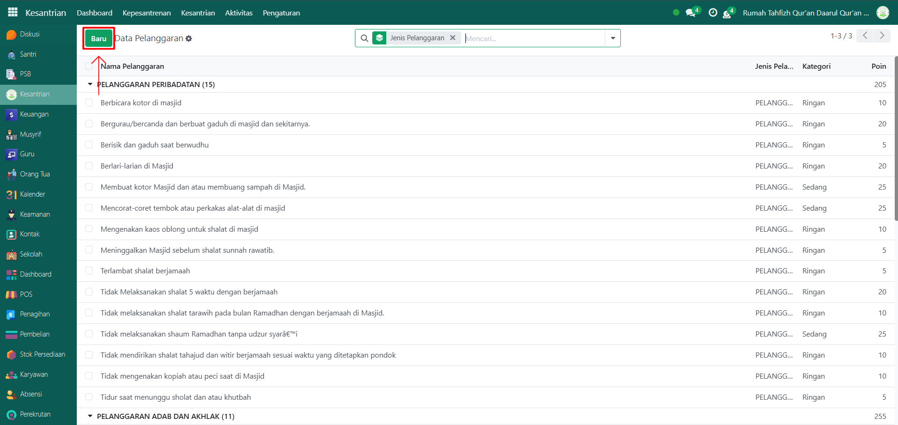
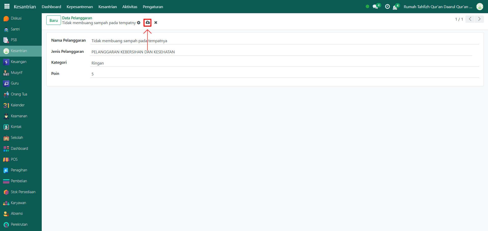
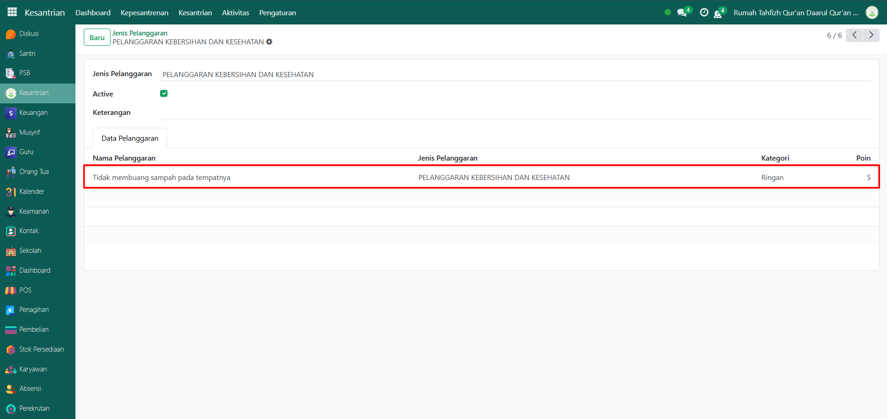

# Data Pelanggaran



## Master Data - Data Pelanggaran

Data **Pelanggaran** pada Odoo Pesantren digunakan untuk menyimpan daftar pelanggaran yang mungkin dilakukan oleh santri dalam kehidupan sehari-hari di lingkungan pesantren. Data ini berfungsi sebagai referensi tetap yang digunakan saat mengisi laporan pelanggaran santri oleh musyrif, guru, atau petugas disiplin. Pelanggaran yang dicatat dapat berupa pelanggaran ringan, sedang, maupun berat, sesuai dengan peraturan pesantren yang berlaku.

### Menambahkan Data Pelanggaran

Berikut adalah langkah-langkah untuk menambahkan data pelanggaran pada Odoo Pesantren.

1. Login menggunakan akun administrator. Jika Anda belum memahami cara login sebagai admin, silakan lihat panduan [**Login Admin** di sini](../../../panduan-login/login-admin.md).
2.  Buka modul **Kesantrian**, lalu klik menu **Pengaturan** kemudian pilih submenu **Data Pelanggaran**.

    <figure><figcaption></figcaption></figure>

3.  Klik tombol “Baru” untuk membuat data pelanggaran baru.

    <figure><figcaption></figcaption></figure>

4.  Akan tampil halaman form, isi inputan yang tersedia seperti:

    * Nama pelanggaran (isi dengan nama pelanggaran yang akan di tambahkan).
    * Jenis pelanggaran (isi dengan jenis pelanggaran yang terrefrensi dari data "Jenis pelanggaran")
    * Kategori pelanggaran (isi dengan kategori pelanggaran yang telah disediakan, yaitu Ringan, Sedang, Berat, dan Sangat Berat)
    * Poin (isi dengan jumlah poin yang didapat santri saat melakukan pelanggaran tersebut).

    <figure><figcaption></figcaption></figure>

5.  Setelah semua inputan diisi dengan benar, klik icon Simpan di sebelah kanan icon Gear agar data pelanggaran tersimpan di sistem.

    <figure><figcaption></figcaption></figure>

6.  Kembali ke submenu jenis pelanggaran untuk melihat data pelanggaran yang baru saja ditambahkan. Cari sesuai jenis pelanggaran yang dimasukkan saat mengisi data pelanggaran.

    <figure><figcaption></figcaption></figure>

### Edit dan Hapus Data Pelanggaran

Untuk mengedit suatu data pelanggaran, silahkan pilih terlebih dahulu data mana yang akan diedit. Editlah data pelanggaran dan klik icon **Simpan** untuk menyimpan data perubahan tersebut.

Untuk menghapus suatu data pelanggaran adalah dengan pilih data mana yang akan dihapus, kemudian klik icon **Gear** atau **Action** lalu pilih opsi **Hapus**, maka akan tampil dialog konfirmasi apakah anda ingin menghapus data tersebut. Jika ya, klik **Hapus** jika tidak maka klik **Tidak, tetap simpan**.

***


Data ini **dapat dihapus**, namun apabila sudah terdapat transaksi yang terkait dengan data tersebut, **disarankan untuk tidak menghapusnya** demi menjaga konsistensi dan keakuratan data transaksi di sistem.

