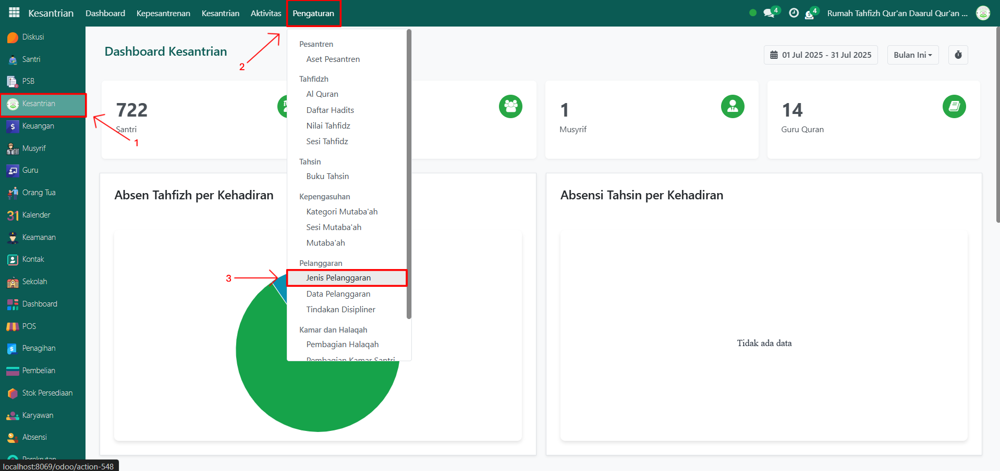

# Jenis Pelanggaran

Video \[]

## Master Data - Jenis Pelanggaran

Data **Jenis Pelanggaran** pada Odoo Pesantren digunakan untuk menyimpan daftar jenis pelanggaran yang dilakukan santri yang nantinya akan memuat informasi data pelanggaran yang masuk ke dalam jenis pelanggaran tersebut.

### Menambahkan Jenis Pelanggaran

Berikut adalah langkah-langkah untuk menambahkan jenis pelanggaran pada Odoo Pesantren.

1. Login menggunakan akun administrator. Jika Anda belum memahami cara login sebagai admin, silakan lihat panduan [**Login Admin** di sini](../../../panduan-login/login-admin.md).
2.  Buka modul **Kesantrian**, lalu klik menu **Pengaturan** kemudian pilih submenu **Jenis Pelanggaran**.&#x20;

    <figure><figcaption></figcaption></figure>

3.  Klik tombol “Baru” untuk membuat data jenis pelanggaran baru.&#x20;

    <figure><figcaption></figcaption></figure>

4.  Akan tampil halaman form, isi inputan yang tersedia seperti:

    * **Jenis pelanggaran** (isi dengan jenis pelanggaran yang akan di tambahkan)
    * Aktifkan checkbox "Aktif" jika jenis pelanggaran tersebut masih berlaku di pesantren.
    * **Keterangan** (opsional, bisa isi dengan informasi tambahan/detail dari jenis pelanggaran tersebut").
    * **Tab Data Pelanggaran** di bagian bawah tidak perlu diisi. Karena akan terisi otomatis apabila ada data pelanggaran yang termasuk kedalam jenis pelanggaran tersebut.

    <figure><figcaption></figcaption></figure>

5.  Setelah semua inputan diisi dengan benar, klik icon **Simpan** di sebelah kanan icon **Gear** agar data jenis pelanggaran tersimpan di sistem.

    <figure><figcaption></figcaption></figure>

6. Jenis Pelanggaran berhasil disimpan dan dapat digunakan saat mencatat data pelanggaran santri.

### Edit dan Hapus Data Jenis Pelanggaran

Untuk mengedit suatu data jenis pelanggaran, silahkan pilih terlebih dahulu data mana yang akan diedit. Editlah data jenis pelanggaran dan klik icon **Simpan** untuk menyimpan data perubahan tersebut.

Untuk menghapus suatu data jenis pelanggaran adalah dengan pilih data mana yang akan dihapus, kemudian klik icon **Gear** atau **Action** lalu pilih opsi **Hapus**, maka akan tampil dialog konfirmasi apakah anda ingin menghapus data tersebut. Jika ya, klik **Hapus** jika tidak maka klik **Tidak, tetap simpan**.

***


Data **Jenis Pelanggaran** tidak dapat dihapus apabila sudah terdapat data pelanggaran yang berhubungan dengan data tersebut. Jika belum ada data pelanggaran yang tercatat, maka data masih dapat dihapus dari sistem.

