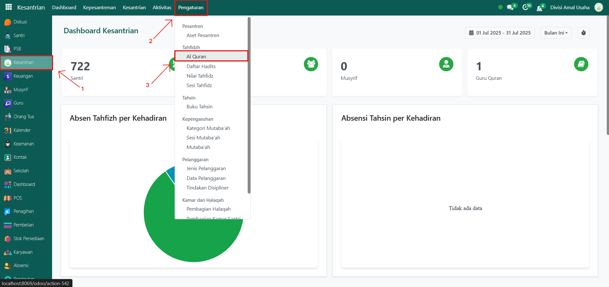
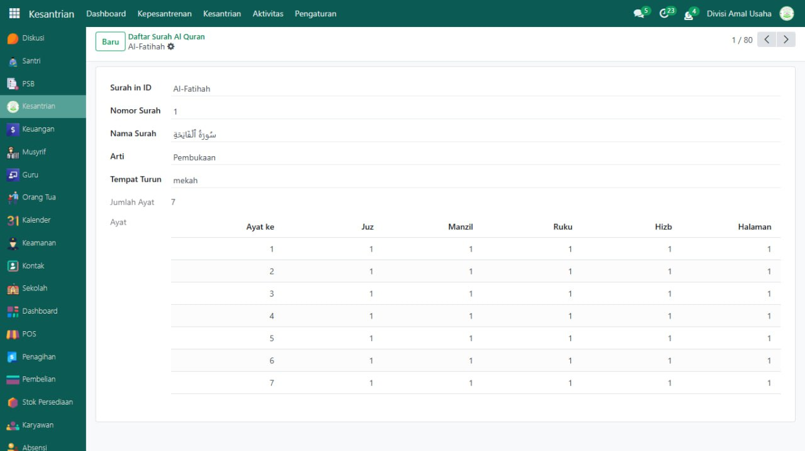

# Al Qur'an

## Master Data - Al-Qur'an

Data **Al‑Qur’an** pada Odoo Pesantren sudah tersedia secara lengkap mulai dari Surah Al‑Fatihah hingga An‑Nas beserta rincian ayatnya. Field ayat pada menu ini bersifat **readonly** sehingga tidak dapat diubah, namun sistem tetap menyediakan tombol “Baru” jika ingin menambahkan surah baru secara manual (meski biasanya tidak diperlukan).

### Melihat/Mengakses Al-Qur'an

Berikut adalah langkah-langkah untuk melihat/mengakses data Al-Qur'an pada Odoo Pesantren.

1. Login menggunakan akun administrator. Jika Anda belum memahami cara login sebagai admin, silakan lihat panduan [**Login Admin** di sini](../../../panduan-login/login-admin.md).
2.  Buka modul **Kesantrian**, lalu klik menu **Pengaturan** kemudian pilih submenu **Al-Qur'an**.

    <figure><figcaption></figcaption></figure>

3.  Sistem akan menampilkan list lengkap seluruh surah Al‑Qur’an beserta jumlah ayatnya.

    <figure><figcaption></figcaption></figure>

4.  Klik salah satu surah (misalnya: _Al‑Fatihah_) untuk melihat detail ayat‑ayatnya.

    <figure><figcaption></figcaption></figure>
5. Karena data sudah disediakan oleh sistem, Anda cukup menggunakan menu ini untuk referensi hafalan, tahfidz, atau tahsin santri.

***


Data Al-Qur’an sudah tersedia lengkap (semua surah dan ayat) dan **tidak boleh dihapus atau diubah**, karena menjadi dasar utama untuk pencatatan hafalan Tahfidz.

