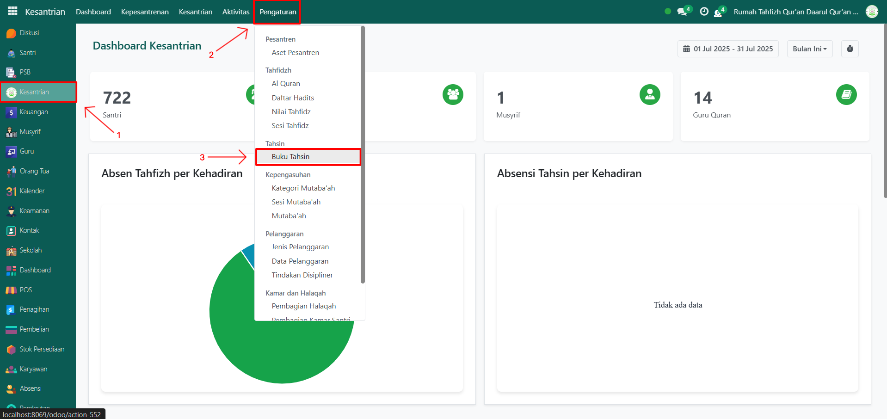
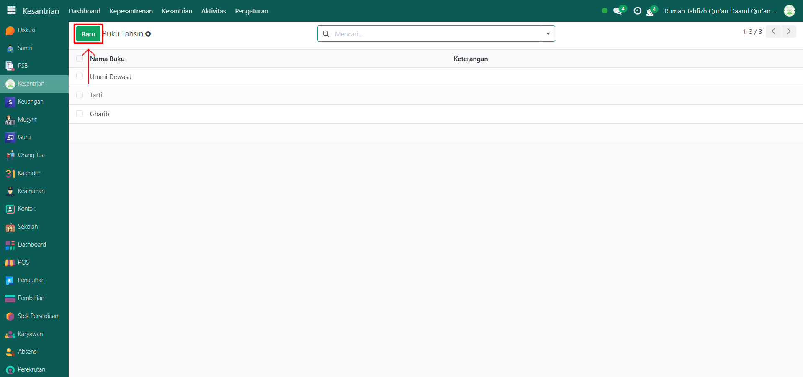
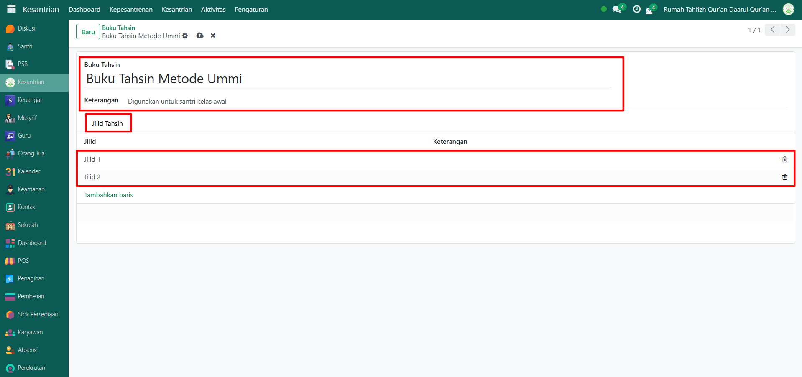
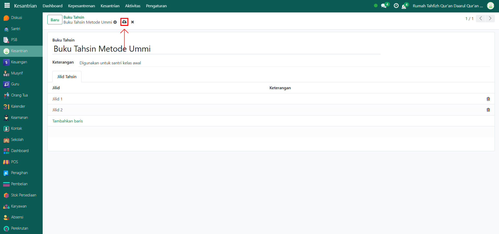

# Buku Tahsin

Video \[]

## Master Data - Buku Tahsin

Data **Buku Tahsin** pada Odoo Pesantren digunakan untuk menyimpan daftar referensi buku atau modul pembelajaran tahsin yang digunakan dalam proses pengajaran baca tulis Al-Qur’an. Data ini mendukung proses pembelajaran bagi para santri.

### Menambahkan Data Buku Tahsin

Berikut adalah langkah-langkah untuk menambahkan data buku tahsin pada Odoo Pesantren.

1. Login menggunakan akun administrator. Jika Anda belum memahami cara login sebagai admin, silakan lihat panduan [**Login Admin** di sini](../../../panduan-login/login-admin.md).
2.  Buka modul **Kesantrian**, lalu klik menu **Pengaturan** kemudian pilih submenu **Buku Tahsin**.

    <figure><figcaption></figcaption></figure>

3.  Klik tombol “Baru” untuk membuat data buku tahsin baru.

    <figure><figcaption></figcaption></figure>

4.  Akan tampil halaman form, isi inputan yang tersedia seperti:

    * Buku Tahsin (isi dengan nama Buku Tahsin yang ada di pesantren).
    * Keterangan (opsional, misalnya atau deskripsi buku catatan tambahan).
    * Jilid Tahsin (isi dengan menambahkan baris dengan data edisi jilid dan keterangan).

    <figure><figcaption></figcaption></figure>

5.  Setelah semua inputan selesai diisi, klik icon **Simpan** di sebelah kanan icon **Gear** agar data Buku Tahsin tersimpan di sistem.

    <figure><figcaption></figcaption></figure>

6. Data Buku Tahsin berhasil disimpan dan dapat digunakan dalam pencatatan tahsin santri.

### Edit dan Hapus Data Buku Tahsin

Untuk mengedit suatu data buku tahsin, silahkan pilih terlebih dahulu data mana yang akan diedit. Editlah data buku tahsin dan klik icon **Simpan** untuk menyimpan data perubahan tersebut.

Untuk menghapus suatu data buku tahsin adalah dengan pilih data mana yang akan dihapus, kemudian klik icon **Gear** atau **Action** lalu pilih opsi **Hapus**, maka akan tampil dialog konfirmasi apakah anda ingin menghapus data tersebut. Jika ya, klik **Hapus** jika tidak maka klik **Tidak, tetap simpan**.

***


Data **Buku Tahsin** tidak dapat dihapus apabila sudah terdapat transaksi yang berhubungan dengan data tersebut. Jika belum ada transaksi yang tercatat, maka data masih dapat dihapus dari sistem.

