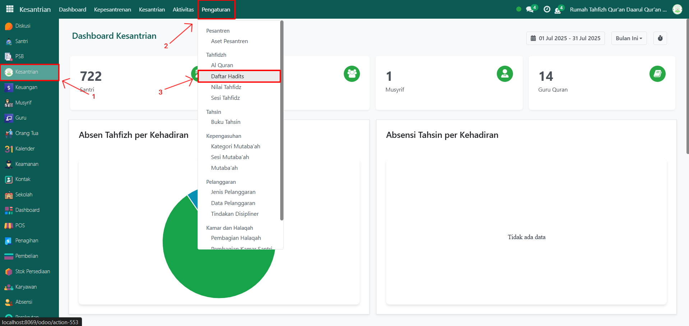
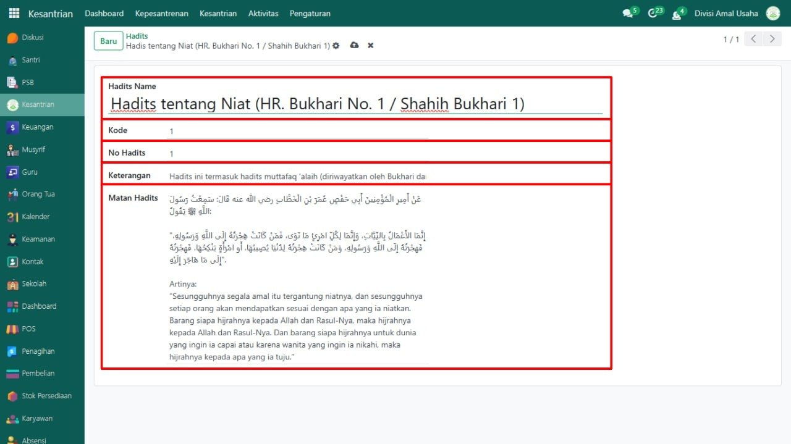
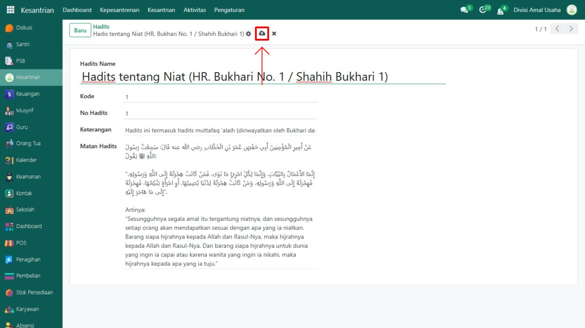

# Daftar Hadits



## Master Data - Daftar Hadits

Data **Hadits** pada Odoo Pesantren digunakan untuk menyimpan koleksi hadits yang menjadi referensi pembelajaran dan hafalan santri. Fitur ini memungkinkan pengguna untuk menambahkan hadits baru lengkap dengan teks arab, terjemahan, dan sumbernya.

### Menambahkan Daftar Hadits

Berikut adalah langkah-langkah untuk menambahkan data hadits pada Odoo Pesantren.

1. Login menggunakan akun administrator. Jika Anda belum memahami cara login sebagai admin, silakan lihat panduan [**Login Admin** di sini](../../../panduan-login/login-admin.md).
2.  Buka modul **Kesantrian**, lalu klik menu **Pengaturan** kemudian pilih submenu **Daftar Hadits**.

    <figure><figcaption></figcaption></figure>

3.  Klik tombol **“Baru”** untuk membuat hadits baru.

    <figure><figcaption></figcaption></figure>

4.  Akan tampil halaman form, isi inputan yang tersedia seperti:

    * **Nama Hadits**
    * **Kode**
    * **No Hadits**
    * **Keterangan** (opsional, misalnya tema atau catatan tambahan)
    * **Matan Hadits**

    <figure><figcaption></figcaption></figure>

5.  Setelah semua inputan diisi dengan benar, klik icon **Simpan** di sebelah kanan icon **Gear** agar hadits tersimpan di sistem.

    <figure><figcaption></figcaption></figure>

6. Hadits berhasil disimpan dan dapat digunakan sebagai referensi hafalan atau penilaian santri.

### Edit dan Hapus Data Hadits

Untuk mengedit suatu data hadits, silahkan pilih terlebih dahulu data mana yang akan diedit. Editlah data hadits dan klik icon **Simpan** untuk menyimpan data perubahan tersebut.

Untuk menghapus suatu data hadits adalah dengan pilih data mana yang akan dihapus, kemudian klik icon **Gear** atau **Action** lalu pilih opsi **Hapus**, maka akan tampil dialog konfirmasi apakah anda ingin menghapus data tersebut. Jika ya, klik **Hapus** jika tidak maka klik **Tidak, tetap simpan**.

***


Data ini **dapat dihapus**, namun apabila sudah terdapat transaksi yang terkait dengan data tersebut, **disarankan untuk tidak menghapusnya** demi menjaga konsistensi dan keakuratan data transaksi di sistem.

