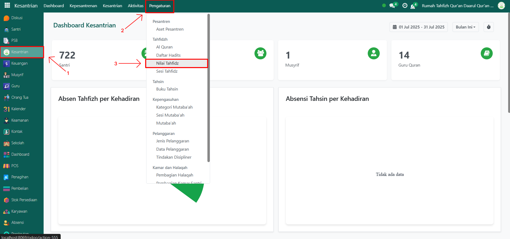
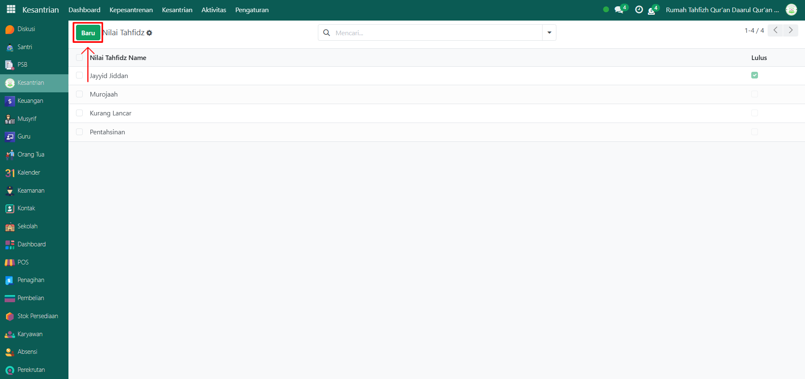
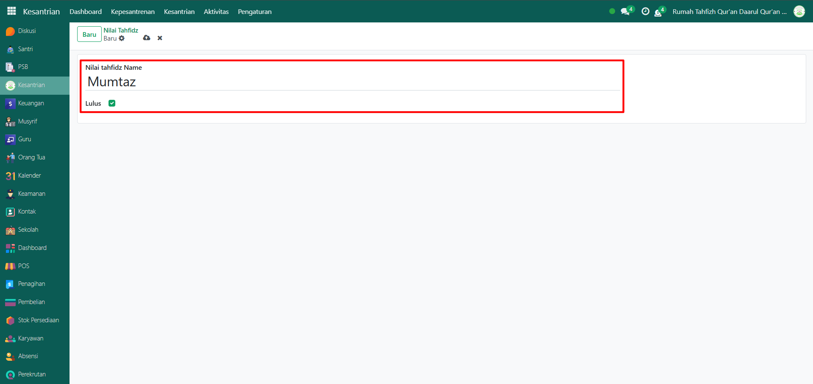
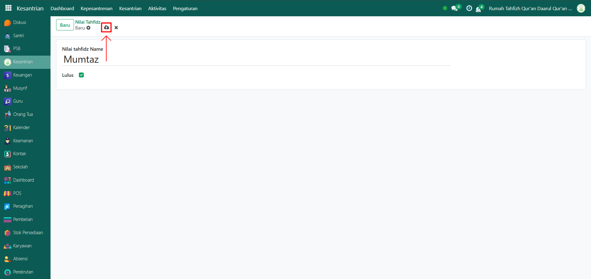

# Nilai Tahfidz



## Master Data - Nilai Tahfidz

Data **Nilai Tahfidz** pada Odoo Pesantren digunakan untuk menyimpan referensi kategori penilaian kemampuan hafalan Al-Qur’an santri. Data ini berfungsi sebagai standar evaluasi dalam program tahfidz, baik untuk ujian, pelaporan, maupun penentuan kelulusan. Setiap entri berisi nama nilai (seperti Mumtaz, Jayyid Jiddan, dsb) dan status kelulusan. Jika diperlukan, pengguna dapat menyesuaikan atau menambahkan nilai baru sesuai kebutuhan lembaga.

### Menambahkan Nilai Tahfidz

Berikut adalah langkah-langkah untuk menambakan nilai tahfidz pada Odoo Pesantren.

1. Login menggunakan akun administrator. Jika Anda belum memahami cara login sebagai admin, silakan lihat panduan [**Login Admin** di sini](../../../panduan-login/login-admin.md).
2.  Buka modul **Kesantrian**, lalu klik menu **Pengaturan** kemudian pilih submenu **Nilai Tahfidz**.

    <figure><figcaption></figcaption></figure>

3.  Klik tombol “Baru” untuk membuat data nilai tahfidz baru.

    <figure><figcaption></figcaption></figure>

4.  Akan tampil halaman form, isi inputan yang tersedia seperti:

    * Nama Nilai Tahfidz (misalnya: Mumtaz).
    * Lulus Checkbox (centang untuk mengaktifkan jika nilai tersebut dianggap sebagai kategori kelulusan nilai tahfidz).

    <figure><figcaption></figcaption></figure>

5.  Setelah semua inputan diisi dengan benar, klik icon **Simpan** di sebelah kanan icon **Gear** agar data nilai tahfidz tersimpan di sistem.

    <figure><figcaption></figcaption></figure>

6. Data Nilai Tahfidz berhasil disimpan dan dapat digunakan saat ustadz/guru qur'an menilai hafalan santri.

### Edit dan Hapus Data Nilai Tahfidz

Untuk mengedit suatu data nilai tahfidz, silahkan pilih terlebih dahulu data mana yang akan diedit. Editlah data nilai tahfidz dan klik icon **Simpan** untuk menyimpan data perubahan tersebut.

Untuk menghapus suatu data nilai tahfidz adalah dengan pilih data mana yang akan dihapus, kemudian klik icon **Gear** atau **Action** lalu pilih opsi **Hapus**, maka akan tampil dialog konfirmasi apakah anda ingin menghapus data tersebut. Jika ya, klik **Hapus** jika tidak maka klik **Tidak, tetap simpan**.

***


Data ini **dapat dihapus**, namun apabila sudah terdapat transaksi yang terkait dengan data tersebut, **disarankan untuk tidak menghapusnya** demi menjaga konsistensi dan keakuratan data transaksi di sistem.

