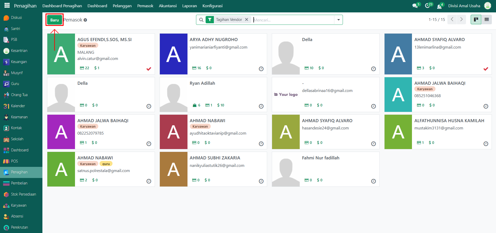
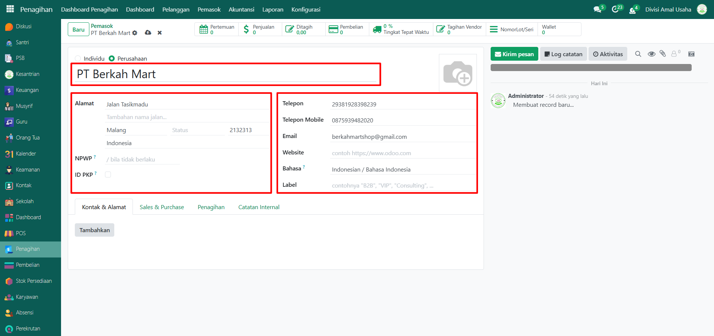
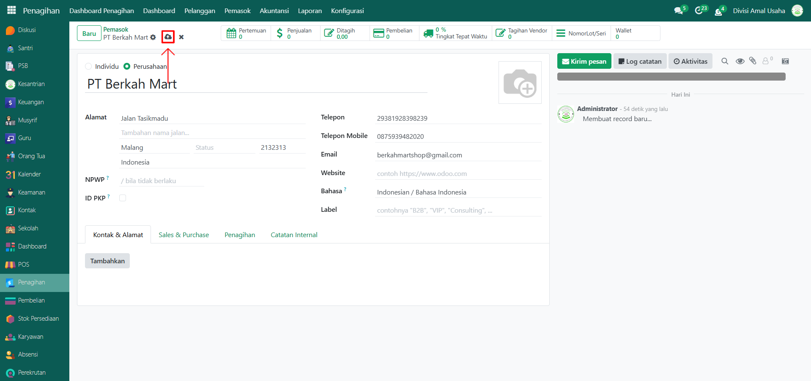

# Data Pemasok

Video \[]

## Master Data - Data Pemasok

Pada bagian pemasok, pengguna dapat menambahkan informasi pemasok yang berhubungan dengan kegiatan usaha. Data ini penting untuk mengelola hubungan dengan pemasok barang maupun jasa, serta digunakan dalam transaksi pembelian dan pengelolaan stok.

### Menambahkan Data Pemasok

Berikut adalah langkah-langkah untuk menambahkan data pemasok pada Odoo Pesantren.

1.  Buka modul **Penagihan**, lalu klik menu **Pemasok** dan pilih submenu **Pemasok**.

    <figure><figcaption></figcaption></figure>

2.  Klik tombol **“Baru”** untuk membuat data pemasok baru.

    <figure><figcaption></figcaption></figure>

3.  Akan tampil halaman formulir pemasok. Lengkapi kolom input yang tersedia, antara lain:

    * **Nama Pemasok**
    * **Alamat**
    * **Telepon**
    * **Email**
    * **Label** (opsional)
    * Dan data lainnya sesuai kebutuhan.

    <figure><figcaption></figcaption></figure>

4.  Setelah semua inputan selesai diisi, klik icon **Simpan** di sebelah kanan icon Gear agar data pemasok tersimpan di sistem.

    <figure><figcaption></figcaption></figure>

5. Data Pemasok berhasil disimpan dan dapat digunakan pada transaksi pembelian maupun pengaturan stok persediaan.
