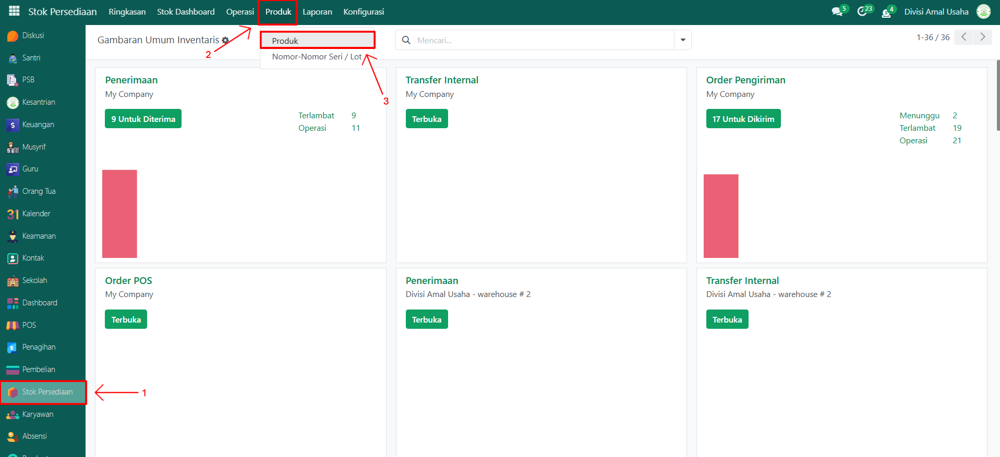
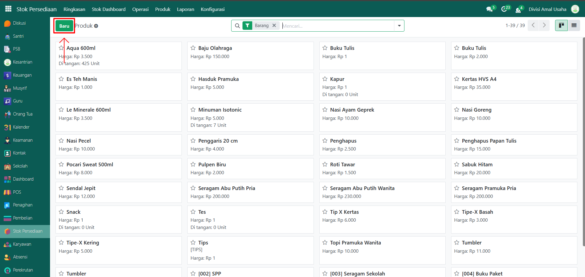
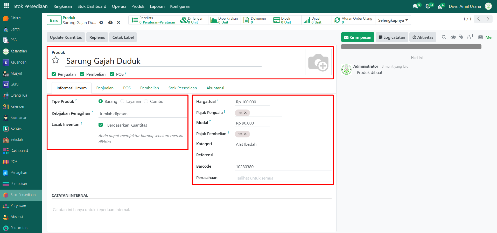
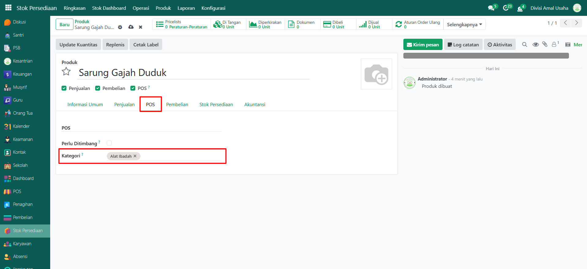
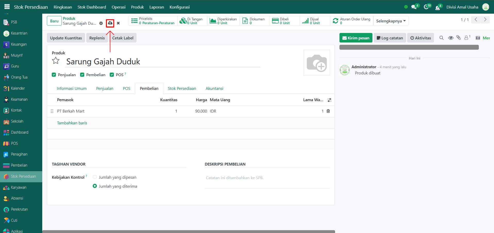

# Data Produk

Video \[]

## Master Data - Data Produk

Produk adalah barang atau jasa yang dijual atau dikelola dalam sistem Odoo Pesantren. Data produk digunakan untuk transaksi penjualan, pembelian, serta pencatatan stok. Produk bisa berupa barang fisik, layanan, maupun produk kombinasi (combo). Pengelolaan data ini sangat penting untuk operasional koperasi, kantin, percetakan, dan unit usaha pesantren lainnya.

### Langkah-Langkah Menambahkan Produk

Berikut adalah langkah-langkah untuk menambahkan data produk pada Odoo Pesantren

1.  Buka modul **Stok Persediaan**, lalu klik menu **Produk** dan pilih submenu **Produk**.

    <figure><figcaption></figcaption></figure>

2.  Klik tombol “Baru” untuk membuat data produk baru.

    <figure><figcaption></figcaption></figure>

3.  Akan tampil halaman form, isi inputan yang tersedia seperti:

    * **Produk** (isi dengan nama produk yang akan ditambahkan)
    * **Penjualan** / **Pembelian** / **POS**: Centang sesuai kebutuhan produk digunakan di modul mana.
    * **Tipe Produk** bisa diisi sesuai tipe yang akan digunakan, berikut adalah tipe-tipe produk yang bisa digunakan.
    * **Barang**: Produk fisik yang memiliki stok
    * **Layanan**: Produk jasa
    * **Combo**: Gabungan beberapa produk
    * **Kebijakan Penagihan** (umumnya diisi Jumlah dipesan)
    * **Lacak Inventari** (Centang jika ingin melacak stok)
    * **Harga Jual** (isi dengan harga satuan jual produk)
    * **Modal** (opsional, bisa diisi dengan harga pokok barang jika perlu)
    * **Pajak Penjual / Pembelian** (opsional, bisa diisi sesuai kebutuhan)
    * **Kategori** (isi dengan kategori produk yang telah dibuat sebelumnya)
    * Referensi / Barcode (opsional bisa diisi untuk keperluan identifikasi tambahan)
    * Pilih Perusahaan (opsional, bisa diisi jika menggunakan sistem multi-company)
    * Tambahkan Gambar Produk (opsional, bisa diisi denagan mengklik ikon kamera di kanan atas untuk mengunggah foto produk.)

    <figure><figcaption></figcaption></figure>

4.  Pindah ke **Tab POS**, kemudian pilih **Kategori POS** yang sesuai (misalnya: Minuman, Makanan, atau Alat Tulis) agar produk muncul di aplikasi Point of Sale.

    <figure><figcaption></figcaption></figure>

5.  Pindah ke **Tab Pembelian**, kemudian tambahkan **Pemasok** yang akan menyediakan produk tersebut.

    <figure><figcaption></figcaption></figure>

6.  Setelah semua field diisi dengan benar, klik icon Simpan di sebelah kanan icon Gear agar data produk tersimpan.

    <figure><figcaption></figcaption></figure>

7. Data Produk berhasil disimpan dan dapat digunakan pada transaksi POS, pembelian, maupun laporan stok.
