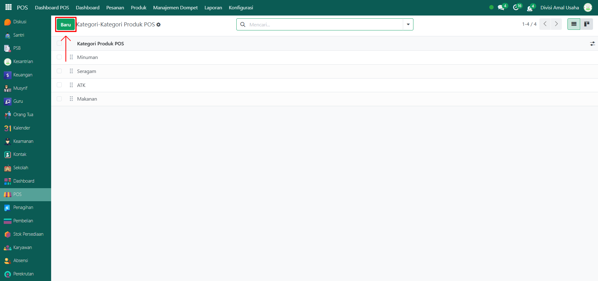
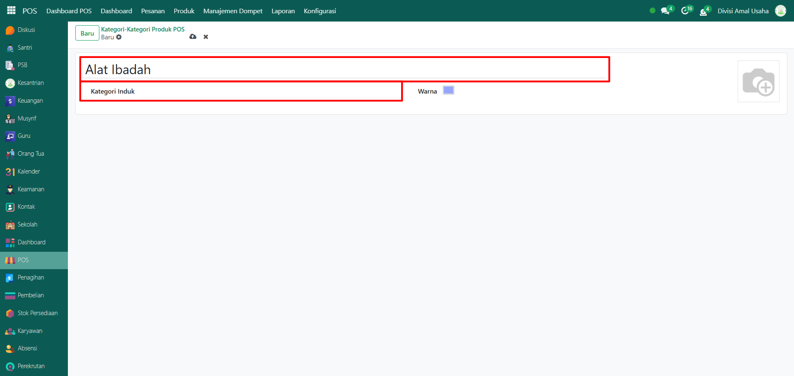
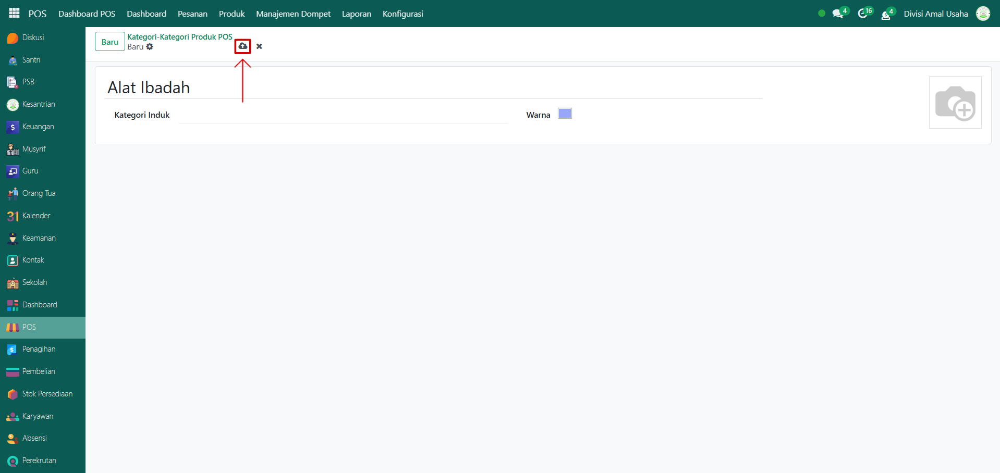

# Kategori Produk POS

Video \[]

## Master Data - Kategori Produk POS

Kategori Produk POS digunakan untuk mengelompokkan produk khusus di Point of Sale (POS). Dengan adanya kategori ini, produk dapat ditampilkan lebih rapi saat transaksi penjualan dilakukan di kasir POS.

### Langkah-Langkah Menambahkan Kategori Produk POS

Berikut adalah langkah-langkah untuk menambahkan kategori produk POS pada Odoo Pesantren.

1.  Buka modul **POS**, lalu klik menu **Konfigurasi** dan pilih submenu Kategori-Kategori Produk POS.

    <figure><figcaption></figcaption></figure>

2.  Klik tombol **“Baru”** untuk membuat kategori produk POS baru.&#x20;

    <figure><figcaption></figcaption></figure>

3.  Akan tampil halaman form, isi inputan yang tersedia seperti:

    * **Nama Kategori POS** (misalnya: Minuman)
    * **Kategori Induk** (kosongkan jika kategori utama, atau pilih kategori lain jika ingin sub-kategori)
    * **Gambar Kategori** (opsional, untuk memudahkan identifikasi di tampilan POS).

    <figure><figcaption></figcaption></figure>

4.  Setelah semua inputan selesai diisi, klik icon **Simpan** di sebelah kanan icon Gear agar data kategori produk POS tersimpan di sistem.

    <figure><figcaption></figcaption></figure>

5. Data Kategori Produk POS berhasil disimpan dan siap digunakan saat transaksi di POS.
