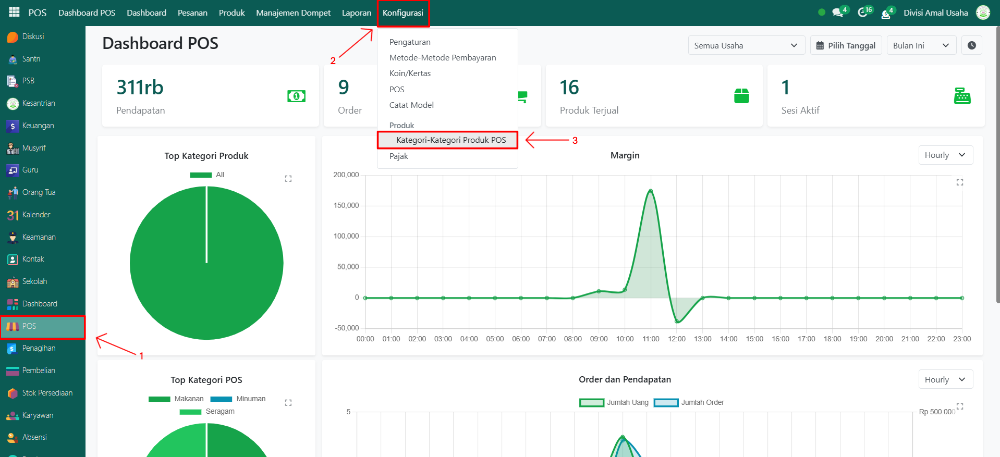

# Kategori Produk POS



## Master Data - Kategori Produk POS

Data **Kategori Produk POS** digunakan untuk mengelompokkan produk khusus di Point of Sale (POS). Dengan adanya kategori ini, produk dapat ditampilkan lebih rapi saat transaksi penjualan dilakukan di kasir POS.

### Menambahkan Kategori Produk POS

Berikut adalah langkah-langkah untuk menambahkan kategori produk POS pada Odoo Pesantren.

1. Login menggunakan akun administrator. Jika Anda belum memahami cara login sebagai admin, silakan lihat panduan [**Login Admin** di sini](../../panduan-login/login-admin.md).
2.  Buka modul **POS**, lalu klik menu **Konfigurasi** kemudian pilih submenu **Kategori-Kategori Produk POS**.

    <figure><figcaption></figcaption></figure>

3.  Klik tombol **“Baru”** untuk membuat kategori produk POS baru.&#x20;

    <figure><figcaption></figcaption></figure>

4.  Akan tampil halaman form, isi inputan yang tersedia seperti:

    * **Nama Kategori POS** (isi dengan nama kategori produk POS yang akan di tambahkan)
    * **Kategori Induk** (kosongkan jika kategori utama, atau pilih kategori lain jika ingin sub-kategori)
    * **Gambar Kategori** (opsional, untuk memudahkan identifikasi di tampilan POS).

    <figure><figcaption></figcaption></figure>

5.  Setelah semua inputan selesai diisi, klik icon **Simpan** di sebelah kanan icon Gear agar data kategori produk POS tersimpan di sistem.

    <figure><figcaption></figcaption></figure>

6. Data Kategori Produk POS berhasil disimpan dan siap digunakan saat transaksi di POS.

### Edit dan Hapus Data Kategori Produk POS

Untuk mengedit suatu data kategori produk POS, silahkan pilih terlebih dahulu data mana yang akan diedit. Editlah data kategori produk POS dan klik icon **Simpan** untuk menyimpan data perubahan tersebut.

Untuk menghapus suatu data kategori produk POS adalah dengan pilih data mana yang akan dihapus, kemudian klik icon **Gear** atau **Action** lalu pilih opsi **Hapus**, maka akan tampil dialog konfirmasi apakah anda ingin menghapus data tersebut. Jika ya, klik **Hapus** jika tidak maka klik **Tidak, tetap simpan**.

***


Data ini **dapat dihapus**, namun apabila sudah terdapat transaksi yang terkait dengan data tersebut, **disarankan untuk tidak menghapusnya** demi menjaga konsistensi dan keakuratan data transaksi di sistem.

