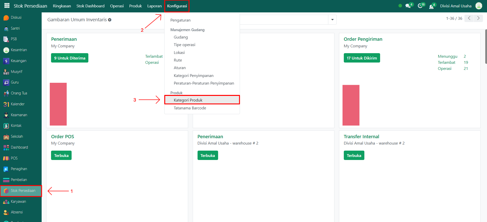
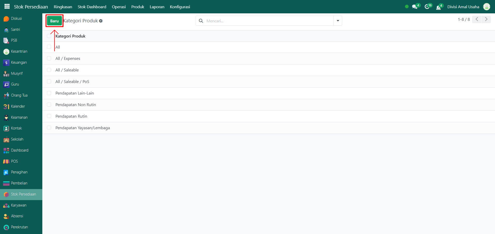
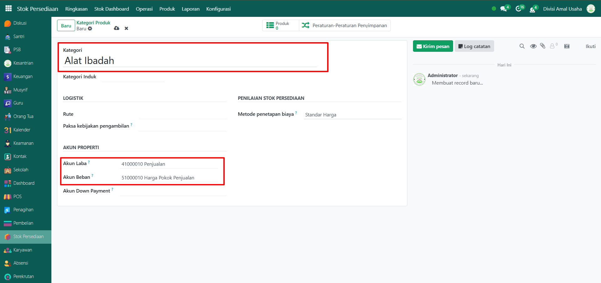
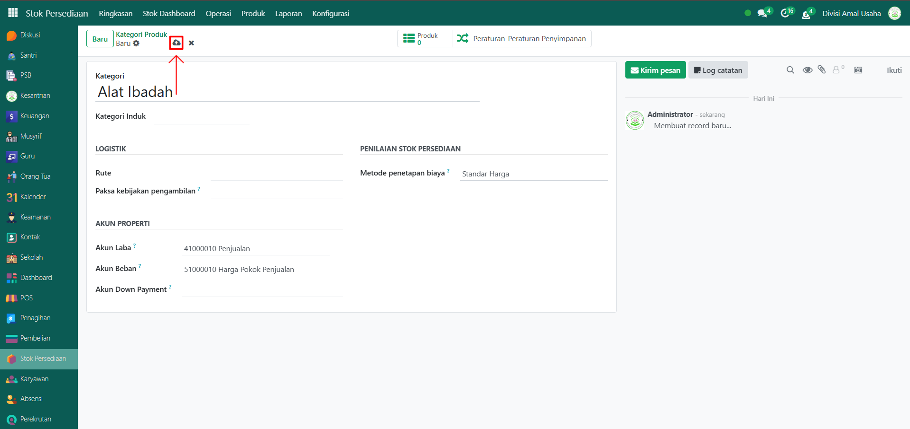

# Kategori Produk

Video \[]

## Master Data - Kategori Produk

Kategori Produk berfungsi untuk mengelompokkan berbagai jenis produk yang digunakan atau dijual dalam lingkungan pesantren. Pengelompokan ini penting untuk memudahkan pengelolaan inventaris, penjualan, pembelian, maupun distribusi produk kepada santri atau unit lain.

### Langkah-Langkah Menambahkan Kategori Produk

Berikut adalah langkah-langkah untuk menambahkan kategori produk pada Odoo Pesantren.

1.  Buka modul **Stok Persediaan**, lalu klik menu **Konfigurasi** dan pilih submenu **Kategori Produk**.

    <figure><figcaption></figcaption></figure>

2.  Klik tombol **“Baru”** untuk membuat kategori produk baru.&#x20;

    <figure><figcaption></figcaption></figure>

3.  Akan tampil halaman form, isi inputan yang tersedia seperti:

    * **Kategori** (isi dengan nama kategori produk yang akan di tambahkan).
    * **Kategori Induk** (opsional, bisa diisi dengan jika ada jalur distribusi atau alur logistik khusus).
    * **Logistik** (opsional, )
    * Akun Properti, pilih akun-akun berikut sesuai dengan kebijakan keuangan:
      * Akun Laba: Akun yang mencatat penjualan (misal: 41000010 Penjualan)
      * Akun Beban: Akun yang mencatat HPP (misal: 51000010 Harga Pokok Penjualan)
    * Metode Penetapan Biaya (umumnya untuk pesantren, cukup pilih Standar Harga jika stok tidak terlalu fluktuatif).

    <figure><figcaption></figcaption></figure>

4.  Setelah semua inputan diisi dengan benar, klik icon **Simpan** di sebelah kanan icon **Gear** agar data kategori produk tersimpan di sistem.

    <figure><figcaption></figcaption></figure>

5. Data Kategori Produk berhasil disimpan dan siap digunakan untuk mengelompokkan produk.
