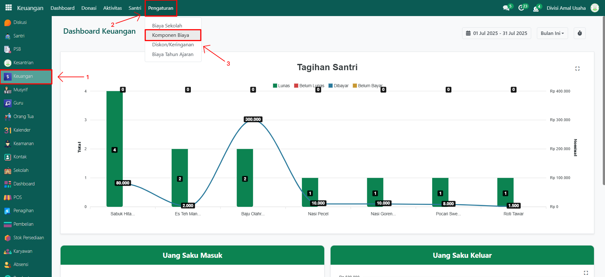
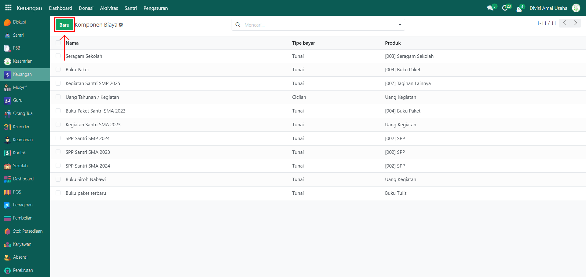
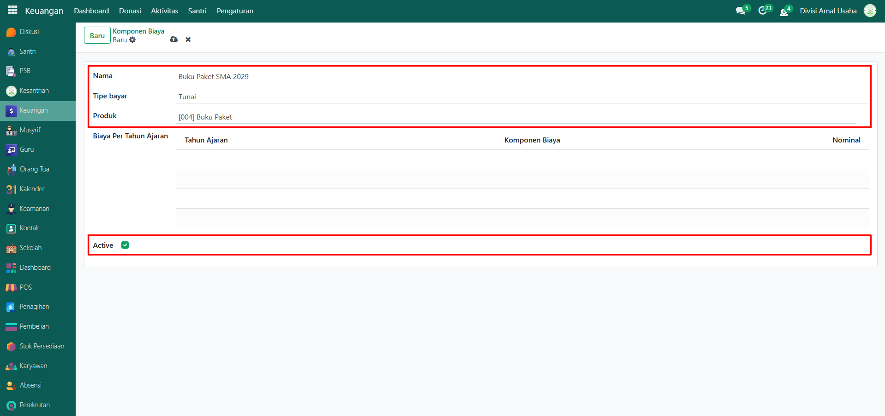
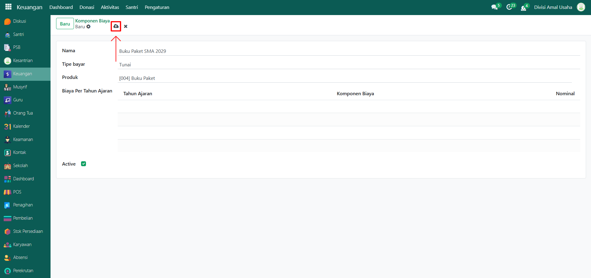
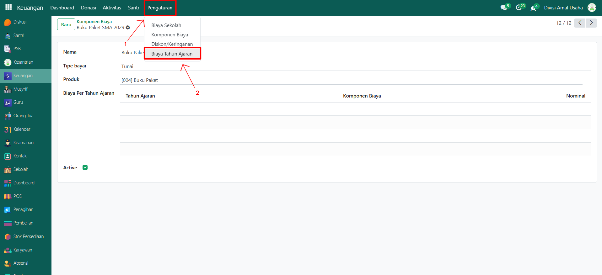
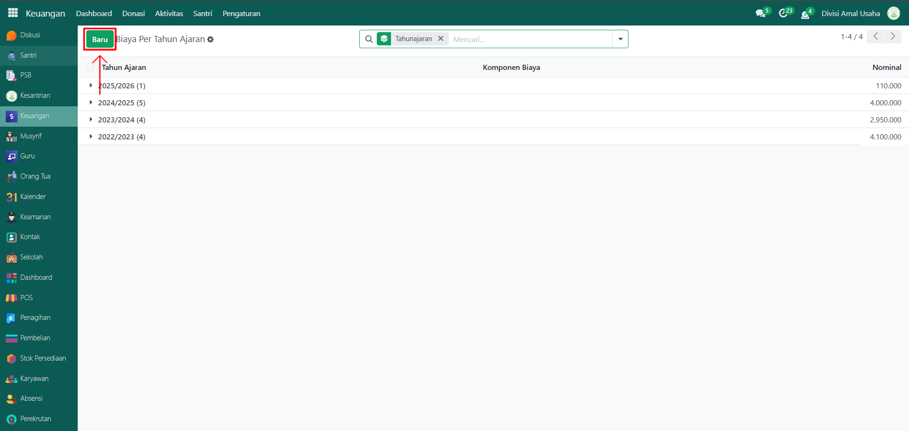
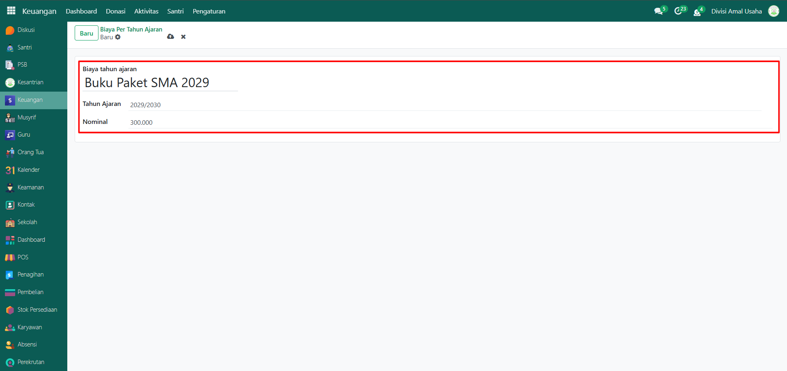
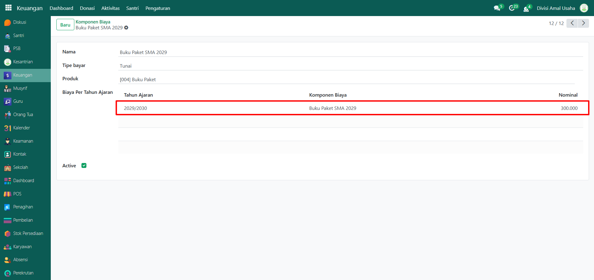

# Komponen Biaya

Video \[]

## Master Data - Komponen Biaya

**Komponen Biaya** digunakan untuk mendefinisikan berbagai jenis biaya pendidikan santri (misalnya biaya SPP, kegiatan, dll.) serta menentukan nominal per tahun ajaran. Data ini akan menjadi acuan dalam penagihan biaya komponen pendidikan.

### Menambahkan Komponen Biaya

Berikut adalah langkah-langkah untuk menambahkan komponen pendidikan pada Odoo Pesantren.

1.  Buka modul **Keuangan**, lalu klik menu **Pengaturan** dan pilih submenu **Komponen Biaya**.

    <figure><figcaption></figcaption></figure>

2.  Klik tombol **"Baru"** untuk membuat data komponen biaya baru.

    <figure><figcaption></figcaption></figure>

3.  Akan tampil halaman form, isi inputan yang tersedia seperti:

    * **Nama Komponen Biaya** (misalnya: Buku Paket SMA 2029)
    * **Tipe Bayar** (Cicilan/Tunai)
    * **Produk** (pilih produk yang telah dibuat pada modul Stok Persediaan)
    * **Biaya Per Tahun Ajaran** → otomatis terisi ketika data Biaya Tahun Ajaran sudah dibuat.
    * **Active** (centang untuk mengaktifkan komponen biaya agar dapat digunakan).

    <figure><figcaption></figcaption></figure>

4.  Setelah semua inputan diisi dengan benar, klik icon **Simpan** di sebelah kanan icon Gear agar data Komponen Biaya tersimpan di sistem.

    <figure><figcaption></figcaption></figure>

### Menambahkan Biaya Komponen per Tahun Ajaran

Berikut adalah langkah-langkah untuk menambahkan biaya komponen per tahun ajaran pada Odoo Pesantren.

1.  Masih di modul **Keuangan**, klik menu **Pengaturan** lalu pilih submenu **Biaya Tahun Ajaran**.

    <figure><figcaption></figcaption></figure>

2.  Klik tombol **"Baru"** untuk membuat data biaya per tahun ajaran.

    <figure><figcaption></figcaption></figure>

3.  Akan tampil halaman form, isi inputan yang tersedia seperti:

    * **Komponen Biaya** (pilih salah satu dari komponen biaya yang sudah dibuat, contoh: SPP Bulanan)
    * **Tahun Ajaran** (misalnya: 2029/2030)
    * **Nominal** (misalnya: Rp 300.000)

    <figure><figcaption></figcaption></figure>

4. Setelah semua inputan diisi dengan benar, klik icon **Simpan** di sebelah kanan icon Gear agar data Biaya Tahun Ajaran tersimpan.
5.  Kembali ke submenu **Komponen Biaya** untuk melihat bahwa kolom **Biaya Per Tahun Ajaran** sudah otomatis menampilkan rincian sesuai dengan data yang baru ditambahkan.

    <figure><figcaption></figcaption></figure>

### Edit dan Hapus Data Komponen Biaya

Untuk mengedit suatu data komponen biaya, silahkan pilih terlebih dahulu data mana yang akan diedit. Editlah data komponen biaya dan klik icon **Simpan** untuk menyimpan data perubahan tersebut.

Untuk menghapus suatu data komponen biaya adalah dengan pilih data mana yang akan dihapus, kemudian klik icon **Gear** atau **Action** lalu pilih opsi **Hapus**, maka akan tampil dialog konfirmasi apakah anda ingin menghapus data tersebut. Jika ya, klik **Hapus** jika tidak maka klik **Tidak, tetap simpan**.

***


Data ini **dapat dihapus**, namun apabila sudah terdapat transaksi yang terkait dengan data tersebut, **disarankan untuk tidak menghapusnya** demi menjaga konsistensi dan keakuratan data transaksi di sistem.

