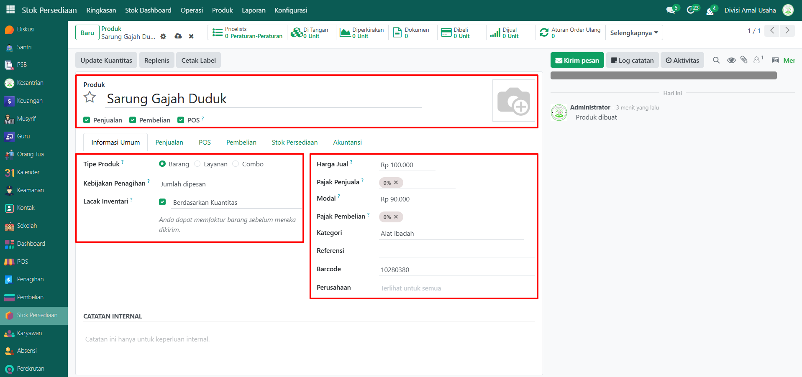
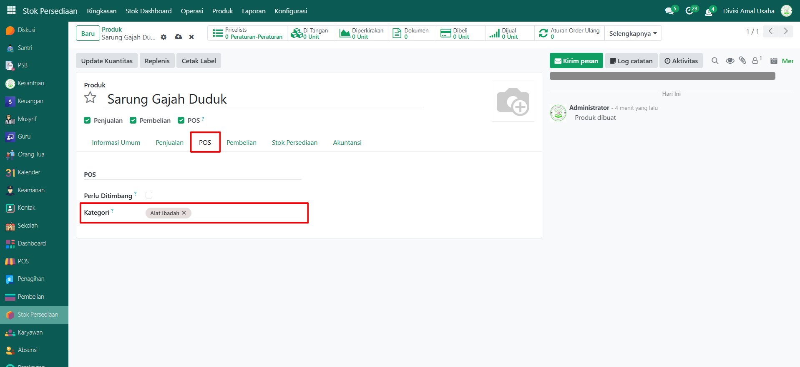

# Produk

Video \[]

## Master Data - Produk

Data **Produk** adalah barang atau jasa yang dijual atau dikelola dalam sistem Odoo Pesantren. Data produk digunakan untuk transaksi penjualan, pembelian, serta pencatatan stok. Produk bisa berupa barang fisik, layanan, maupun produk kombinasi (combo). Pengelolaan data ini sangat penting untuk operasional koperasi, kantin, percetakan, dan unit usaha pesantren lainnya.

### Menambahkan Produk

Berikut adalah langkah-langkah untuk menambahkan data produk pada Odoo Pesantren

1. Login menggunakan akun administrator. Jika Anda belum memahami cara login sebagai admin, silakan lihat panduan [**Login Admin** di sini](../../panduan-login/login-admin.md).
2.  Buka modul **Stok Persediaan**, lalu klik menu **Produk** kemudian pilih submenu **Produk**.

    <figure><figcaption></figcaption></figure>

3.  Klik tombol “Baru” untuk membuat data produk baru.

    <figure><figcaption></figcaption></figure>

4.  Akan tampil halaman form, isi inputan yang tersedia seperti:

    * **Produk** (isi dengan nama produk yang akan ditambahkan).
    * **Penjualan** / **Pembelian** / **POS** (centang sesuai kebutuhan produk digunakan di modul mana).
    * **Tipe Produk** (bisa diisi sesuai tipe yang akan digunakan, berikut adalah tipe-tipe produk yang bisa digunakan).
    * **Harga Jual** (isi dengan harga satuan jual produk).
    * **Modal** (opsional, bisa diisi dengan harga pokok barang jika perlu).
    * **Pajak Penjual / Pembelian** (opsional, bisa diisi sesuai kebutuhan).
    * **Kategori** (isi dengan kategori produk yang telah dibuat sebelumnya).
    * **Referensi / Barcode** (opsional bisa diisi untuk keperluan identifikasi tambahan).
    * **Gambar Produk** (opsional, bisa diisi denagan mengklik ikon kamera di kanan atas untuk mengunggah foto produk).

    <figure><figcaption></figcaption></figure>

5.  Pindah ke **Tab POS**, kemudian pilih **Kategori POS** yang sesuai (misalnya: Minuman, Makanan, atau Alat Ibadah) agar produk muncul di aplikasi Point of Sale.

    <figure><figcaption></figcaption></figure>

6.  Pindah ke **Tab Pembelian**, kemudian tambahkan **Pemasok** yang akan menyediakan produk tersebut.

    <figure><figcaption></figcaption></figure>

7.  Setelah semua field diisi dengan benar, klik icon Simpan di sebelah kanan icon Gear agar data produk tersimpan.

    <figure><figcaption></figcaption></figure>

8. Data Produk berhasil disimpan dan dapat digunakan pada transaksi POS, pembelian, maupun laporan stok.

### Edit dan Hapus Data Produk

Untuk mengedit suatu data produk, silahkan pilih terlebih dahulu data mana yang akan diedit. Editlah data produk dan klik icon **Simpan** untuk menyimpan data perubahan tersebut.

Untuk menghapus suatu data produk adalah dengan pilih data mana yang akan dihapus, kemudian klik icon **Gear** atau **Action** lalu pilih opsi **Hapus**, maka akan tampil dialog konfirmasi apakah anda ingin menghapus data tersebut. Jika ya, klik **Hapus** jika tidak maka klik **Tidak, tetap simpan**.

***


Data **Produk** tidak dapat dihapus apabila sudah terdapat transaksi yang berhubungan dengan data tersebut. Jika belum ada transaksi yang tercatat, maka data masih dapat dihapus dari sistem.

