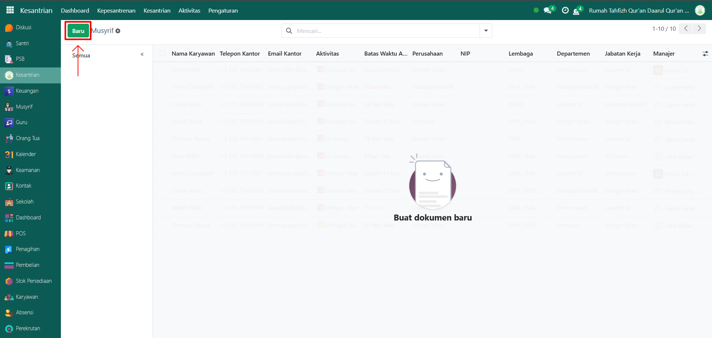
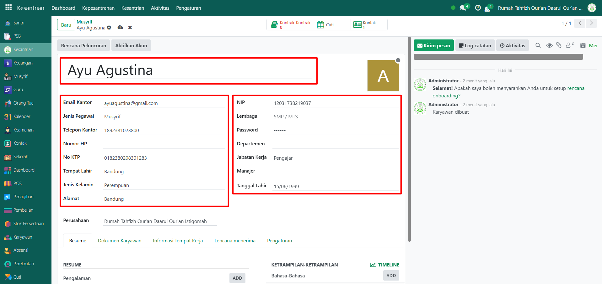
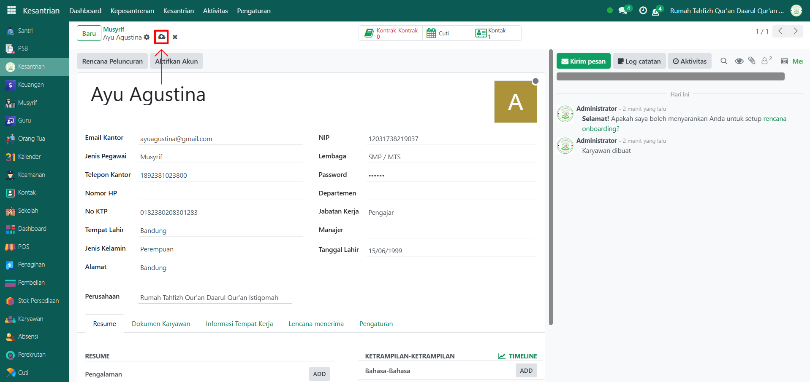

# Data Musyrif

Video \[]

## Master Data - Data Musyrif

Data Musyrif digunakan untuk mencatat identitas musyrif (pembimbing asrama) yang bertanggung jawab terhadap santri. Data ini wajib diinput agar musyrif bisa dikaitkan dengan santri, kamar, serta aktivitas kesantrian.

### Langkah-Langkah Menambahkan Musyrif

Berikut adalah langkah-langkah untuk menambahkan musyrif pada Odoo Pesantren.

1.  Buka **modul Kesantrian**, lalu klik menu **Kesantrian** dan pilih submenu **Musyrif**.

    <figure><figcaption></figcaption></figure>

2.  Klik tombol **“Baru”** untuk membuat data musyrif baru.

    <figure><figcaption></figcaption></figure>

3.  Akan tampil halaman form, isi inputan yang tersedia seperti:

    * **Nama Musyrif** (misalnya: Ayu Agustina)
    * **Email Kantor** (misalnya: ayuagustina@gmail.com)
    * **Jenis Pegawai** (Musyrif)
    * **Telepon Kantor, Nomor HP, dan No KTP**
    * **Tempat Lahir, Jenis Kelamin, dan Alamat**
    * **Departemen, Jabatan Kerja, dan Manajer**
    * **Tanggal Lahir**

    <figure><figcaption></figcaption></figure>

4.  Setelah semua inputan diisi dengan benar, klik icon **Simpan** di sebelah kanan icon **Gear** agar data musyrif tersimpan di sistem.

    <figure><figcaption></figcaption></figure>

5.  Data musyrif berhasil disimpan dan dapat digunakan untuk mengelola santri, absensi, mutaba’ah, serta aktivitas kesantrian lainnya.

    <figure><figcaption></figcaption></figure>
