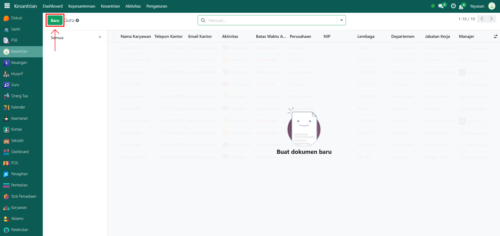
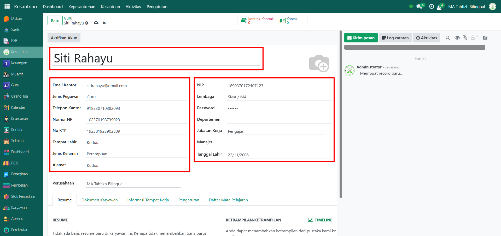
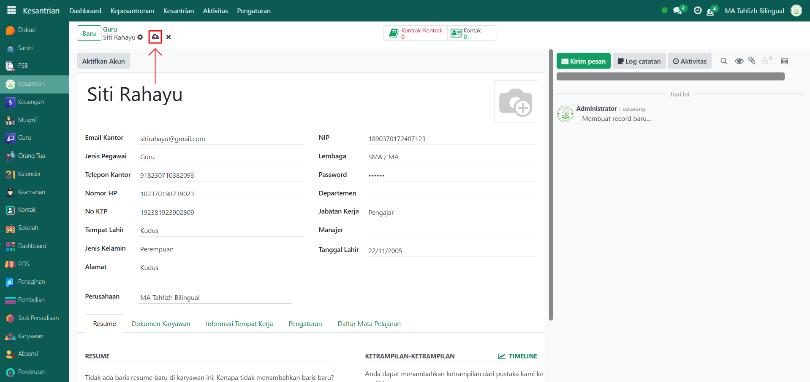
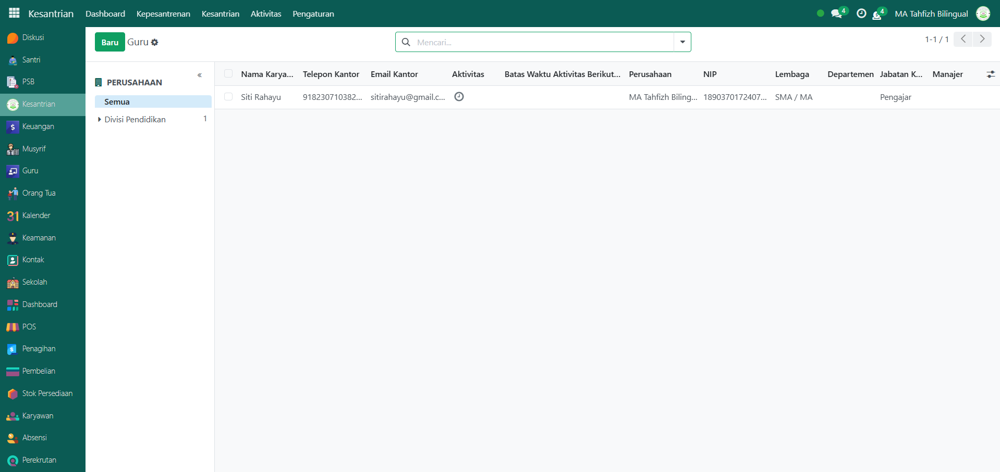
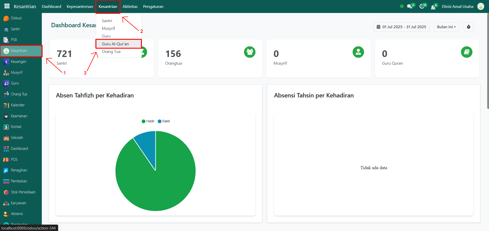
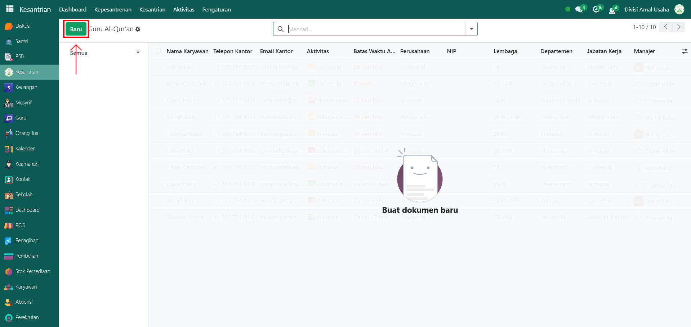
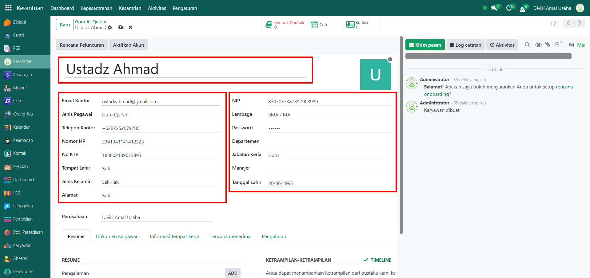
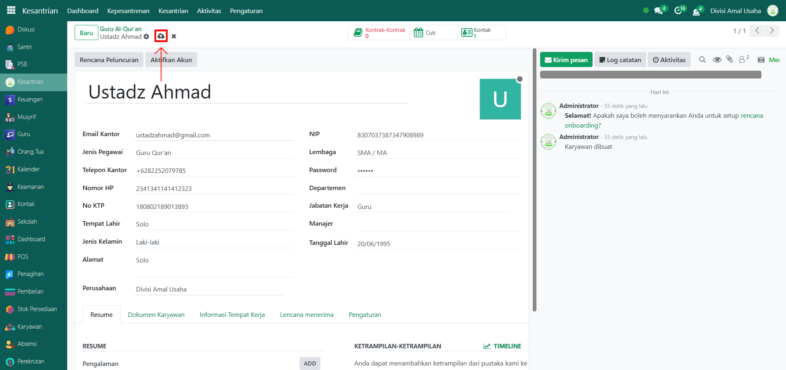
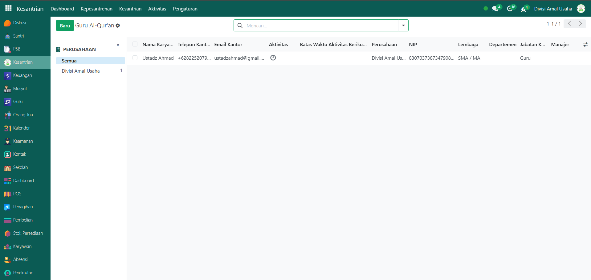

# Guru & Guru Al-Qur'an

Video \[]

## Master Data - Guru

Guru adalah tenaga pengajar umum di pesantren yang bertugas mengajar mata pelajaran sesuai kurikulum yang berlaku. Data guru perlu dicatat di sistem agar dapat dikelola, dimonitor, dan digunakan dalam proses akademik maupun administrasi.

### Langkah-langkah Menambahkan Guru

Berikut adalah langkah-langkah untuk menambahkan data guru pada Odoo Pesantren:

1.  Buka **modul Kesantrian**, lalu klik menu **Kesantrian** dan pilih submenu **Guru**.

    <figure><figcaption></figcaption></figure>

2.  Klik tombol **“Baru”** untuk membuat data guru baru.

    <figure><figcaption></figcaption></figure>

3.  Akan tampil halaman form, isi inputan yang tersedia seperti:

    * **Nama Guru** (misalnya: Siti Rahayu)
    * **Email Kantor** (misalnya: sitirahayu@gmail.com)
    * **Jenis Pegawai** (Guru)
    * **Telepon Kantor, Nomor HP, dan No KTP**
    * **Tempat Lahir, Jenis Kelamin, dan Alamat**
    * **Departemen, Jabatan Kerja, dan Manajer**
    * **Tanggal Lahir**

    <figure><figcaption></figcaption></figure>

4.  Setelah semua inputan diisi dengan benar, klik icon **Simpan** di sebelah kanan icon Gear agar data guru tersimpan di sistem.

    <figure><figcaption></figcaption></figure>

5.  Data Guru berhasil disimpan dan dapat digunakan untuk kebutuhan akademik maupun administrasi.

    <figure><figcaption></figcaption></figure>

## Master Data Guru Al-Qur'an

Guru Al-Qur’an adalah tenaga pengajar yang berfokus pada pembelajaran Tahfidz dan Tahsin Al-Qur’an. Data guru Al-Qur’an penting untuk dicatat agar dapat dimonitor dan dilibatkan dalam proses pembelajaran kesantrian.

### Langkah-Langkah Menambahkan Guru Al-Qur'an

Berikut adalah langkah-langkah untuk menambahkan data Guru Al-Qur’an pada Odoo Pesantren:

1.  Pada modul **Kesantrian**, klik menu **Kesantrian** dan pilih submenu **Guru Al-Qur’an**.

    <figure><figcaption></figcaption></figure>

2.  Klik tombol **“Baru”** untuk membuat data Guru Al-Qur’an baru.

    <figure><figcaption></figcaption></figure>

3.  Akan tampil halaman form, isi inputan yang tersedia seperti:

    * **Nama Guru Al-Qur’an** (misalnya: Ustadz Ahmad)
    * **Email Kantor** (misalnya: ustadzahmad@gmail.com)
    * **Jenis Pegawai** (Guru Al-Qur’an)
    * **Telepon Kantor, Nomor HP, dan No KTP**
    * **Tempat Lahir, Jenis Kelamin, dan Alamat**
    * **Departemen, Jabatan Kerja, dan Manajer**
    * **Tanggal Lahir**

    <figure><figcaption></figcaption></figure>

4.  Setelah semua inputan diisi dengan benar, klik icon **Simpan** di sebelah kanan icon Gear agar data Guru Al-Qur’an tersimpan di sistem.

    <figure><figcaption></figcaption></figure>

5.  Data Guru Al-Qur’an berhasil disimpan dan dapat digunakan dalam pengelolaan Tahfidz dan Tahsin Al-Qur’an santri.

    <figure><figcaption></figcaption></figure>

