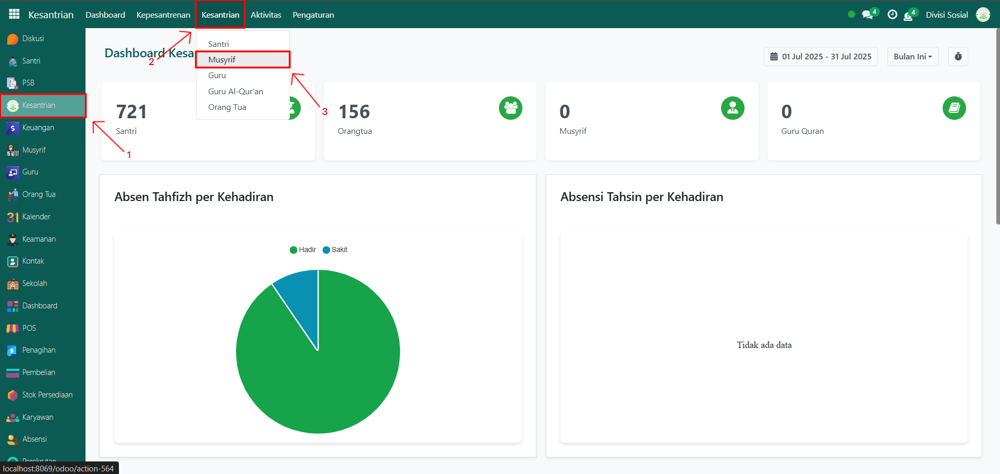
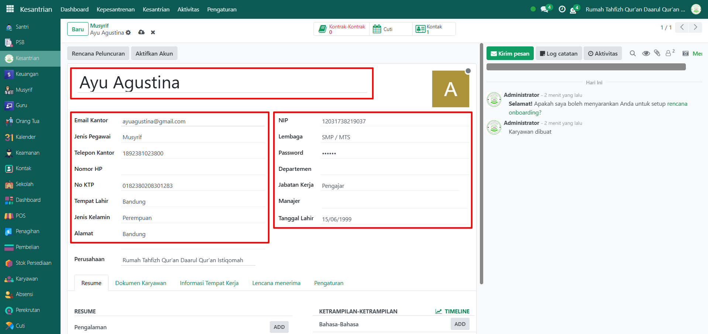
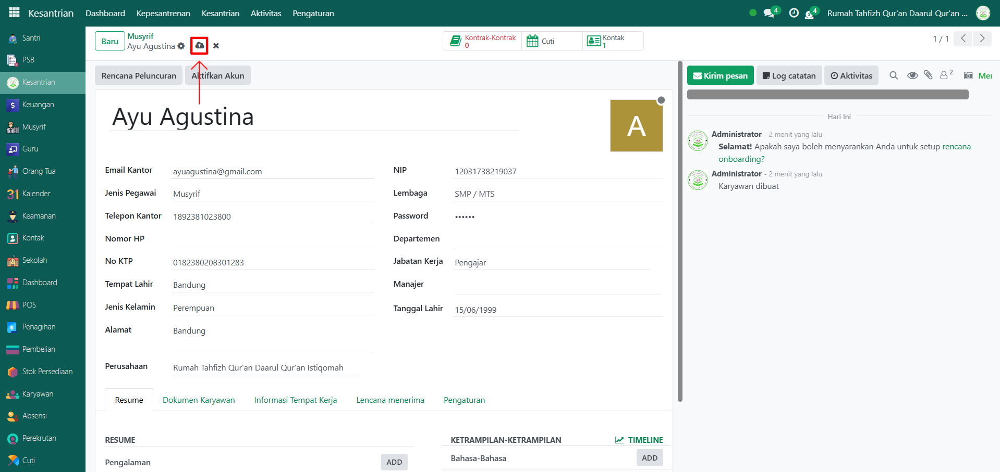
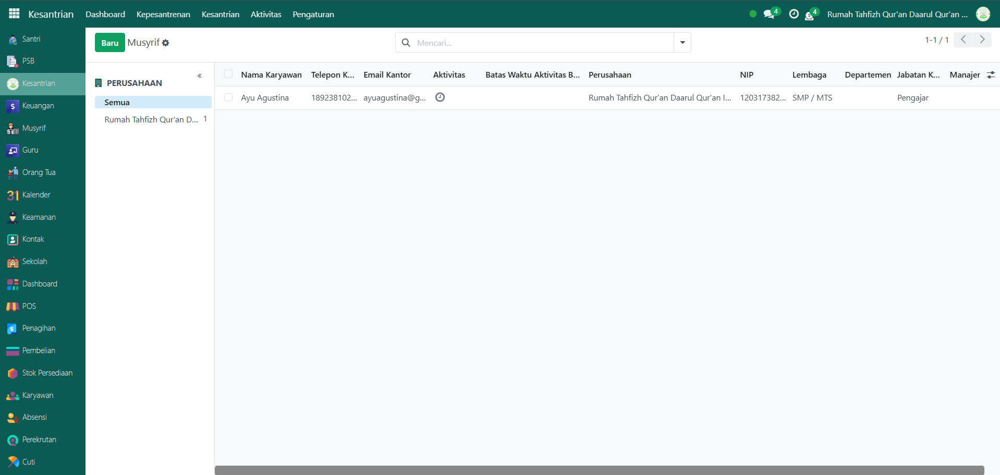

# Musyrif



## Master Data - Data Musyrif

**Data Musyrif** digunakan untuk mencatat identitas musyrif (pembimbing asrama) yang bertanggung jawab terhadap santri. Data ini wajib diinput agar musyrif bisa dikaitkan dengan santri, kamar, serta aktivitas kesantrian.

### Menambahkan Musyrif

Berikut adalah langkah-langkah untuk menambahkan musyrif pada Odoo Pesantren.

1. Login menggunakan akun administrator. Jika Anda belum memahami cara login sebagai admin, silakan lihat panduan [**Login Admin** di sini](../../panduan-login/login-admin.md).
2.  Buka **modul Kesantrian**, lalu klik menu **Kesantrian** kemudian pilih submenu **Musyrif**.

    <figure><figcaption></figcaption></figure>

3.  Klik tombol **“Baru”** untuk membuat data musyrif baru.

    <figure><figcaption></figcaption></figure>

4.  Akan tampil halaman form, isi inputan yang tersedia seperti:

    * **Nama Musyrif** (misalnya: Ayu Agustina)
    * **Email Kantor** (misalnya: ayuagustina@gmail.com)
    * **Jenis Pegawai** (Musyrif)
    * **Telepon Kantor, Nomor HP, dan No KTP**
    * **Tempat Lahir, Jenis Kelamin, dan Alamat**
    * **NIP, Lembaga, Jabatan Kerja, dan Tanggal Lahir**

    <figure><figcaption></figcaption></figure>

5.  Setelah semua inputan diisi dengan benar, klik icon **Simpan** di sebelah kanan icon **Gear** agar data musyrif tersimpan di sistem.

    <figure><figcaption></figcaption></figure>

6.  Data musyrif berhasil disimpan dan dapat digunakan untuk mengelola santri, absensi, mutaba’ah, serta aktivitas kesantrian lainnya.

    <figure><figcaption></figcaption></figure>

### Edit Data Musyrif

Untuk mengedit suatu data musyrif, silahkan pilih terlebih dahulu data mana yang akan diedit. Editlah data musyrif dan klik icon **Simpan** untuk menyimpan data perubahan tersebut.

***


Data **Musyrif** tidak dapat dihapus dari sistem. Anda hanya diperbolehkan melakukan **perubahan atau pembaruan data** pada entri Musyrif yang sudah ada.

