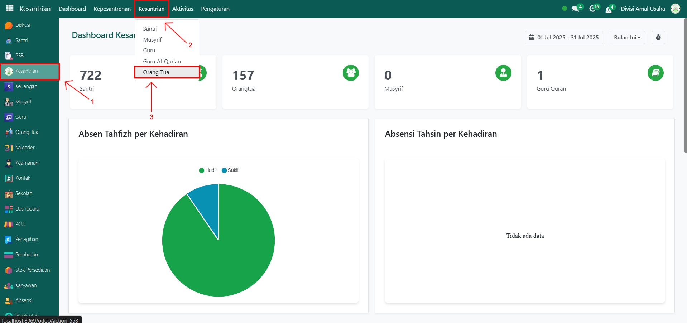
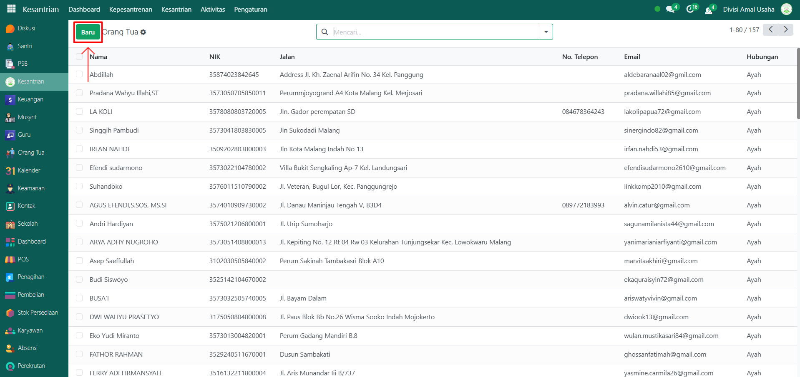
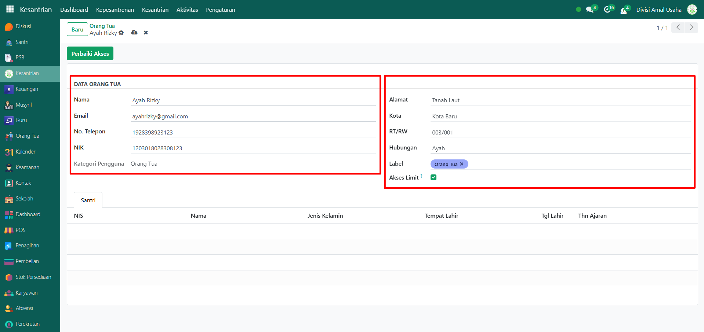
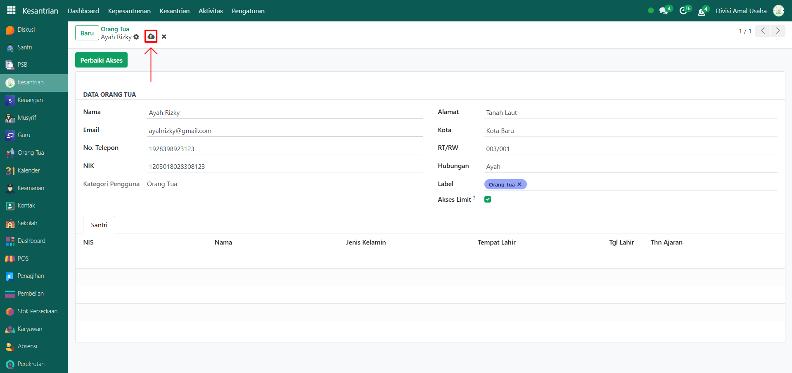
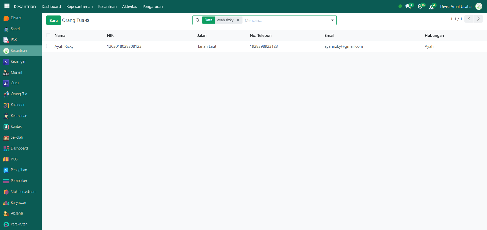
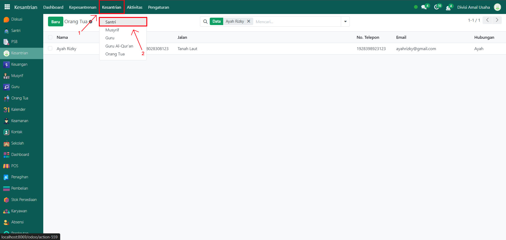
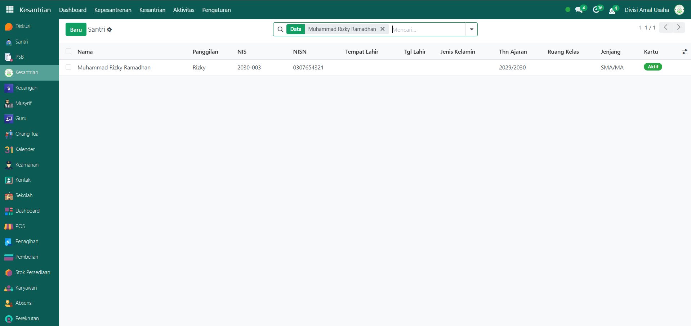
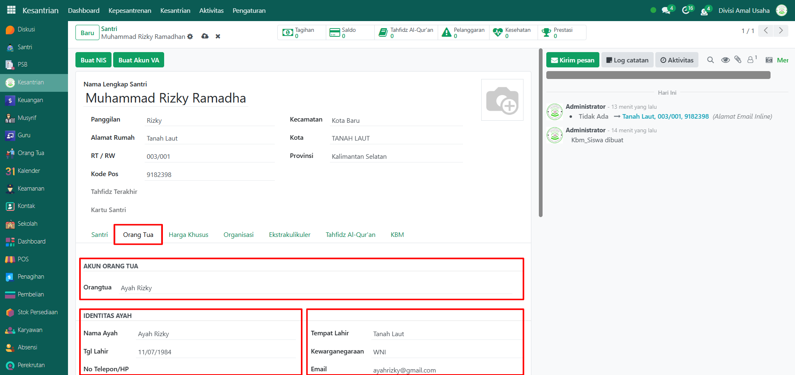
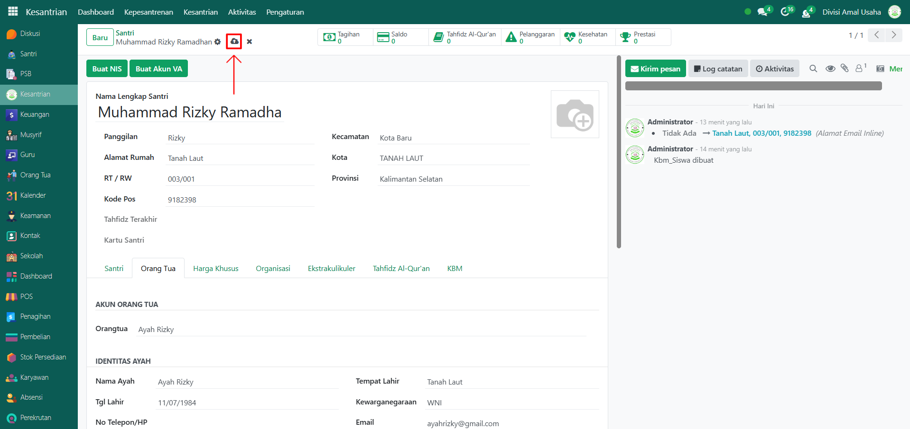
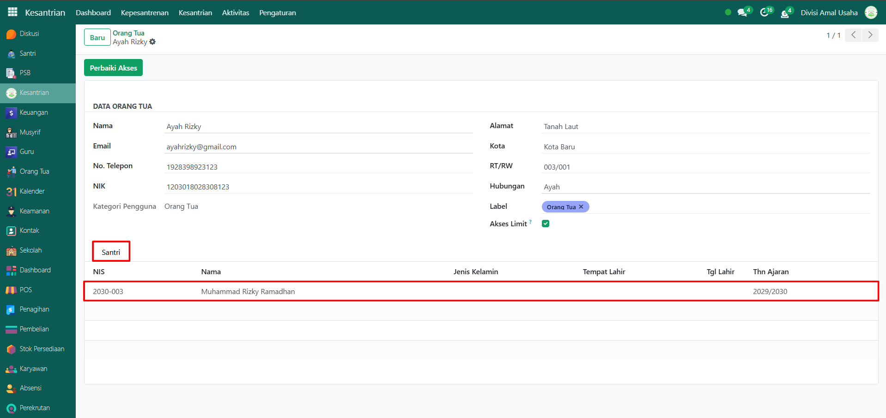

# Orang Tua

Video \[]

## Master Data - Orang Tua

**Orang Tua** merupakan data utama yang berfungsi untuk menghubungkan santri dengan wali mereka dalam sistem Odoo Pesantren. Dengan menambahkan data orang tua, pihak pesantren dapat mengelola informasi identitas orang tua serta mengaitkannya dengan anak (santri) yang bersangkutan.

### Menambahkan Orang Tua

Berikut adalah langkah-langkah untuk menambahkan data orang tua pada Odoo Pesantren.

1. Login menggunakan akun administrator. Jika Anda belum memahami cara login sebagai admin, silakan lihat panduan [**Login Admin** di sini](../../panduan-login/login-admin.md).
2.  Buka modul **Kesantrian**, lalu klik menu **Kesantrian** kemudian pilih submenu **Orang Tua**.

    <figure><figcaption></figcaption></figure>

3.  Klik tombol **"Baru"** untuk membuat data orang tua baru.

    <figure><figcaption></figcaption></figure>

4.  Akan tampil halaman form, isi inputan yang tersedia seperti:

    * **Nama Orang Tua** (misalnya: _Ayah Rizky_)
    * **Email** (misalnya: _ayahrizky@gmail.com_)
    * **No. Telepon** dan **NIK**
    * **Alamat, Kota, RT/RW**
    * **Hubungan** (misalnya: _Ayah_)
    * **Label** (misalnya: _Orang Tua_)
    * **Akses Limit** (opsional, diaktifkan jika ingin membatasi penggunaan saldo anak oleh orang tua)
    * **Tab Santri** → menampilkan daftar santri yang terhubung dengan akun orang tua tersebut.

    <figure><figcaption></figcaption></figure>

5.  Setelah semua inputan diisi dengan benar, klik icon **Simpan** di sebelah kanan icon **Gear** agar data orang tua tersimpan di sistem.

    <figure><figcaption></figcaption></figure>

6.  Data orang tua berhasil disimpan dan dapat digunakan untuk memantau aktivitas serta transaksi anak melalui akun login orang tua.

    <figure><figcaption></figcaption></figure>

### Mengaitkan Data Orang Tua ke Santri

Berikut adalah langkah-langkah untuk mengaitkan data orang tua ke Santri pada Odoo Pesantren:

1.  Pada modul yang sama yaitu **Kesantrian, k**lik menu **Kesantrian** lalu pilih submenu **Santri**.

    <figure><figcaption></figcaption></figure>

2.  Pilih santri yang ingin ditambahkan data orang tua (misalnya: _Muhammad Rizky Ramadhan_).

    <figure><figcaption></figcaption></figure>

3.  Pada **Tab Orang Tua**, tambahkan orang tua yang telah dibuat sebelumnya (misalnya: _Ayah Rizky_) pada field **Akun Orang Tua**, lalu lengkapi data yang diperlukan.

    <figure><figcaption></figcaption></figure>

4.  Kemudian, klik icon **Simpan** di sebelah kanan icon **Gear** agar perubahan tersimpan di sistem.

    <figure><figcaption></figcaption></figure>

5.  Kembali ke halaman form **data Orang Tua** untuk memastikan bahwa santri telah terhubung dengan akun orang tua tersebut.

    <figure><figcaption></figcaption></figure>

### Edit dan Hapus Data Orang Tua

Untuk mengedit suatu data orang tua, silahkan pilih terlebih dahulu data mana yang akan diedit. Editlah data orang tua dan klik icon **Simpan** untuk menyimpan data perubahan tersebut.

Untuk menghapus suatu data orang tua adalah dengan pilih data mana yang akan dihapus, kemudian klik icon **Gear** atau **Action** lalu pilih opsi **Hapus**, maka akan tampil dialog konfirmasi apakah anda ingin menghapus data tersebut. Jika ya, klik **Hapus** jika tidak maka klik **Tidak, tetap simpan**.
