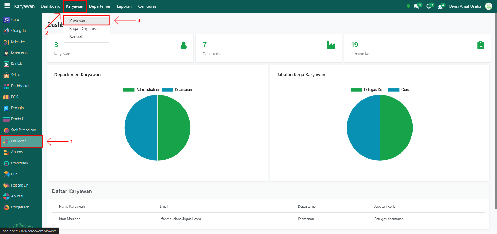
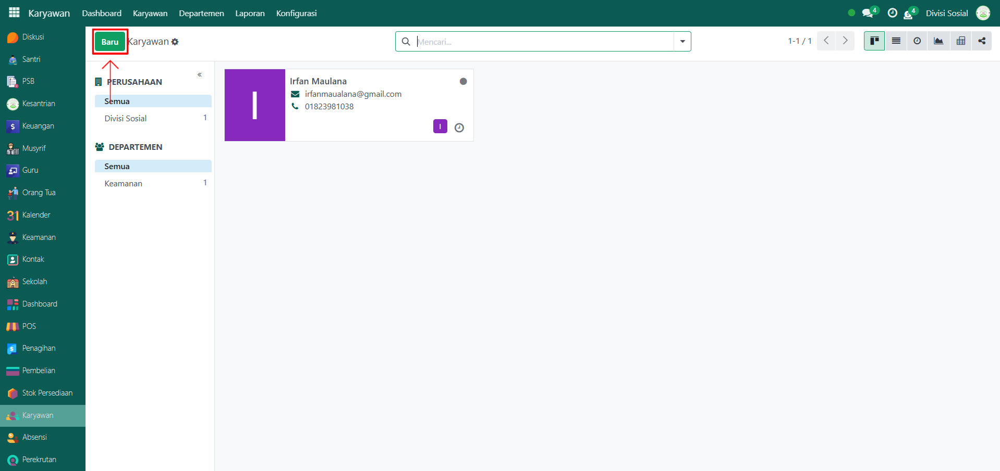
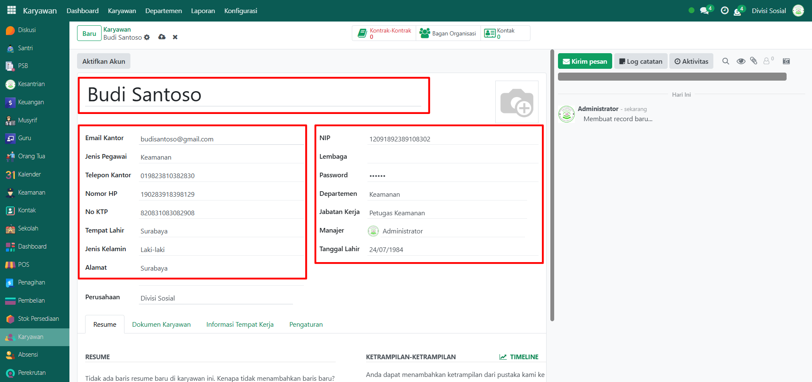
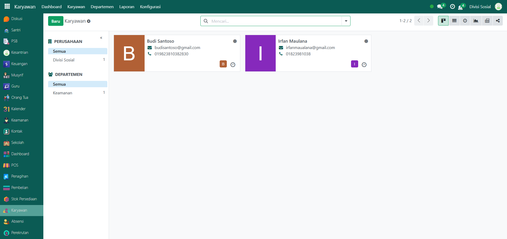

# Petugas Keamanan

Video \[]

## Master Data - Petugas Keamanan

Petugas Keamanan adalah karyawan yang bertugas menjaga keamanan, mengawasi izin keluar/masuk santri, serta mendukung ketertiban lingkungan pesantren. Data Petugas Keamanan perlu dicatat di sistem agar dapat dikelola dan dimonitor dengan baik.

### Langkah-Langkah Menambahkan Petugas Keamanan

Berikut adalah langkah-langkah untuk menambahkan data Petugas Keamanan pada Odoo Pesantren:

1.  Buka **modul Karyawan**, lalu klik menu **Karyawan** dan pilih submenu **Karyawan**.

    <figure><figcaption></figcaption></figure>

2.  Klik tombol **“Baru”** untuk membuat data karyawan/petugas keamanan baru.

    <figure><figcaption></figcaption></figure>

3.  Akan tampil halaman form, isi inputan yang tersedia seperti:

    * **Nama Petugas Keamanan** (misalnya: Budi Santoso)
    * **Email Kantor** (misalnya: budisantoso@gmail.com)
    * **Jenis Pegawai** (Keamanan)
    * **Telepon Kantor, Nomor HP, dan No KTP**
    * **Tempat Lahir, Jenis Kelamin, dan Alamat**
    * **Departemen, Jabatan Kerja, dan Manajer**
    * **Tanggal Lahir**

    <figure><figcaption></figcaption></figure>

4.  Setelah semua inputan diisi dengan benar, klik icon **Simpan** di sebelah kanan icon Gear agar data Petugas Keamanan tersimpan di sistem.

    <figure><figcaption></figcaption></figure>

5.  Data Petugas Keamanan berhasil disimpan dan dapat digunakan untuk mendukung pengelolaan keamanan serta pengawasan izin keluar/masuk santri.

    <figure><figcaption></figcaption></figure>
