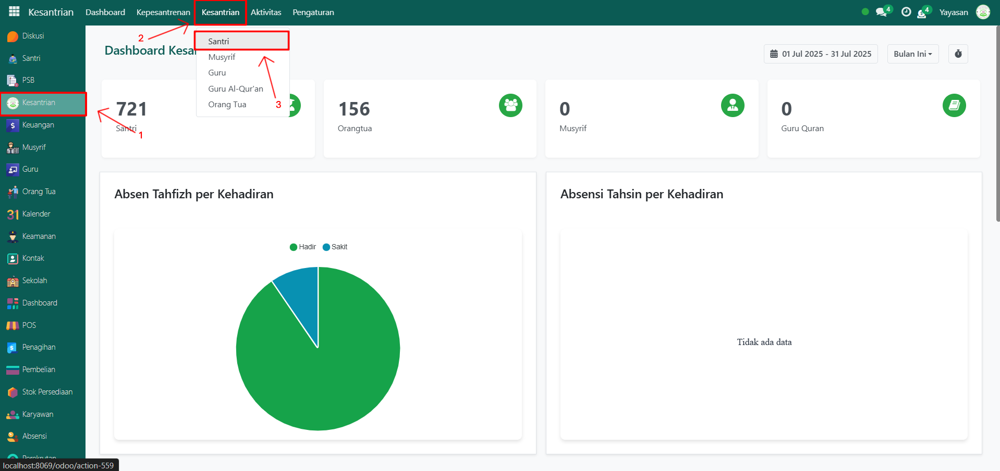
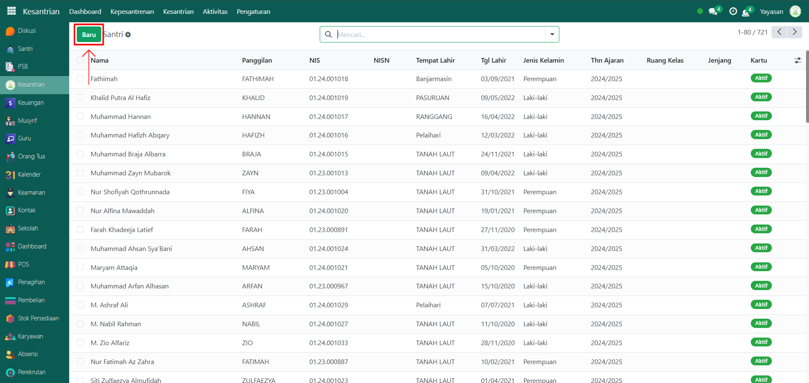
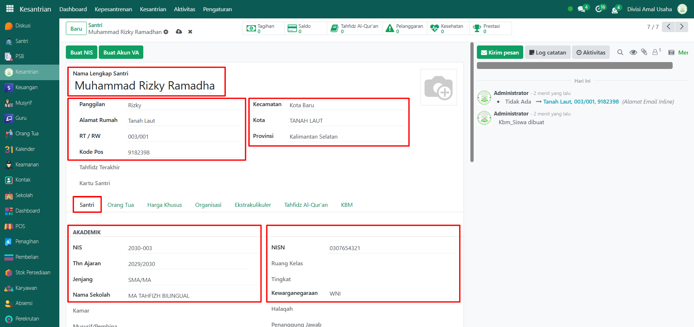
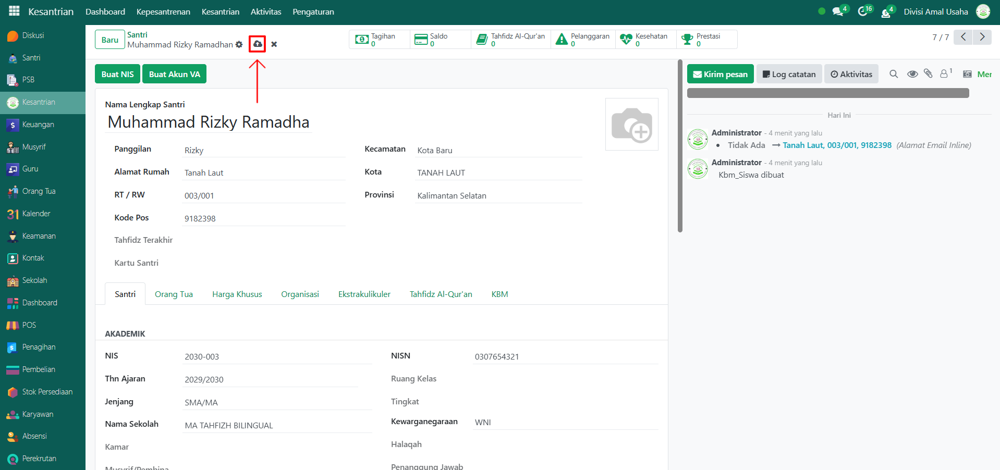
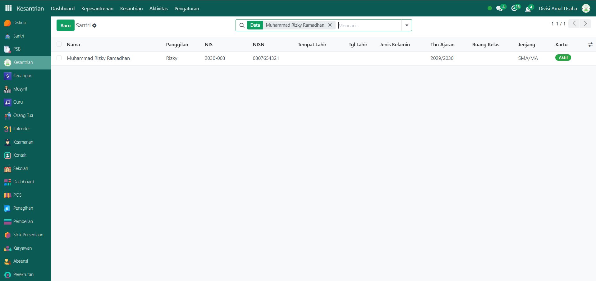

# Santri

Video \[]

## Master Data - Santri

**Santri** merupakan salah satu data utama yang harus dikelola dalam sistem Odoo Pesantren. Dengan menginput data santri, pihak pesantren dapat mengatur berbagai informasi terkait identitas, pendidikan, serta aktivitas santri di pesantren.

Data santri dapat dimasukkan ke dalam sistem dengan **dua cara**:

1. **Melalui proses pendaftaran mandiri oleh calon santri**, dimulai dari tahap pengisian formulir pendaftaran hingga statusnya diterima sebagai santri pesantren.
2. **Input manual oleh administrator atau petugas pesantren**, langsung melalui form santri seperti pada langkah-langkah menambahkan santri.

### Menambahkan Santri

Berikut adalah langkah-langkah untuk menambahkan data santri pada Odoo Pesantren.

1. Login menggunakan akun administrator. Jika Anda belum memahami cara login sebagai admin, silakan lihat panduan [**Login Admin** di sini](../../panduan-login/login-admin.md).
2.  Buka modul **Kesantrian**, lalu klik menu **Kesantrian** kemudian pilih submenu **Santri**.

    <figure><figcaption></figcaption></figure>

3.  Klik tombol **"Baru"** untuk membuat data santri baru.

    <figure><figcaption></figcaption></figure>

4.  Akan tampil halaman form, isi inputan yang tersedia seperti:

    * **Nama Lengkap Santri** (misalnya: _Muhammad Rizky Ramadhan_).
    * **Panggilan** (misalnya: _Rizky_).
    * **Alamat Rumah**, RT/RW, Kode Pos, Kecamatan, Kota, Provinsi.
    * **Tab Santri** berisi:
      * NIS (misalnya: _2030-003_), Tahun Ajaran (_2029/2030_), Jenjang (_SMA/MA_), Nama Sekolah (_MA TAHFIDZ BILINGUAL_), NISN (_0307654321_), Kewarganegaraan (_WNI_).
      * Dan data lainnya yang dibutuhkan.

    <figure><figcaption></figcaption></figure>

5.  Setelah semua inputan diisi dengan benar, klik icon **Simpan** di sebelah kanan icon **Gear** agar data santri tersimpan di sistem.

    <figure><figcaption></figcaption></figure>

6.  Data santri berhasil disimpan dan dapat digunakan untuk berbagai keperluan manajemen santri, seperti absensi, akademik, keuangan, hingga pelaporan.

    <figure><figcaption></figcaption></figure>

### Edit dan Hapus Data Santri

Untuk mengedit suatu data santri, silahkan pilih terlebih dahulu data mana yang akan diedit. Editlah data santri dan klik icon **Simpan** untuk menyimpan data perubahan tersebut.

Untuk menghapus suatu data santri adalah dengan pilih data mana yang akan dihapus, kemudian klik icon **Gear** atau **Action** lalu pilih opsi **Hapus**, maka akan tampil dialog konfirmasi apakah anda ingin menghapus data tersebut. Jika ya, klik **Hapus** jika tidak maka klik **Tidak, tetap simpan**.
