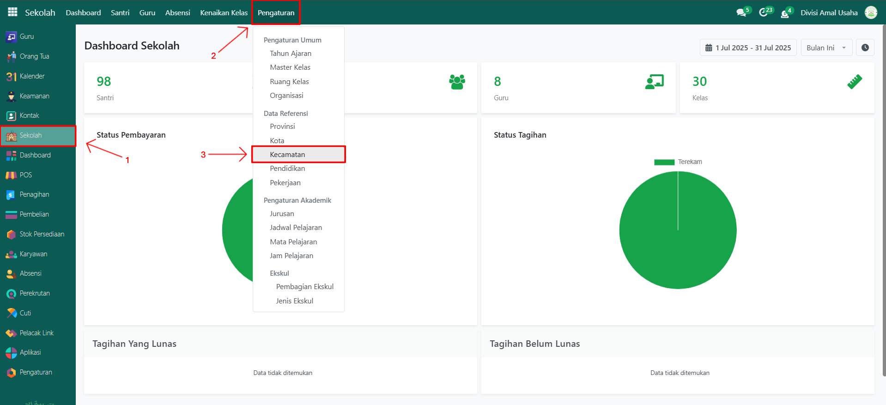
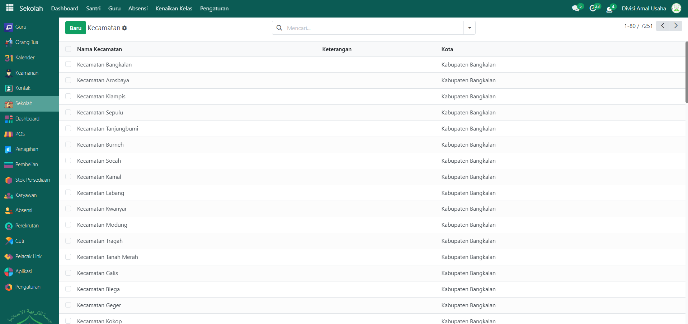
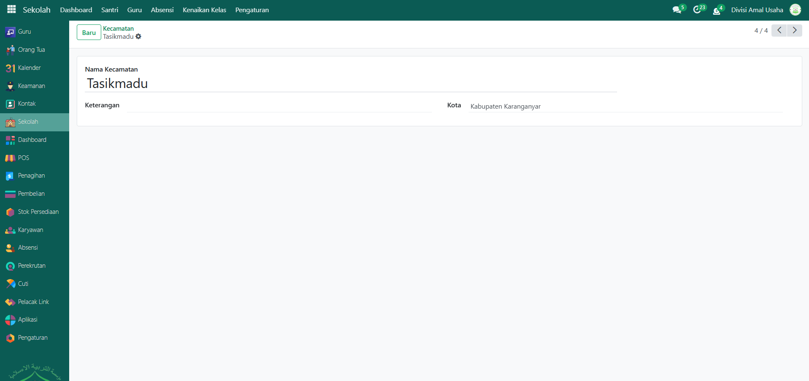
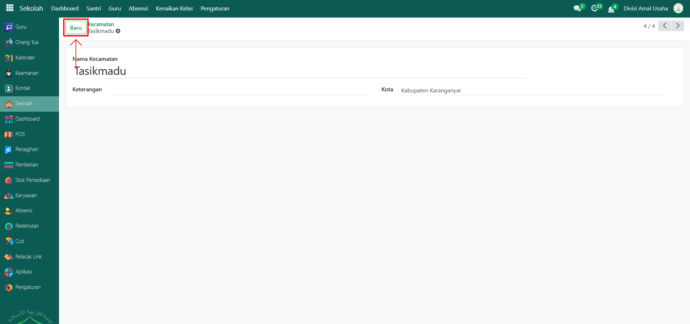
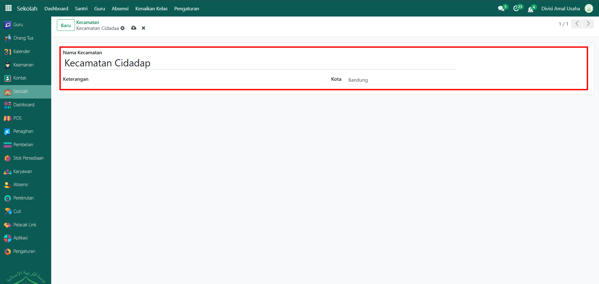
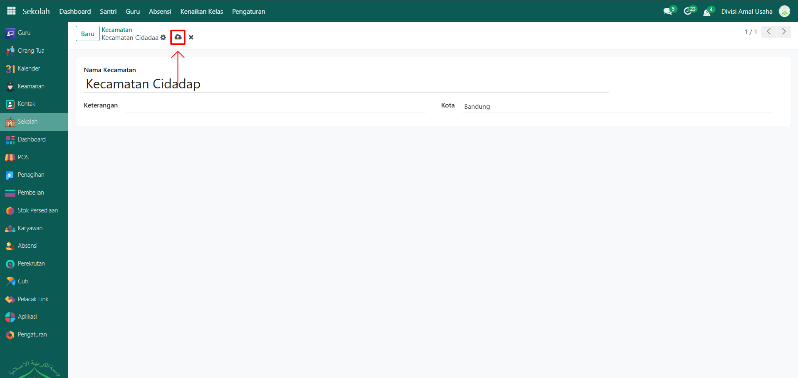

# Kecamatan

Video \[]

## Master Data - Kecamatan

Data **Kecamatan** adalah data referensi wilayah administratif yang digunakan untuk melengkapi informasi alamat santri, orang tua, maupun pihak lain di Odoo Pesantren. Data kecamatan biasanya sudah tersedia secara lengkap dalam sistem.

### Melihat dan Menambahkan Data Kecamatan

Berikut adalah langkah-langkah untuk melihat/mengakses data kecatama pada Odoo Pesantren.

1. Login menggunakan akun administrator. Jika Anda belum memahami cara login sebagai admin, silakan lihat panduan [**Login Admin** di sini](../../panduan-login/login-admin.md).
2.  Buka **modul Sekolah**, lalu klik menu **Pengaturan** kemudian pilih submenu **Kecamatan**.

    <figure><figcaption></figcaption></figure>

3.  Sistem akan menampilkan list kecamatan yang tersedia.

    <figure><figcaption></figcaption></figure>

4.  Klik salah satu kecamatan (misalnya: _Kecamatan Tasikmadu_) untuk melihat detail informasinya.

    <figure><figcaption></figcaption></figure>

5.  Jika ada kecamatan yang belum tersedia, klik tombol **Baru** untuk menambahkannya.

    <figure><figcaption></figcaption></figure>

6.  Akan tampil halaman form kota, isi inputan yang tersedia seperti:

    * **Nama Kecamatan** (misalnya: Kecamatan Cidadap)
    * **Keterangan** (Opsional)
    * **Kota** (misalnya: Bandung)

    <figure><figcaption></figcaption></figure>

7.  Setelah semua inputan diisi dengan benar, klik icon **Simpan** di sebelah kanan icon **Gear** agar data kota baru tersimpan di sistem.

    <figure><figcaption></figcaption></figure>

### Edit dan Hapus Data Kecamatan

Untuk mengedit suatu data kecamatan, silahkan pilih terlebih dahulu data mana yang akan diedit. Editlah data kecamatan dan klik icon **Simpan** untuk menyimpan data perubahan tersebut.

Untuk menghapus suatu data kecamatan adalah dengan pilih data mana yang akan dihapus, kemudian klik icon **Gear** atau **Action** lalu pilih opsi **Hapus**, maka akan tampil dialog konfirmasi apakah anda ingin menghapus data tersebut. Jika ya, klik **Hapus** jika tidak maka klik **Tidak, tetap simpan**.

***


Data **Kecamatan** bawaan sistem sebaiknya tidak dihapus. Penambahan diperbolehkan bila memang ada data yang belum tersedia.

