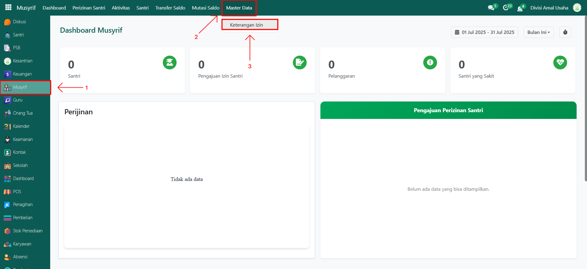
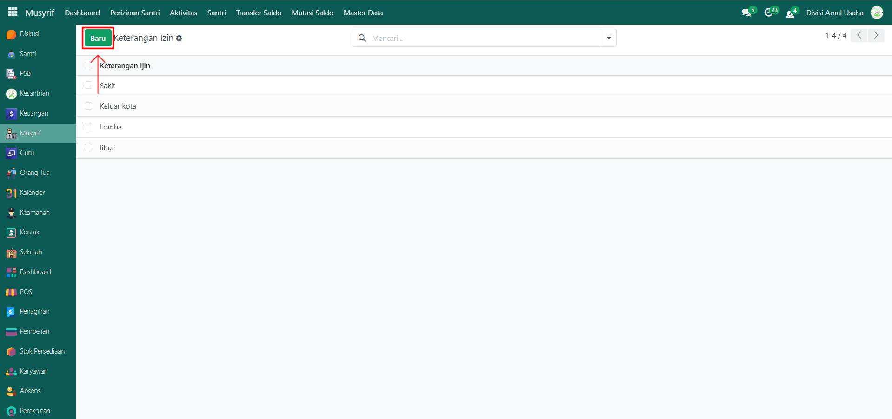
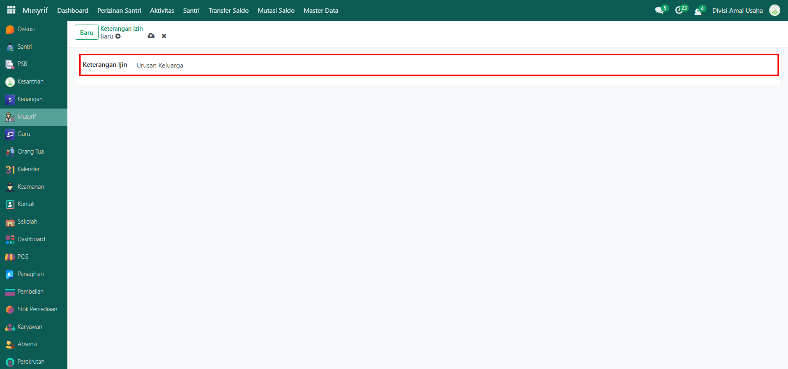
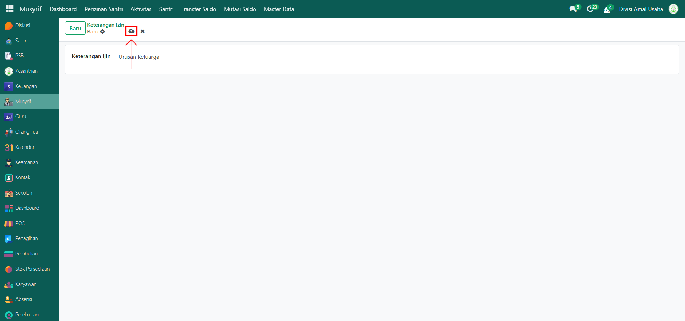

# Keterangan Izin

Video \[]

## Master Data - Keterangan Izin

Data **Keterangan Izin** digunakan untuk mendefinisikan alasan atau keperluan santri dalam melakukan pengajuan izin, seperti sakit, keluar kota, urusan keluarga, lomba, libur, maupun keterangan lainnya. Data ini menjadi acuan agar pengajuan izin santri dapat dikelompokkan dan dipantau sesuai dengan jenis keterangannya.

### Menambahkan Keterangan Izin

Berikut adalah langkah-langkah untuk menambahkan keterangan izin pada Odoo Pesantren.

1. Login menggunakan akun administrator atau musyrif. Jika Anda belum memahami cara login sebagai admin atau musyrif, silakan lihat panduan [**Login Admin** di sini](../../panduan-login/login-admin.md) dan [**Login Musyrif** di sini](../../setup-and-konfigurasi/role-and-hak-akses-pengguna/panduan-login/login-musyrif.md).
2.  Buka modul **Musyrif**, lalu klik menu **Master Data** kemudian pilih submenu **Keterangan Izin**.

    <figure><figcaption></figcaption></figure>

3.  Klik tombol **"Baru"** untuk membuat data Keterangan Izin baru.

    <figure><figcaption></figcaption></figure>

4.  Akan tampil halaman form, isi inputan yang tersedia seperti:

    * **Nama Keterangan Izin** (misalnya: Acara Keluarga, Kegiatan Sekolah, atau Keperluan Mendesak).

    <figure><figcaption></figcaption></figure>

5.  Setelah semua inputan diisi dengan benar, klik icon **Simpan** di sebelah kanan icon Gear agar data Keterangan Izin tersimpan di sistem.

    <figure><figcaption></figcaption></figure>

6. Data Keterangan Izin berhasil disimpan dan secara otomatis dapat dipilih saat santri atau orang tua melakukan pengajuan izin.

### Edit dan Hapus Data Keterangan Izin

Untuk mengedit suatu data keterangan izin, silahkan pilih terlebih dahulu data mana yang akan diedit. Editlah data keterangan izin dan klik icon **Simpan** untuk menyimpan data perubahan tersebut.

Untuk menghapus suatu data keterangan izin adalah dengan pilih data mana yang akan dihapus, kemudian klik icon **Gear** atau **Action** lalu pilih opsi **Hapus**, maka akan tampil dialog konfirmasi apakah anda ingin menghapus data tersebut. Jika ya, klik **Hapus** jika tidak maka klik **Tidak, tetap simpan**.

***


Data **Keterangan Izin** tidak dapat dihapus apabila sudah terdapat transaksi yang berhubungan dengan data tersebut. Jika belum ada transaksi yang tercatat, maka data masih dapat dihapus dari sistem.

