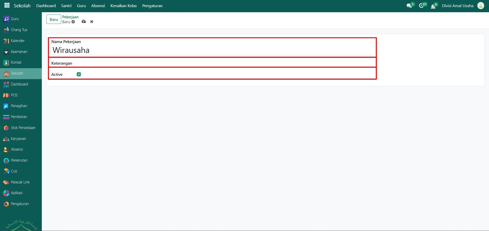

# Pekerjaan

Video \[]

## Master Data - Pekerjaan

### Langkah-Langkah Menambahkan Data Pekerjaan

Berikut adalah langkah-langkah untuk menambahkna data pekerjaan pada Odoo Pesantren.

1.  Buka **modul Sekolah**, lalu klik menu **Pengaturan** dan pilih submenu **Pekerjaan**.

    <figure><figcaption></figcaption></figure>

2.  Klik tombol **“Baru”** untuk membuat data Pekerjaan baru.

    <figure><figcaption></figcaption></figure>

3.  Akan tampil halaman form, isi inputan yang tersedia seperti:

    * **Nama Pekerjaan** (misalnya: Wirausaha)
    * **Keterangan** (opsional)
    * **Active** (aktifkan jika data pekerjaan ini akan digunakan dalam sistem)

    <figure><figcaption></figcaption></figure>

4.  Setelah semua inputan diisi dengan benar, klik icon **Simpan** di sebelah kanan icon **Gear** agar data Pekerjaan tersimpan di sistem.

    <figure><figcaption></figcaption></figure>

5. Data pekerjaan yang sudah tersimpan akan muncul dalam daftar, dan dapat digunakan saat mengisi data orang tua atau wali santri.
6. Jika pekerjaan tertentu sudah tidak digunakan, data bisa dinonaktifkan dengan menghilangkan centang pada kolom **Active** tanpa harus menghapusnya.
